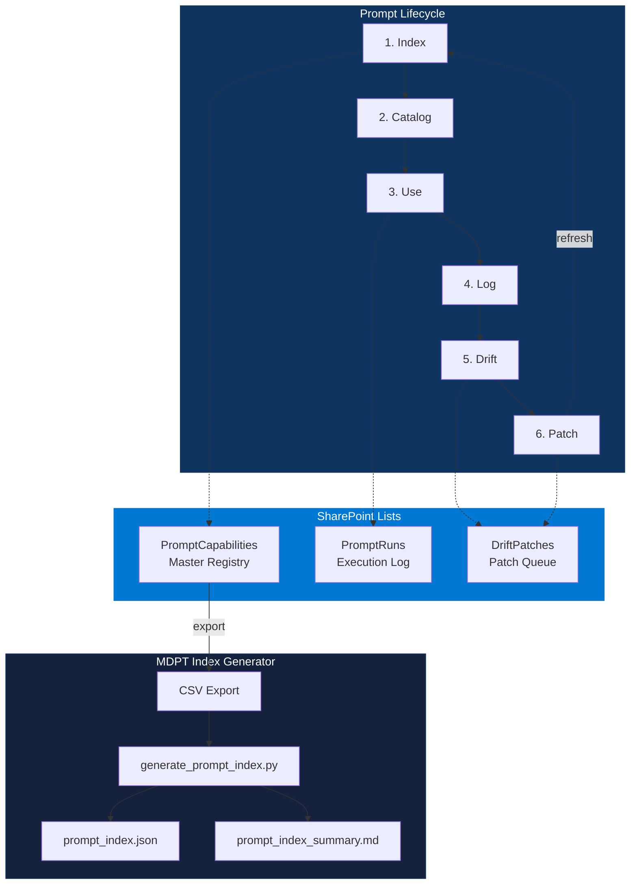

[](https://github.com/8ryanWh1t3/DeepSigma/actions/workflows/ci.yml)
[](./LICENSE)
[](https://www.python.org/downloads/)

<div align="center">

# Institutional Decision Infrastructure

**Truth · Reasoning · Memory**

[🚀 Start Here](START_HERE.md) · [🔁 Hero Demo](HERO_DEMO.md) · [🏢 Boardroom Brief](category/boardroom_brief.md) · [📜 Specs](canonical/) · [🗺️ Navigation](NAV.md) · [🔬 RAL](ABOUT.md)

</div>

---

## The Problem

Your organization makes thousands of decisions. Almost none are structurally recorded with their reasoning, evidence, or assumptions.

- **Leader leaves** → their rationale leaves with them.
- **Conditions change** → nobody detects stale assumptions.
- **Incident occurs** → root-cause analysis becomes guessing.
- **AI accelerates decisions 100×** → governance designed for human speed fails silently.

This is not a documentation gap. It is a **missing infrastructure layer**.

Every institution pays this cost — in re-litigation, audit overhead, governance drag, and silent drift. The question: keep paying in consequences, or invest in prevention.

→ [Full economic tension analysis](category/economic_tension.md) · [Boardroom brief](category/boardroom_brief.md) · [Risk model](category/risk_model.md)

---

## The Solution

**Σ OVERWATCH** fills the void between systems of record and systems of engagement with a **system of decision**.

Every decision flows through three primitives:

| Primitive | Artifact | What It Captures |
|-----------|----------|------------------|
| **Truth** | Decision Ledger Record (DLR) | What was decided, by whom, with what evidence |
| **Reasoning** | Reasoning Scaffold (RS) | Why this choice — claims, counter-claims, weights |
| **Memory** | Decision Scaffold + Memory Graph (DS + MG) | Reusable templates + queryable institutional memory |

When assumptions decay, **Drift** fires.
When drift exceeds tolerance, a **Patch** corrects it.
This is the **Drift → Patch loop** — continuous self-correction.

---

## Try It (5 Minutes)

```bash
git clone https://github.com/8ryanWh1t3/DeepSigma.git && cd DeepSigma
pip install -r requirements.txt

# Score coherence (0–100, A–F)
python -m coherence_ops score ./coherence_ops/examples/sample_episodes.json --json

# Full pipeline: episodes → DLR → RS → DS → MG → report
python -m coherence_ops.examples.e2e_seal_to_report

# Why did we make this decision?
python -m coherence_ops iris query --type WHY --target ep-001
```

**Drift → Patch in 60 seconds** (v0.3.0):

```bash
python -m coherence_ops.examples.drift_patch_cycle
# BASELINE 90.00 (A) → DRIFT 85.75 (B) → PATCH 90.00 (A)
```

👉 Full walkthrough: [HERO_DEMO.md](HERO_DEMO.md) — 8 steps, every artifact touched.

---

## Golden Path (v0.5.1)

One command. One outcome. No ambiguity. Proves the full 7-step loop end-to-end:
Connect → Normalize → Extract → Seal → Drift → Patch → Recall.

```bash
# Local (fixture mode — no credentials)
deepsigma golden-path sharepoint \
  --fixture demos/golden_path/fixtures/sharepoint_small --clean

# Or via the coherence CLI
coherence golden-path sharepoint \
  --fixture demos/golden_path/fixtures/sharepoint_small

# Docker
docker compose --profile golden-path run --rm golden-path
```

Output: `golden_path_output/` with per-step JSON artifacts and `summary.json`.

👉 Details: [demos/golden_path/README.md](demos/golden_path/README.md)

---

## Trust Scorecard (v0.6.0)

Measurable SLOs from every Golden Path run. Generated automatically in CI.

```bash
python -m tools.trust_scorecard \
  --input golden_path_ci_out --output trust_scorecard.json

# With coverage
python -m tools.trust_scorecard \
  --input golden_path_ci_out --output trust_scorecard.json --coverage 85.3
```

Output: `trust_scorecard.json` with metrics, SLO checks, and timing data.

👉 Spec: [specs/trust_scorecard_v1.md](specs/trust_scorecard_v1.md) · Dashboard: **Trust Scorecard** tab

---

## Creative Director Suite (v0.6.2)

Excel-first Coherence Ops — govern creative decisions in a shared workbook that any team can edit in SharePoint. No code required.

```bash
# Generate the governed workbook
pip install -e ".[excel]"
python tools/generate_cds_workbook.py

# Explore the sample dataset
ls datasets/creative_director_suite/samples/
```

The workbook includes a `BOOT` sheet (LLM system prompt), 7 named governance tables (tblTimeline, tblDeliverables, tblDLR, tblClaims, tblAssumptions, tblPatchLog, tblCanonGuardrails), and a Coherence Index dashboard.

**Quickstart:**
1. Download the template workbook from `templates/creative_director_suite/`
2. Fill `BOOT!A1` (or use the pre-filled template)
3. Attach workbook to your LLM app (ChatGPT, Claude, Copilot)
4. Respond to: **"What Would You Like To Do Today?"**
5. Paste write-back rows into Excel tables

> Docs: [Excel-First Guide](docs/excel-first/multi-dim-prompting-for-teams/README.md) · [Boot Protocol](docs/excel-first/WORKBOOK_BOOT_PROTOCOL.md) · [Table Schemas](docs/excel-first/TABLE_SCHEMAS.md) · [Dataset](datasets/creative_director_suite/README.md)

---

## Excel-first Money Demo (v0.6.3)

One command. Deterministic Drift→Patch proof — no LLM, no network.

```bash
python -m demos.excel_first --out out/excel_money_demo

# Or via console entry point
excel-demo --out out/excel_money_demo
```

Output: `workbook.xlsx`, `run_record.json`, `drift_signal.json`, `patch_stub.json`, `coherence_delta.txt`

> Docs: [Money Demo](docs/excel-first/MONEY_DEMO.md) · [BOOT Validator](tools/validate_workbook_boot.py) · [MDPT Power App Pack](docs/excel-first/multi-dim-prompting-for-teams/POWER_AUTOMATE_FLOWS.md)

---

## MDPT Beta Kit (v0.6.4)

Registry index, product CLI, and Power App starter kit for governed prompt operations.



```bash
# Generate MDPT Prompt Index from SharePoint export
deepsigma mdpt index --csv prompt_export.csv --out out/mdpt

# Product CLI
deepsigma doctor                                    # Environment health check
deepsigma demo excel --out out/excel_money_demo     # Excel-first Money Demo
deepsigma validate boot <file.xlsx>                 # BOOT contract validation
deepsigma golden-path sharepoint --fixture ...      # 7-step Golden Path
```

> Docs: [CLI Reference](docs/CLI.md) · [MDPT](mdpt/README.md) · [Power App Starter Kit](mdpt/powerapps/STARTER_KIT.md)

---

## Repo Structure

```
DeepSigma/
├─ START_HERE.md          # Front door
├─ HERO_DEMO.md           # 5-min hands-on walkthrough
├─ NAV.md                 # Navigation index
├── category/             # Economic tension, boardroom brief, risk model
├── canonical/            # Normative specs: DLR, RS, DS, MG, Prime Constitution
├── coherence_ops/        # Python library + CLI + examples
├── deepsigma/cli/        # Unified product CLI (doctor, demo, validate, mdpt, golden-path)
├── mdpt/                 # MDPT tools, templates, Power App starter kit
├── specs/                # JSON schemas (11 schemas)
├── examples/             # Episodes, drift events, demo data
├── llm_data_model/       # LLM-optimized canonical data model
├── datasets/             # Creative Director Suite sample data (8 CSVs)
├── docs/                 # Extended docs (vision, IRIS, policy packs, Excel-first)
├── templates/            # Excel workbook templates
├── mermaid/              # 37+ architecture & flow diagrams
├── engine/               # Compression, degrade ladder, supervisor
├── dashboard/            # React dashboard + mock API
├── adapters/             # MCP, OpenClaw, SharePoint, Power Platform, AskSage, Snowflake, LangChain
├── demos/                # Golden Path end-to-end demo + fixtures
└── release/              # Release readiness checklist
```

---

## CLI Quick Reference

| Command | Purpose |
|---------|---------|
| `python -m coherence_ops audit <path>` | Cross-artifact consistency audit |
| `python -m coherence_ops score <path> [--json]` | Coherence score (0–100, A–F) |
| `python -m coherence_ops mg export <path> --format=json` | Export Memory Graph |
| `python -m coherence_ops iris query --type WHY --target <id>` | Why was this decided? |
| `python -m coherence_ops iris query --type WHAT_DRIFTED --json` | What assumptions decayed? |
| `python -m coherence_ops demo <path>` | Score + IRIS in one command |
| `coherence reconcile <path> [--auto-fix] [--json]` | Reconcile cross-artifact inconsistencies |
| `coherence schema validate <file> --schema <name>` | Validate JSON against named schema |
| `coherence dte check <path> --dte <spec>` | Check episodes against DTE constraints |
| `deepsigma doctor` | Environment health check |
| `deepsigma demo excel [--out DIR]` | Excel-first Money Demo |
| `deepsigma validate boot <file.xlsx>` | BOOT contract validation |
| `deepsigma mdpt index --csv <file>` | Generate MDPT Prompt Index |
| `deepsigma golden-path <source> [--fixture <path>]` | 7-step end-to-end Golden Path |

---

## Connectors (v0.6.0)

All connectors conform to the [Connector Contract v1.0](specs/connector_contract_v1.md) — a standard interface with a canonical Record Envelope for provenance, hashing, and access control.

| Connector | Transport | MCP Tools | Docs |
|-----------|-----------|-----------|------|
| SharePoint | Graph API | `sharepoint.list` / `get` / `sync` | [docs/26](docs/26-sharepoint-connector.md) |
| Power Platform | Dataverse Web API | `dataverse.list` / `get` / `query` | [docs/27](docs/27-power-platform-connector.md) |
| AskSage | REST API | `asksage.query` / `models` / `datasets` / `history` | [docs/28](docs/28-asksage-connector.md) |
| Snowflake | Cortex + SQL API | `cortex.complete` / `embed` / `snowflake.query` / `tables` / `sync` | [docs/29](docs/29-snowflake-connector.md) |
| LangChain | Callback | Governance + Exhaust handlers | [docs/23](docs/23-langgraph-adapter.md) |
| OpenClaw | HTTP | Dashboard API client | [adapters/openclaw/](adapters/openclaw/) |

---

## Key Links

| Resource | Path |
|----------|------|
| Reality Await Layer (RAL) | [ABOUT.md](ABOUT.md) |
| Front door | [START_HERE.md](START_HERE.md) |
| Hero demo | [HERO_DEMO.md](HERO_DEMO.md) |
| Boardroom brief | [category/boardroom_brief.md](category/boardroom_brief.md) |
| Economic tension | [category/economic_tension.md](category/economic_tension.md) |
| Risk model | [category/risk_model.md](category/risk_model.md) |
| Canonical specs | [/canonical/](canonical/) |
| JSON schemas | [/specs/](specs/) |
| Python library | [/coherence_ops/](coherence_ops/) |
| IRIS docs | [docs/18-iris.md](docs/18-iris.md) |
| Docs map | [docs/99-docs-map.md](docs/99-docs-map.md) |

---

## Operations

| Resource | Purpose |
|----------|---------|
| [OPS_RUNBOOK.md](OPS_RUNBOOK.md) | Run Money Demo, tests, diagnostics, incident playbooks |
| [TROUBLESHOOTING.md](TROUBLESHOOTING.md) | Top 20 issues — symptom → cause → fix → verify |
| [CONFIG_REFERENCE.md](CONFIG_REFERENCE.md) | All CLI args, policy pack schema, environment variables |
| [STABILITY.md](STABILITY.md) | What's stable, what's not, versioning policy, v1.0 criteria |
| [TEST_STRATEGY.md](TEST_STRATEGY.md) | Test tiers, SLOs, how to run locally, coverage |

**Run with coverage:**
```bash
pytest --cov=coherence_ops --cov-report=term-missing
```

---

## Contributing

See [CONTRIBUTING.md](CONTRIBUTING.md). All contributions must maintain consistency with Truth · Reasoning · Memory and the four canonical artifacts (DLR / RS / DS / MG).

## License

See [LICENSE](LICENSE).

---

<div align="center">

**Σ OVERWATCH**
*We don't sell agents. We sell the ability to trust them.*

</div>
