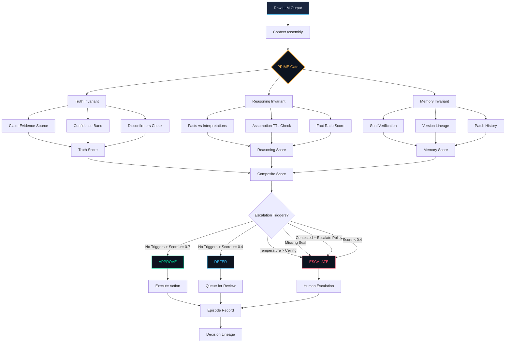
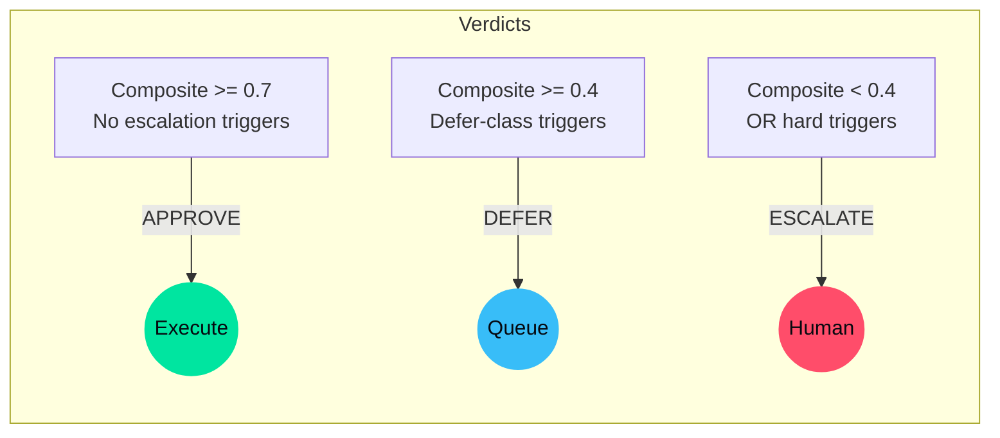
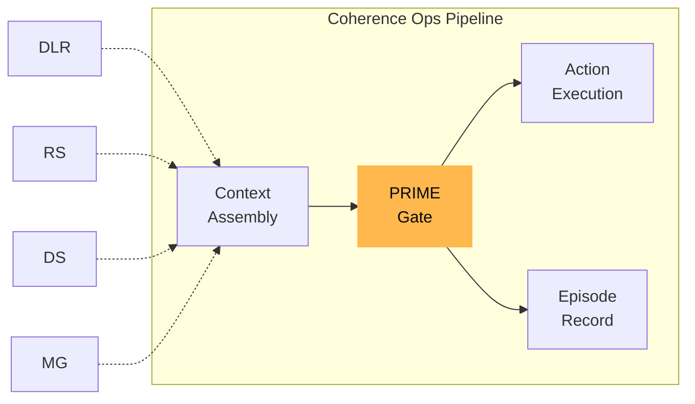

# 27 — PRIME Threshold Gate

> LLM output → PRIME gate → Decision-grade action

## Overview

The PRIME Threshold Gate sits between context assembly and action execution
in the Coherence Ops pipeline. It evaluates Truth-Reasoning-Memory invariants
and emits one of three verdicts: **APPROVE**, **DEFER**, or **ESCALATE**.

## Gate Flow

## Scoring Weights

| Component         | Weight | Source                    |
|--------------------|--------|---------------------------|
| Truth Score        | 40%    | Claim confidence + evidence ratio |
| Reasoning Score    | 30%    | Fact ratio - assumption penalty   |
| Memory Score       | 15%    | Seal + lineage + version          |
| Coherence Score    | 15%    | External coherence scorer         |

## Verdict Decision Matrix

## Hard Escalation Triggers

These bypass the composite score and force ESCALATE:

1. **Temperature breach** — System temperature exceeds configured ceiling
2. **Missing seal** — Memory seal required but absent (when `require_seal=True`)
3. **Contested claim** — Active disconfirmers present (when policy = "escalate")
4. **Expired assumptions** — Too many expired assumptions in reasoning context

## Pipeline Position

## Configuration

See `specs/prime_gate.schema.json` for the full schema.

Key config parameters:
- `approve_threshold`: Minimum composite for APPROVE (default: 0.7)
- `defer_threshold`: Minimum composite for DEFER (default: 0.4)
- `temperature_ceiling`: Max system temperature before forced ESCALATE (default: 0.8)
- `require_seal`: Whether memory seal is mandatory (default: false)
- `contested_claim_policy`: "defer" or "escalate" (default: "defer")

## Related

- [coherence_ops/prime.py](../coherence_ops/prime.py) — Implementation
- [specs/prime_gate.schema.json](../specs/prime_gate.schema.json) — JSON Schema
- [tests/test_prime.py](../tests/test_prime.py) — Unit tests
- [docs/17-prime.md](../docs/17-prime.md) — Full documentation
