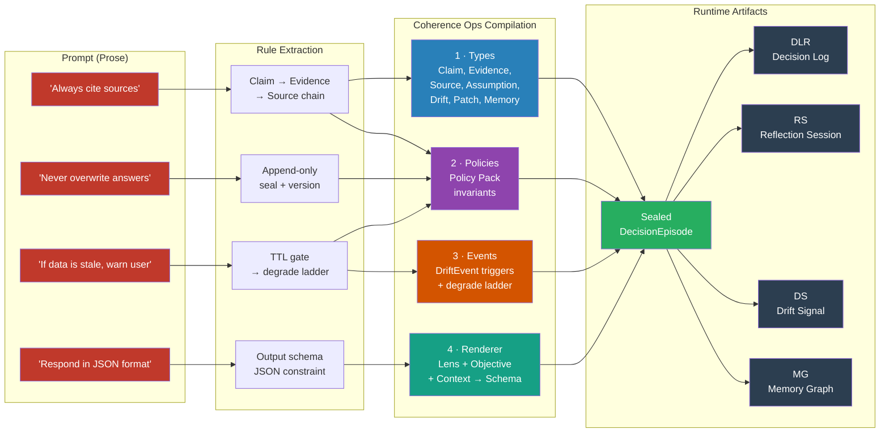
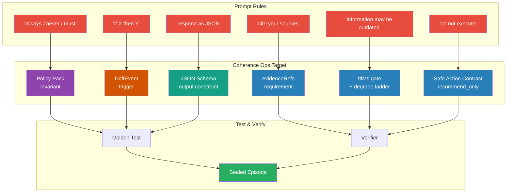

# Prompt Translation Flow

How prompt rules get compiled into Coherence Ops primitives: types, policies, events, and renderers.

```mermaid
flowchart LR
  subgraph Input["Prompt (Prose)"]
    P1["'Always cite sources'"]
    P2["'Never overwrite answers'"]
    P3["'If data is stale, warn user'"]
    P4["'Respond in JSON format'"]
  end

  subgraph Extract["Rule Extraction"]
    P1 --> R1["Claim → Evidence<br/>→ Source chain"]
    P2 --> R2["Append-only<br/>seal + version"]
    P3 --> R3["TTL gate<br/>→ degrade ladder"]
    P4 --> R4["Output schema<br/>JSON constraint"]
  end

  subgraph Compile["Coherence Ops Compilation"]
    R1 --> T["1 · Types<br/>Claim, Evidence,<br/>Source, Assumption,<br/>Drift, Patch, Memory"]
    R1 --> PO["2 · Policies<br/>Policy Pack<br/>invariants"]
    R2 --> PO
    R3 --> E["3 · Events<br/>DriftEvent triggers<br/>+ degrade ladder"]
    R3 --> PO
    R4 --> RE["4 · Renderer<br/>Lens + Objective<br/>+ Context → Schema"]
  end

  subgraph Output["Runtime Artifacts"]
    T --> EP["Sealed<br/>DecisionEpisode"]
    PO --> EP
    E --> EP
    RE --> EP
    EP --> DLR["DLR<br/>Decision Log"]
    EP --> RS["RS<br/>Reflection Session"]
    EP --> DS["DS<br/>Drift Signal"]
    EP --> MG["MG<br/>Memory Graph"]
  end

  style P1 fill:#c0392b,color:#fff
  style P2 fill:#c0392b,color:#fff
  style P3 fill:#c0392b,color:#fff
  style P4 fill:#c0392b,color:#fff
  style T fill:#2980b9,color:#fff
  style PO fill:#8e44ad,color:#fff
  style E fill:#d35400,color:#fff
  style RE fill:#16a085,color:#fff
  style EP fill:#27ae60,color:#fff
  style DLR fill:#2c3e50,color:#fff
  style RS fill:#2c3e50,color:#fff
  style DS fill:#2c3e50,color:#fff
  style MG fill:#2c3e50,color:#fff
```

## Rule-by-Rule Mapping

```mermaid
flowchart TD
  subgraph Prompt_Rules["Prompt Rules"]
    ALWAYS["'always / never / must'"]
    IF_THEN["'if X then Y'"]
    FORMAT["'respond as JSON'"]
    CITE["'cite your sources'"]
    FRESH["'information may be outdated'"]
    NO_EXEC["'do not execute'"]
  end

  subgraph Target["Coherence Ops Target"]
    PP[Policy Pack<br/>invariant]
    DE[DriftEvent<br/>trigger]
    JS[JSON Schema<br/>output constraint]
    EV[evidenceRefs<br/>requirement]
    TTL[ttlMs gate<br/>+ degrade ladder]
    SAC[Safe Action Contract<br/>recommend_only]
  end

  subgraph Verification["Test & Verify"]
    GT[Golden Test]
    VER[Verifier]
    SEAL[Sealed Episode]
  end

  ALWAYS --> PP
  IF_THEN --> DE
  FORMAT --> JS
  CITE --> EV
  FRESH --> TTL
  NO_EXEC --> SAC

  PP --> GT
  DE --> GT
  JS --> GT
  EV --> VER
  TTL --> VER
  SAC --> VER

  GT --> SEAL
  VER --> SEAL

  style ALWAYS fill:#e74c3c,color:#fff
  style IF_THEN fill:#e74c3c,color:#fff
  style FORMAT fill:#e74c3c,color:#fff
  style CITE fill:#e74c3c,color:#fff
  style FRESH fill:#e74c3c,color:#fff
  style NO_EXEC fill:#e74c3c,color:#fff
  style PP fill:#8e44ad,color:#fff
  style DE fill:#d35400,color:#fff
  style JS fill:#16a085,color:#fff
  style EV fill:#2980b9,color:#fff
  style TTL fill:#2980b9,color:#fff
  style SAC fill:#2980b9,color:#fff
  style SEAL fill:#27ae60,color:#fff
```
