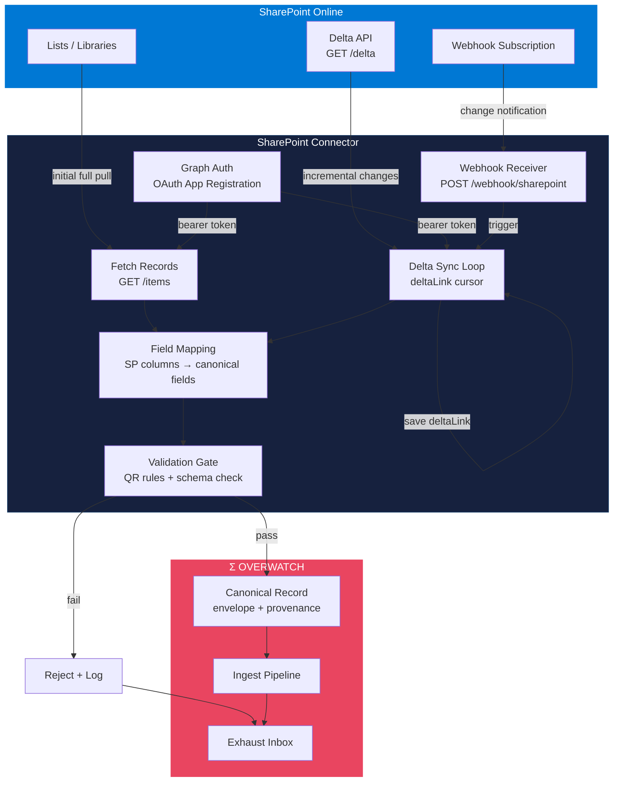

# SharePoint Connector Flow

Data extraction from SharePoint Online via Microsoft Graph API, with delta sync and webhook-driven incremental updates.

## Key Details

- **Delta Sync Loop**: Uses Microsoft Graph `/delta` endpoint with a persisted `deltaLink` cursor. Only changed items are fetched on subsequent runs.
- **Webhook Subscription**: Registered via Graph API; SharePoint sends change notifications to the connector's webhook endpoint, triggering an immediate delta sync.
- **Validation Gate**: Applies QR rules (schema, required fields, data types) before admitting records into the canonical store.
- **Rejected records** are logged to the Exhaust Inbox with failure reasons for audit.
