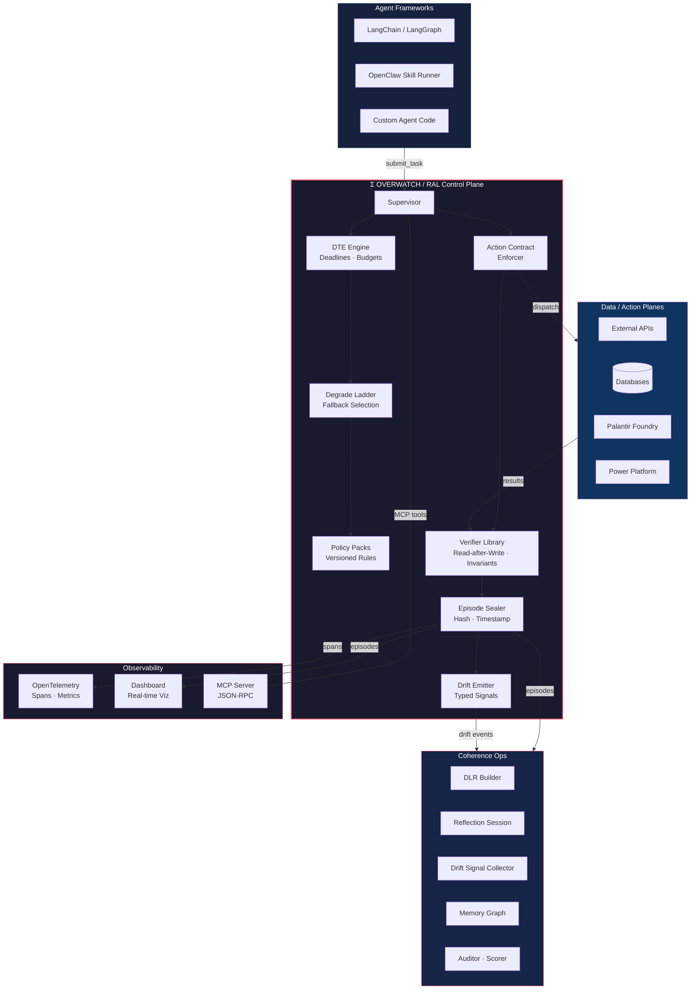

# System Architecture

High-level view of where Σ OVERWATCH / RAL sits in the agentic AI stack.

```mermaid
graph TB
    subgraph Agents["Agent Frameworks"]
        LC[LangChain / LangGraph]
        OC[OpenClaw Skill Runner]
        Custom[Custom Agent Code]
    end

    subgraph RAL["Σ OVERWATCH / RAL Control Plane"]
        direction TB
        SUP[Supervisor]
        DTE[DTE Engine<br/>Deadlines · Budgets]
        DL[Degrade Ladder<br/>Fallback Selection]
        PP[Policy Packs<br/>Versioned Rules]
        AC[Action Contract<br/>Enforcer]
        VER[Verifier Library<br/>Read-after-Write · Invariants]
        SEAL[Episode Sealer<br/>Hash · Timestamp]
        DRIFT[Drift Emitter<br/>Typed Signals]
    end

    subgraph Data["Data / Action Planes"]
        APIs[External APIs]
        DB[(Databases)]
        Foundry[Palantir Foundry]
        Power[Power Platform]
    end

    subgraph Observe["Observability"]
        OTEL[OpenTelemetry<br/>Spans · Metrics]
        DASH[Dashboard<br/>Real-time Viz]
        MCP[MCP Server<br/>JSON-RPC]
    end

    subgraph CohOps["Coherence Ops"]
        DLR[DLR Builder]
        RS[Reflection Session]
        DS[Drift Signal Collector]
        MG[Memory Graph]
        AUDIT[Auditor · Scorer]
    end

    Agents -->|submit_task| SUP
    SUP --> DTE
    DTE --> DL
    DL --> PP
    SUP --> AC
    AC --> VER
    VER --> SEAL
    SEAL --> DRIFT

    AC -->|dispatch| Data
    Data -->|results| VER

    SEAL -->|episodes| CohOps
    DRIFT -->|drift events| CohOps
    SEAL -->|spans| OTEL
    SEAL -->|episodes| DASH
    SUP ---|MCP tools| MCP

    style RAL fill:#1a1a2e,stroke:#e94560,stroke-width:2px,color:#fff
    style Agents fill:#16213e,stroke:#0f3460,stroke-width:1px,color:#fff
    style Data fill:#0f3460,stroke:#533483,stroke-width:1px,color:#fff
    style Observe fill:#1a1a2e,stroke:#e94560,stroke-width:1px,color:#fff
    style CohOps fill:#162447,stroke:#e94560,stroke-width:1px,color:#fff
```
