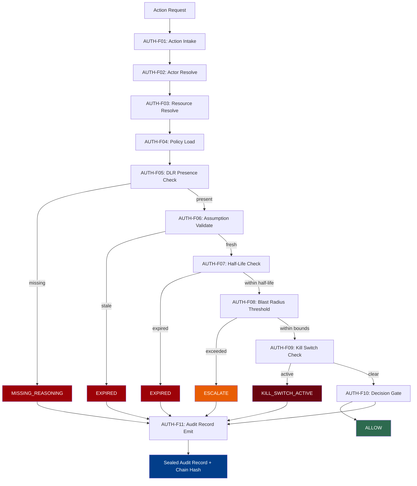

# AuthorityOps -- Architecture Overview

## Mission

Ensure every autonomous action is backed by verifiable authority, sufficient reasoning, and non-expired assumptions.

## Core Question

> Does this actor have authority to perform this action on this resource, with adequate reasoning, right now?

AuthorityOps is the cross-cutting governance layer that binds authority, action, rationale, expiry, and audit into a single evaluable control plane. It sits between reasoning and execution, enforcing that nothing runs without a complete, verifiable decision chain.

## Position in the Execution Flow

```
IntelOps --> ReOps --> AuthorityOps --> Execution --> FranOps
```

- **IntelOps** provides situational intelligence and claims.
- **ReOps** builds the reasoning artifacts (DLR, claims, half-lives).
- **AuthorityOps** evaluates whether authority exists, reasoning is sufficient, assumptions are fresh, and blast radius is within bounds.
- **Execution** proceeds only on an ALLOW verdict.
- **FranOps** measures outcomes, detects drift, and closes the governance loop.

## Objects (14)

All objects are defined in `src/core/authority/models.py` and mirrored in `src/core/schemas/authorityops.schema.json`.

| # | Object | Purpose |
|---|--------|---------|
| 1 | **Actor** | Entity requesting authority to act (agent, human, system, service) |
| 2 | **Role** | Role binding scoped to a domain with grant/expiry timestamps |
| 3 | **Authority** (AuthorityGrant) | Resolved authority grant for a specific scope with constraints |
| 4 | **Delegation** | Chain of authority from one actor to another with depth limits |
| 5 | **Action** (ActionRequest) | Action submitted for authority evaluation with blast radius tier |
| 6 | **Resource** | Governed resource targeted by an action with classification and constraints |
| 7 | **Constraint** (PolicyConstraint) | Single evaluable policy constraint (time window, blast radius, approval, etc.) |
| 8 | **DecisionGate** (DecisionGateResult) | Terminal result of the authority decision gate with verdict |
| 9 | **ApprovalPath** | Escalation/approval path for gated decisions with deadline |
| 10 | **ReasoningRequirement** | Requirements for reasoning sufficiency (DLR presence, claim count, confidence) |
| 11 | **ExpiryCondition** | Condition that can expire an authority grant (time, half-life, external event) |
| 12 | **RevocationEvent** | Event that revokes authority, delegation, role, or policy |
| 13 | **GovernanceArtifact** | Sealed governance artifact produced by AuthorityOps with hash chain |
| 14 | **AuditRecord** | Immutable audit record with hash chain, assumption snapshot, and expiry state |

## Functions (AUTH-F01 through AUTH-F12)

Each function is a handler in the `AuthorityOps` domain mode (`src/core/modes/authorityops.py`). The governance loop: intake, resolve, policy, evaluate, audit.

| Function | Name | Description |
|----------|------|-------------|
| AUTH-F01 | Action Request Intake | Validate action request fields and create evaluation context |
| AUTH-F02 | Actor Resolution | Resolve actor identity, roles, and delegation source from registry |
| AUTH-F03 | Resource Resolution | Resolve resource classification, owner, and constraints |
| AUTH-F04 | Policy Load | Load and compile applicable policy pack for the action type |
| AUTH-F05 | DLR Presence Check | Verify a Decision Log Record exists for this decision |
| AUTH-F06 | Assumption Validation | Check assumption freshness across referenced claims |
| AUTH-F07 | Half-Life Check | Check claim half-lives for authority-scoped claims |
| AUTH-F08 | Blast Radius Threshold | Compare requested blast radius against policy maximum |
| AUTH-F09 | Kill Switch Check | Check if kill-switch is active (immediate KILL_SWITCH_ACTIVE verdict) |
| AUTH-F10 | Decision Gate | Aggregate all checks and compute final AuthorityVerdict |
| AUTH-F11 | Audit Record Emit | Create append-only audit record with hash chain |
| AUTH-F12 | Delegation Chain Validate | Validate delegation chain connectivity, expiry, and depth limits |

## Events (AUTH-E01 through AUTH-E12)

Events emitted on the `authority_slice` and `drift_signal` FEEDS topics during evaluation.

| Event | Topic | Subtype | Emitted When |
|-------|-------|---------|--------------|
| AUTH-E01 | authority_slice | authority_evaluation_started | Action request intake begins |
| AUTH-E02 | authority_slice | actor_resolved / actor_unknown | Actor identity resolved or not found |
| AUTH-E03 | authority_slice | resource_resolved / resource_unknown | Resource resolved or not found |
| AUTH-E04 | authority_slice | policy_loaded / policy_missing | Policy pack loaded or not found |
| AUTH-E05 | authority_slice | dlr_present / dlr_missing | DLR found or absent for the decision |
| AUTH-E06 | drift_signal | assumptions_valid / assumptions_stale | Assumption freshness check result |
| AUTH-E07 | drift_signal | claims_fresh / claims_expired | Claim half-life expiry check result |
| AUTH-E08 | authority_slice | blast_radius_ok / blast_radius_exceeded | Blast radius within or beyond policy limit |
| AUTH-E09 | drift_signal | killswitch_clear / killswitch_active | Kill switch state check |
| AUTH-E10 | authority_slice | authority_allow / authority_block / authority_escalate | Final decision gate verdict |
| AUTH-E11 | decision_lineage | authority_audited | Audit record sealed with chain hash |
| AUTH-E12 | authority_slice | delegation_valid / delegation_broken | Delegation chain validation result |

## Interfaces

### Inbound: from IntelOps and ReOps

AuthorityOps receives:

- **Action requests** with actorId, actionType, resourceRef, blastRadiusTier, episodeId
- **Claims** from ReOps with truthType, halfLife, confidence scores
- **DLR references** linking the action to its Decision Log Record
- **Delegation data** from the authority graph

### Outbound: to Execution and FranOps

AuthorityOps emits:

- **AuthorityVerdict** (ALLOW, BLOCK, ESCALATE, EXPIRED, MISSING_REASONING, KILL_SWITCH_ACTIVE)
- **Governance artifacts** sealed with hash chain for tamper evidence
- **Audit records** with assumption snapshot, expiry state, and chain hash
- **Drift signals** for stale assumptions, expired claims, broken delegations
- **Decision lineage events** linking verdict to actor, action, resource, and policy

### Memory Graph Integration

AUTH-F10 (Decision Gate) and AUTH-F11 (Audit Record Emit) write to the Memory Graph, creating provenance nodes that answer "who authorized this, and why?"

## Architecture Diagram: 11-Step Runtime Evaluation



The pipeline short-circuits on critical failures. Every path -- allow, block, escalate, expired -- terminates with an audit record emission. Nothing passes through without being recorded.

## Module Layout

All source files live in `src/core/authority/`.

| File | Class / Functions | Purpose |
|------|-------------------|---------|
| `__init__.py` | Re-exports `AuthorityLedger`, `AuthorityEntry` | Package entry point |
| `models.py` | 15 dataclasses, 7 enums | All AuthorityOps typed models (incl. CompiledPolicy) |
| `ledger.py` | `AuthorityLedger`, `AuthorityEntry` | Hash-chained authority ledger with JSON persistence |
| `authority_graph.py` | `resolve_actor()`, `resolve_resource()`, `find_authority()` | Actor/resource resolution and authority lookup |
| `delegation_chain.py` | `validate_chain()`, `check_expiry()`, `compute_effective_scope()` | Delegation chain validation with depth and expiry checks |
| `reasoning_gate.py` | `check_dlr_presence()`, `check_assumption_freshness()`, `check_minimum_confidence()`, `check_required_truth_types()` | DLR presence, assumption freshness, confidence gate |
| `policy_compiler.py` | `compile_policy()`, `compile_from_source()`, `extract_reasoning_requirements()`, `extract_constraints()` | DLR to governance artifact compilation (OpenPQL step) |
| `policy_runtime.py` | `evaluate()` + 11 pipeline step functions | 11-step authority evaluation pipeline |
| `decision_authority_resolver.py` | `resolve()`, `check_scope_overlap()` | Effective authority intersection (actor x resource x policy) |
| `authority_audit.py` | `AuthorityAuditLog` | Hash-chained append-only audit log with query methods |
| `seal_and_hash.py` | `canonical_json()`, `compute_hash()`, `seal()`, `verify_seal()`, `verify_chain()` | Primitive 7: Cryptographic immutability foundation |
| `policy_source.py` | `PolicySource`, `build_policy_source()`, `validate_policy_source()` | Primitive 1: Validated, hashable pipeline input |
| `artifact_builder.py` | `build_artifact()`, `write_artifact()`, `load_artifact()`, `verify_artifact()` | Primitive 3: Serialize compiled policies to inspectable JSON |
| `runtime_gate.py` | `RuntimeGate`, `GateDecision` | Primitive 4: Artifact-aware evaluation gateway |
| `evidence_chain.py` | `EvidenceChain`, `EvidenceEntry` | Primitive 5: Append-only JSONL hash-chained evidence log |
| `audit_retrieval.py` | `AuditRetrieval`, `AuditAnswer` | Primitive 6: Forensic query interface over evidence chain |

### Related Files

| File | Purpose |
|------|---------|
| `src/core/modes/authorityops.py` | Domain mode wrapping all 12 function handlers |
| `src/core/schemas/authorityops.schema.json` | JSON Schema for all AuthorityOps objects |
| `src/core/schemas/authority_ledger.schema.json` | JSON Schema for the authority ledger |
| `src/core/fixtures/authority_grant_sample.json` | Sample authority grant fixture |
| `src/core/feeds/consumers/authority_gate.py` | FEEDS consumer for authority gate evaluation |
| `src/core/schemas/feeds/authority_slice.schema.json` | FEEDS authority slice event schema |

## Design Principles

1. **Fail closed.** Missing authority, missing reasoning, stale assumptions, or active kill switch all produce non-ALLOW verdicts. Nothing proceeds without explicit authorization.

2. **Short-circuit on critical failure.** The pipeline stops at the first terminal verdict (BLOCK, KILL_SWITCH_ACTIVE, MISSING_REASONING, EXPIRED) to avoid unnecessary computation.

3. **Every verdict is sealed.** ALLOW, BLOCK, ESCALATE -- every outcome produces an immutable audit record with a hash chain. Nothing is lost. Nothing is silent.

4. **Reasoning is required, not optional.** Authority without a DLR, without claims, without evidence is not authority. It is a guess.

5. **Time is a first-class constraint.** Assumptions expire. Delegations expire. Half-lives decay. Authority that was valid yesterday may not be valid today.
