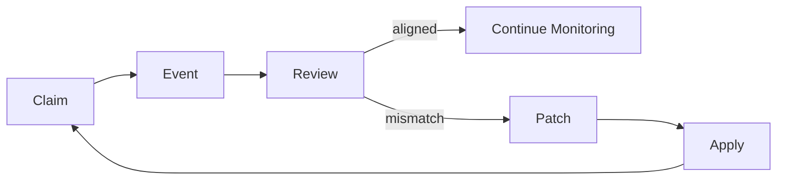

# CERPA — The Foundational Adaptation Loop

**Claim -> Event -> Review -> Patch -> Apply**

CERPA is the minimal governance primitive for DeepSigma. Every supervision
flow — across all five operational domains — follows this cycle.

## The Loop

```
  +-------+     +---------+     +--------+
  | Claim |---->|  Event  |---->| Review |
  +-------+     +---------+     +--------+
                                   |
                        +----------+----------+
                        |                     |
                    [aligned]            [mismatch]
                        |                     |
                   Continue              +-------+     +-------+
                   Monitoring            | Patch |---->| Apply |
                                         +-------+     +-------+
                                                           |
                                                    (feeds back to
                                                     next Claim)
```

## Primitives

### Claim

An asserted truth or commitment to be monitored.

- **id** — unique identifier
- **text** — the assertion in natural language
- **domain** — operational domain (intelops, reops, franops, authorityops, actionops)
- **source** — where the claim originates
- **assumptions** — conditions the claim depends on

### Event

An observable occurrence that may affect a Claim.

- **id** — unique identifier
- **text** — description of what was observed
- **observed_state** — structured state data

### Review

Evaluation of a Claim against an Event. Produces a verdict.

- **verdict** — aligned, mismatch, violation, or expired
- **drift_detected** — boolean flag
- **severity** — green, yellow, or red (when drift detected)

### Patch

Corrective action generated when a Review detects drift.

- **action** — adjust, escalate, redefine, strengthen, or expire
- **target** — the claim or system being corrected

### ApplyResult

Outcome of executing a Patch.

- **success** — whether the patch was applied
- **new_state** — the resulting system state
- **updated_claims** — claims affected by the patch

## CERPA Across Domains

Every operational domain runs the same CERPA cycle with domain-specific
claims, events, and review logic.

```mermaid
flowchart TB
    subgraph IntelOps
        I1[Claim] --> I2[Event] --> I3[Review] --> I4[Patch] --> I5[Apply]
    end
    subgraph ReOps
        R1[Claim] --> R2[Event] --> R3[Review] --> R4[Patch] --> R5[Apply]
    end
    subgraph FranOps
        F1[Claim] --> F2[Event] --> F3[Review] --> F4[Patch] --> F5[Apply]
    end
    subgraph AuthorityOps
        AU1[Claim] --> AU2[Event] --> AU3[Review] --> AU4[Patch] --> AU5[Apply]
    end
    subgraph ActionOps
        AC1[Claim] --> AC2[Event] --> AC3[Review] --> AC4[Patch] --> AC5[Apply]
    end
```



## Mapping to Existing Architecture

CERPA does not replace existing structures. It names the cycle they
already implement.

| CERPA Step | Existing Structure | Module |
|------------|-------------------|--------|
| Claim | `AtomicClaim` (canonical) | `core/primitives.py` |
| Claim | `Claim` (surface) | `core/decision_surface/models.py` |
| Claim | `Claim` (JRM) | `core/jrm/types.py` |
| Event | `Event` (surface) | `core/decision_surface/models.py` |
| Event | `JRMEvent` | `core/jrm/types.py` |
| Review | `evaluate()` | `core/decision_surface/claim_event_engine.py` |
| Review | `detect_contradictions()` | `core/decision_surface/claim_event_engine.py` |
| Review | `DriftSignalCollector.ingest()` | `core/drift_signal.py` |
| Patch | `Patch` (canonical) | `core/primitives.py` |
| Patch | `PatchRecommendation` | `core/decision_surface/models.py` |
| Patch | `PatchRecord` (JRM) | `core/jrm/types.py` |
| Apply | `build_memory_graph_update()` | `core/decision_surface/claim_event_engine.py` |
| Apply | `MemoryGraph.add_patch()` | `core/memory_graph.py` |

## Mapping to Decision Accounting

| CERPA Step | Decision Accounting Concept |
|------------|---------------------------|
| Claim | Truth assertion logged in DLR |
| Event | Observable state change |
| Review | Coherence evaluation (DLR + RS + DS + MG) |
| Patch | Governed correction (never overwrite) |
| Apply | Memory Graph update, claim refresh |

## Mapping to AI Supervision

| CERPA Step | Supervision Concept |
|------------|-------------------|
| Claim | Policy constraint on agent behavior |
| Event | Agent action or output observed |
| Review | Policy evaluation — aligned or violated |
| Patch | Control strengthening or rule update |
| Apply | Governed state updated, agent re-constrained |

## Mapping to Contract Governance

| CERPA Step | Contract Governance Concept |
|------------|---------------------------|
| Claim | Contractual commitment |
| Event | Delivery observation |
| Review | Compliance check |
| Patch | Plan adjustment or escalation |
| Apply | Updated operating condition |

## Cycle Flow



## File Layout

| File | Purpose |
|------|---------|
| `src/core/cerpa/__init__.py` | Package init and re-exports |
| `src/core/cerpa/types.py` | Enums: CerpaDomain, CerpaStatus, ReviewVerdict, PatchAction |
| `src/core/cerpa/models.py` | Dataclasses: Claim, Event, Review, Patch, ApplyResult, CerpaCycle |
| `src/core/cerpa/engine.py` | Orchestrator: `run_cerpa_cycle()` and step functions |
| `src/core/cerpa/mappers.py` | Adapters to AtomicClaim, DriftSignal, DLR, etc. |
| `src/core/examples/cerpa_contract_demo.py` | Contract delivery demo |
| `src/core/examples/cerpa_agent_supervision_demo.py` | AI agent supervision demo |
| `tests/test_cerpa_models.py` | Model construction tests |
| `tests/test_cerpa_engine.py` | Engine and cycle tests |
| `tests/test_cerpa_mappers.py` | Mapper round-trip tests |
| `tests/test_cerpa_contract_demo.py` | Demo validation tests |
| `docs/architecture/cerpa.md` | This document |
