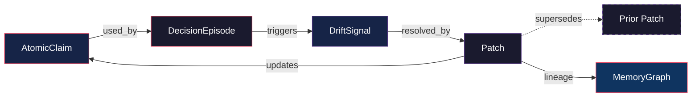

# Core Primitives — Architecture Overview

Deep Sigma enforces a **five-primitive model**: CLAIM, EVENT, REVIEW, PATCH, APPLY. Every object in the system is one of these five types, a subtype, metadata, a derived view, or orchestration. No sixth primitive may be introduced.

See [five-primitive-rule.md](five-primitive-rule.md) for enforcement details, CI guard, and envelope wrapping.

## Five-Primitive Enforcement

| Enforcement Layer | Module |
|---|---|
| `PrimitiveType` enum (exactly 5 members) | `src/core/primitives.py` |
| `ALLOWED_PRIMITIVE_TYPES` frozenset | `src/core/primitives.py` |
| `PrimitiveEnvelope` canonical wrapper | `src/core/primitive_envelope.py` |
| Explicit record types per primitive | `src/core/primitive_records.py` |
| Coherence loop orchestrator | `src/core/coherence_loop.py` |
| Memory Graph mapping | `src/core/primitive_mg.py` |
| CI guard (10 checks) | `scripts/validate_five_primitives.py` |
| JSON Schema | `src/core/schemas/primitives/primitive_envelope.schema.json` |

## Design Principles

1. **Additive, not replacing** — existing domain models remain untouched
2. **Schema-first** — JSON schemas define the contract; Python dataclasses implement
3. **Never overwrite** — patches supersede; claims are retracted, not deleted
4. **Deterministic sealing** — SHA-256 hashing for tamper detection
5. **No sixth type** — CI guard enforces exactly five primitives

## Domain-Specific Implementations

Four archival dataclasses implement domain-specific aspects of the five-primitive model:

### AtomicClaim → CLAIM

The indivisible unit of asserted truth. Every higher-order structure is composed of or references claims.

- **ID pattern**: `CLAIM-YYYY-NNNN`
- **Epistemic types**: observation, inference, assumption, forecast, norm, constraint
- **Lifecycle**: active → expired | superseded | disputed | retracted
- **Confidence**: 0.00–1.00 machine-comparable score
- **Expiry**: optional `expires_at` timestamp; `is_expired()` helper

### DecisionEpisode → EVENT (orchestration container)

Captures the full decision lifecycle from goal through outcome, referencing claims.

- **Lifecycle**: pending → active → sealed → archived (or frozen)
- **Options**: available choices with selected/rejected tracking
- **Blast radius**: scope of potential impact
- **Kill switches**: named stops that can halt execution
- **Lineage**: parent/child decision references

### DriftSignal → EVENT (drift detection)

Divergence between expected and observed state. Links a DecisionEpisode to the corrective action that follows.

- **Trigger**: what caused the drift (half_life_expiry, contradiction, etc.)
- **Severity**: green / yellow / red (traffic-light model)
- **Lifecycle**: detected → acknowledged → resolved | escalated | suppressed
- **State comparison**: `expected_state` vs `observed_state`

### Patch → PATCH

Append-only correction resolving a drift signal. Patches never overwrite prior state — they supersede, creating an immutable lineage chain.

- **Lifecycle**: proposed → approved → applied (or rejected | superseded)
- **Supersedes**: list of prior patch IDs this one replaces
- **Lineage**: revision tracking and drift reference

## Relationships

Patch updates lineage and does not overwrite prior state.

## Coexistence with Existing Models

These canonical primitives are reference definitions. Existing domain-specific models remain in place and are not replaced.

| Canonical Primitive | Existing Domain Model | Module | Relationship |
|---|---|---|---|
| AtomicClaim | `Claim` (surface layer) | `decision_surface/models.py` | Simplified evaluation view — no provenance, no expiry |
| AtomicClaim | `Claim` (JRM) | `jrm/types.py` | Extraction-focused — tied to source events |
| AtomicClaim | `claim.schema.json` | `schemas/` | Full canonical JSON — superset of AtomicClaim fields |
| DecisionEpisode | `episode.schema.json` | `schemas/` | Execution-focused — DTE, telemetry, verification |
| DecisionEpisode | `EpisodeState` | `episode_state.py` | State machine — same status values |
| DecisionEpisode | `DLREntry` / `ClaimNativeDLREntry` | `decision_log.py` | Post-seal record — derived from episodes |
| DriftSignal | `DriftSignalCollector` | `drift_signal.py` | Aggregation layer — buckets and summaries |
| DriftSignal | `DriftDetection` | `jrm/types.py` | JRM-specific — tied to pipeline fingerprints |
| DriftSignal | `drift.schema.json` | `schemas/` | Runtime drift events — episode-scoped |
| Patch | `PatchRecord` | `jrm/types.py` | JRM-specific — revision tracking, never-overwrite |
| Patch | `PatchRecommendation` | `decision_surface/models.py` | Surface layer — recommendation only |
| Patch | `TensionPatch` | `paradox_ops/models.py` | Paradox-specific — tension remediation |

## File Layout

| File | Purpose |
|---|---|
| `src/core/primitives.py` | PrimitiveType enum, archival dataclasses, status enums |
| `src/core/primitive_envelope.py` | PrimitiveEnvelope wrapper, wrap/validate/supersede |
| `src/core/primitive_records.py` | Explicit record types (ClaimRecord, EventRecord, etc.) |
| `src/core/coherence_loop.py` | Coherence loop orchestrator wrapping CERPA |
| `src/core/primitive_mg.py` | Memory Graph node/edge mapping |
| `src/core/schemas/primitives/*.schema.json` | JSON Schema contracts (5 files) |
| `src/core/fixtures/primitives/*.json` | Example payloads (4 files) |
| `scripts/validate_five_primitives.py` | CI guard (10 checks) |
| `tests/test_primitives.py` | Unit and lifecycle tests |
| `tests/test_primitive_envelope.py` | Envelope wrapping tests |
| `tests/test_primitive_records.py` | Record type tests |
| `tests/test_coherence_loop.py` | Coherence loop tests |
| `tests/test_primitive_mg.py` | MG mapping tests |
| `tests/test_five_primitives.py` | CI guard tests |
| `docs/architecture/core_primitives.md` | This document |
| `docs/architecture/five-primitive-rule.md` | Enforcement rule details |
