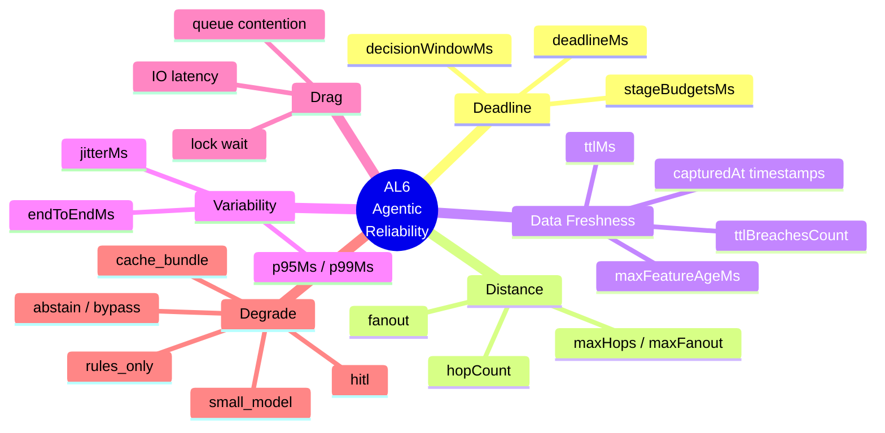
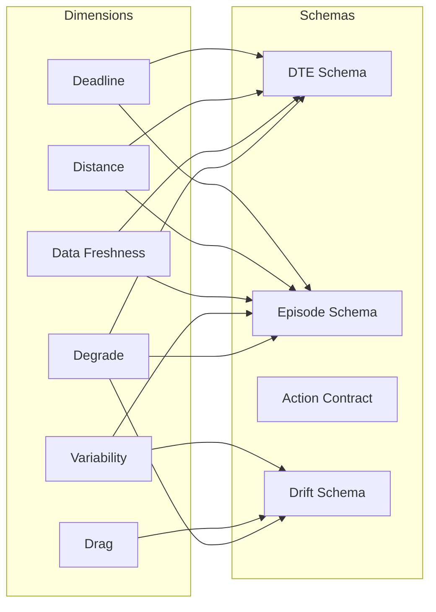

# AL6 — Six Dimensions of Agentic Reliability

The AL6 model defines six dimensions that determine whether an agentic
system is production-safe. Each maps to specific RAL mechanisms.

## Dimension to Schema Mapping

