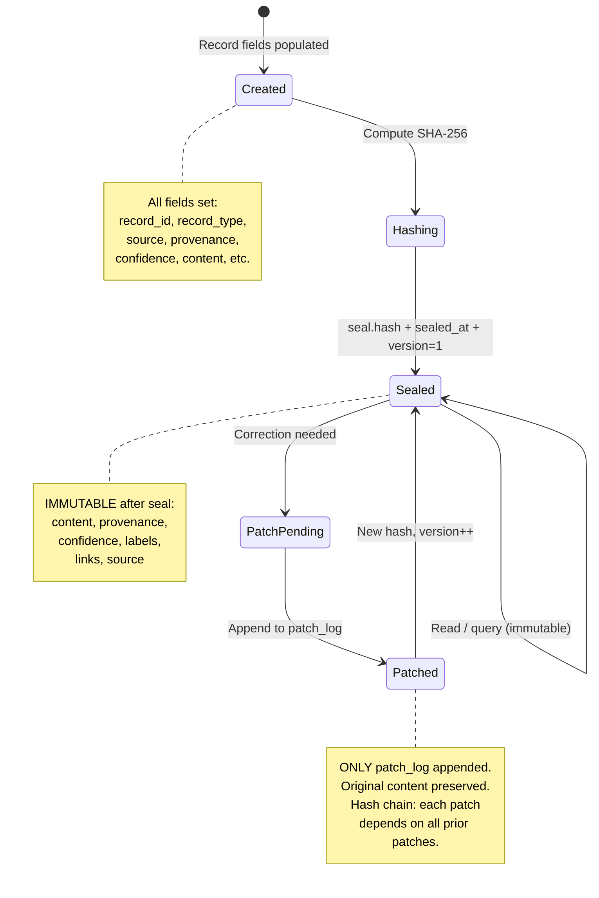

# 14 — Seal and Patch Lifecycle

State diagram showing how records move from creation to sealing, and how patches work.

```mermaid
stateDiagram-v2
    [*] --> Created: Record fields populated
    Created --> Hashing: Compute SHA-256
    Hashing --> Sealed: seal.hash + sealed_at + version=1
    Sealed --> Sealed: Read / query (immutable)
    Sealed --> PatchPending: Correction needed
    PatchPending --> Patched: Append to patch_log
    Patched --> Sealed: New hash, version++

    note right of Created
        All fields set:
        record_id, record_type,
        source, provenance,
        confidence, content, etc.
    end note

    note right of Sealed
        IMMUTABLE after seal:
        content, provenance,
        confidence, labels,
        links, source
    end note

    note right of Patched
        ONLY patch_log appended.
        Original content preserved.
        Hash chain: each patch
        depends on all prior patches.
    end note
```

## Seal vs. Supersede decision tree

```mermaid
flowchart TD
    START["Record needs updating"] --> Q1{"Minor correction?<br/>(confidence, metadata)"}
    Q1 -->|Yes| PATCH["Append to patch_log<br/>Same record_id<br/>version++"]
    Q1 -->|No| Q2{"Major revision?<br/>(new policy version,<br/>new entity snapshot)"}
    Q2 -->|Yes| SUPER["Create NEW record<br/>New record_id<br/>Link: supersedes old"]
    Q2 -->|No| Q3{"Content mutation<br/>required?"}
    Q3 -->|Yes| SUPER
    Q3 -->|No| PATCH

    PATCH --> DONE["Record updated<br/>patch_log grows"]
    SUPER --> DONE2["New record sealed<br/>Old record unchanged"]

    style START fill:#533483,stroke:#e94560
    style PATCH fill:#0f3460,stroke:#e94560
    style SUPER fill:#16213e,stroke:#e94560
```
