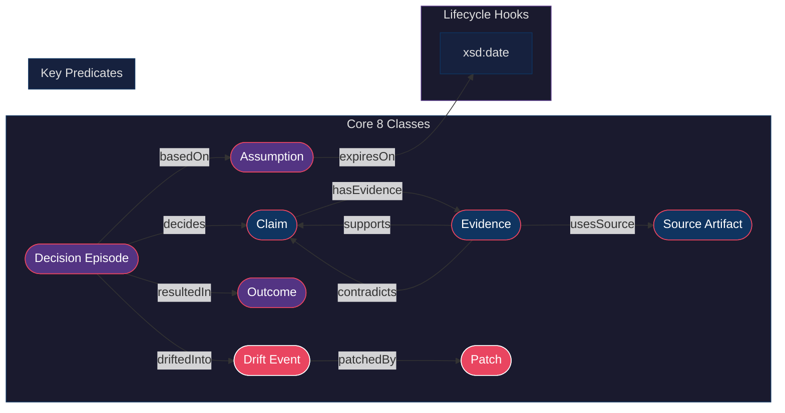

# 23 — Core 8 Ontology Graph

> Source: `rdf/ontology/coherence_ops_core.ttl`

## Reading the Diagram

| Colour | Meaning |
|--------|---------|
| Blue nodes | Evidence chain (Claim, Evidence, Source Artifact) |
| Purple nodes | Decision chain (Decision Episode, Assumption, Outcome) |
| Red nodes | Drift chain (Drift Event, Patch) |
| Labelled edges | OWL Object Properties from `coherence_ops_core.ttl` |

## See Also

- [rdf/ontology/coherence_ops_core.ttl](../rdf/ontology/coherence_ops_core.ttl)
- [rdf/ontology/coherence_ops_extended.ttl](../rdf/ontology/coherence_ops_extended.ttl)
- [05 — Drift to Patch](05-drift-to-patch.md)
- [21 — Coherence Ops Alignment](21-coherence-ops-alignment.md)
