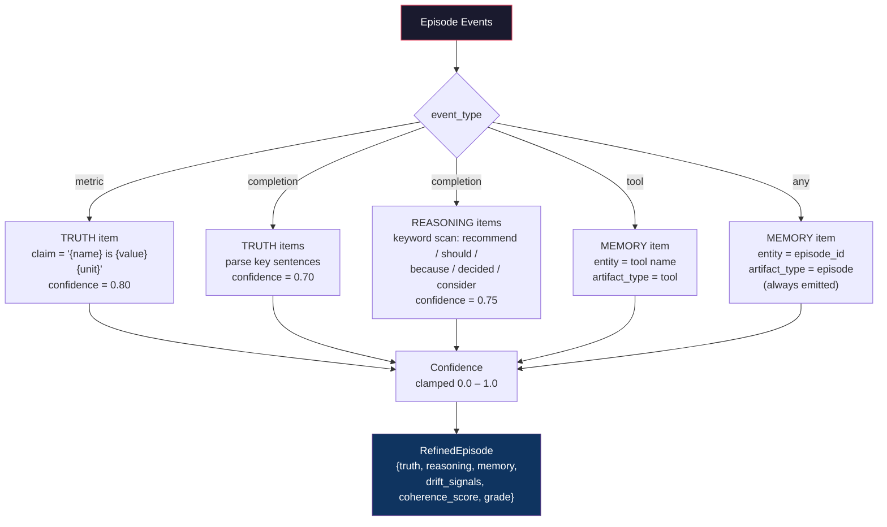
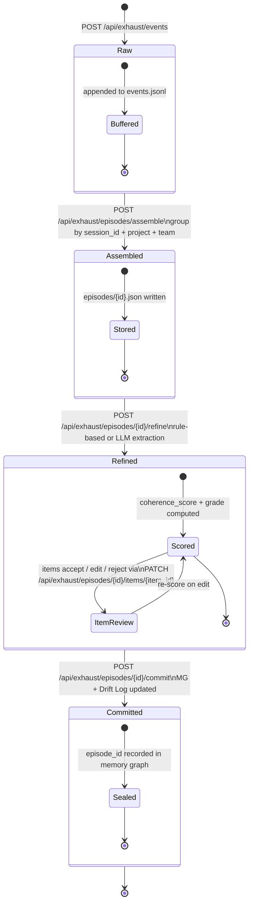

# Exhaust Inbox Pipeline

Full architecture of the Exhaust Inbox — from adapter emission through bucket extraction to Coherence Ops.

```mermaid
graph TB
    subgraph Adapters["Adapters (Build 29)"]
        LC[LangChain Callback<br/>on_llm_start / on_llm_end]
        AZ[Azure OpenAI Adapter<br/>Batch JSONL]
        AN[Anthropic Adapter<br/>Messages API JSONL]
        MN[Manual / REST<br/>POST /api/exhaust/events]
    end

    subgraph Inbox["Exhaust Inbox API"]
        EVT[Event Store<br/>events.jsonl]
        LC -->|POST /events| EVT
        AZ -->|POST /events| EVT
        AN -->|POST /events| EVT
        MN --> EVT
        EVT --> ASM[Episode Assembler<br/>group by session_id]
        ASM --> EP[Episode Store<br/>episodes/{id}.json]
    end

    subgraph Refiner["Refiner — POST /episodes/{id}/refine"]
        EP --> RF{EXHAUST_USE_LLM?}
        RF -->|"= 1 + ANTHROPIC_API_KEY set"| LLM[LLM Extraction<br/>claude-haiku-4-5-20251001]
        RF -->|"= 0 (default)"| RB[Rule-Based Extraction<br/>keyword + pattern matching]
        LLM -->|fallback on any error| RB
        LLM --> BKT
        RB --> BKT
        BKT[Buckets<br/>TRUTH · REASONING · MEMORY]
        BKT --> DRIFT[Drift Detector<br/>contradiction / stale_reference /<br/>missing_policy / low_coverage]
        DRIFT --> SCORE[Coherence Scorer<br/>0–100 · Grade A–F]
        SCORE --> REF[Refined Episode<br/>refined/{id}.json]
    end

    subgraph Commit["POST /episodes/{id}/commit"]
        REF --> CMT[Commit Handler]
        CMT --> MG[Memory Graph<br/>mg/memory_graph.jsonl]
        CMT --> DRF[Drift Log<br/>drift/drift.jsonl]
        CMT --> COH[Coherence Ops<br/>DLR · RS · DS · MG]
    end

    style Adapters fill:#1a1a2e,stroke:#e94560,color:#fff
    style Inbox fill:#16213e,stroke:#0f3460,color:#fff
    style Refiner fill:#162447,stroke:#e94560,color:#fff
    style Commit fill:#0f3460,stroke:#533483,color:#fff
```

## Bucket Extraction Detail

How events are mapped into TRUTH, REASONING, and MEMORY items.



## Episode State Machine


