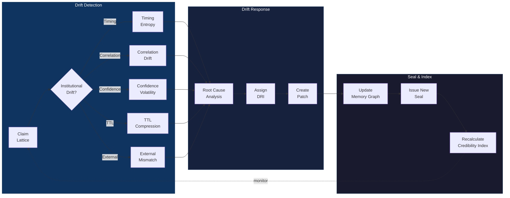

# 39 — Institutional Drift Loop

> Institutional-scale Drift → Root Cause → Patch → Memory Graph Update → Seal → Credibility Index recalculation.

```mermaid
graph LR
    subgraph Detection["Drift Detection"]
        LATTICE[Claim<br/>Lattice] --> DETECT{Institutional<br/>Drift?}
        DETECT -->|Timing| TE[Timing<br/>Entropy]
        DETECT -->|Correlation| CD[Correlation<br/>Drift]
        DETECT -->|Confidence| CV[Confidence<br/>Volatility]
        DETECT -->|TTL| TC[TTL<br/>Compression]
        DETECT -->|External| EM[External<br/>Mismatch]
    end

    subgraph Response["Drift Response"]
        TE --> RC[Root Cause<br/>Analysis]
        CD --> RC
        CV --> RC
        TC --> RC
        EM --> RC
        RC --> DRI[Assign<br/>DRI]
        DRI --> PATCH[Create<br/>Patch]
    end

    subgraph Repair["Seal & Index"]
        PATCH --> MG[Update<br/>Memory Graph]
        MG --> SEAL[Issue New<br/>Seal]
        SEAL --> IDX[Recalculate<br/>Credibility Index]
        IDX -.->|monitor| LATTICE
    end

    style Detection fill:#0f3460,stroke:#0f3460,color:#fff
    style Response fill:#16213e,stroke:#0f3460,color:#fff
    style Repair fill:#1a1a2e,stroke:#0f3460,color:#fff
```
