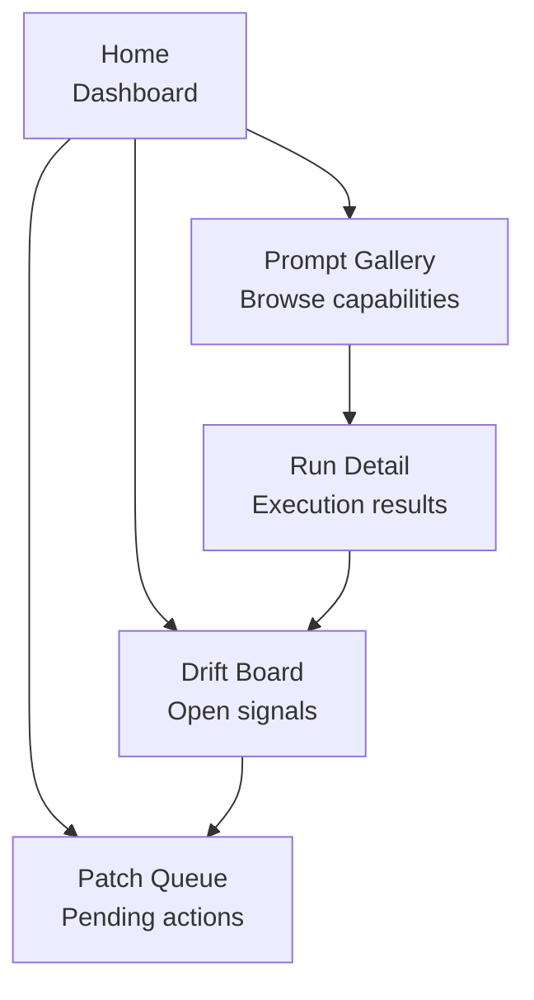

# Power Apps Screen Map

> 5-screen canvas app for managing MDPT prompt runs, drift signals, and patches.

---

## App Overview

The MDPT Power App provides a mobile-friendly interface for teams to browse prompt capabilities, review run results, monitor drift, and manage patches — all backed by the three SharePoint lists.

---

## Screen Navigation



---

## Screen 1: Home (Dashboard)

**Purpose:** At-a-glance governance health.

| Component | Type | Data Source |
|-----------|------|-------------|
| Runs this week | Label (count) | PromptRuns (filter: last 7 days) |
| Open drifts | Label (count) | DriftPatches (filter: Status != Closed) |
| Critical patches | Label (count, red) | DriftPatches (filter: Severity = CRITICAL) |
| Drift rate | Label (%) | Calculated: drifts / total rows analyzed |
| Recent runs | Gallery (top 5) | PromptRuns (sort: Run_Timestamp desc) |
| Quick actions | Buttons | "New Run", "View Drift Board", "Patch Queue" |

---

## Screen 2: Prompt Gallery

**Purpose:** Browse and launch prompt capabilities.

| Component | Type | Data Source |
|-----------|------|-------------|
| Filter bar | Dropdown × 2 | Lens (6 choices), Operation (3 choices) |
| Capability cards | Gallery | PromptCapabilities (filtered by Lens + Operation) |
| Card fields | Labels | Title, Description, Target_Tables, Risk_Lane |
| Run count | Label | Count of PromptRuns linked to this capability |
| Launch button | Button | Navigates to "New Run" form |

**Card layout:**

```
┌──────────────────────────────┐
│ [Lens badge]  [Risk badge]   │
│ Title                        │
│ Description (2 lines)        │
│ Tables: tblClaims, tblDLR    │
│ Runs: 12    [Launch →]       │
└──────────────────────────────┘
```

---

## Screen 3: Run Detail

**Purpose:** View results of a specific prompt run.

| Component | Type | Data Source |
|-----------|------|-------------|
| Header | Labels | Run_ID, Capability name, User, Timestamp |
| Platform | Label | LLM_Platform |
| Findings | Rich text | Findings_Summary |
| Stats bar | Labels | Rows_Analyzed, Actions_Proposed, Writeback_Rows |
| Drift indicator | Icon + label | Drift_Detected (green check / red warning) |
| Related patches | Gallery | DriftPatches (filter: Run_Ref = this run) |

---

## Screen 4: Drift Board

**Purpose:** Monitor all open drift signals.

| Component | Type | Data Source |
|-----------|------|-------------|
| Severity filter | Toggle buttons | CRITICAL, HIGH, MEDIUM, LOW, All |
| Drift cards | Gallery | DriftPatches (filter: Status = Open or In_Progress) |
| Card fields | Labels | Patch_ID, Title, Severity, Source_Table, Source_Row_ID |
| Age indicator | Label (calculated) | Days since Date_Opened |
| SLA status | Icon | Green (within SLA), Red (breached) |
| Assign button | Button | Opens person picker → updates Assigned_To |

**Sort:** Severity desc, then Date_Opened asc (oldest first).

---

## Screen 5: Patch Queue

**Purpose:** Manage patches through the approval lifecycle.

| Component | Type | Data Source |
|-----------|------|-------------|
| Status tabs | Tab control | Open, In_Progress, Approved, Closed |
| Patch cards | Gallery | DriftPatches (filtered by Status tab) |
| Card fields | Labels | Patch_ID, Proposed_Action, Assigned_To, Expected_CI_Impact |
| Action buttons | Buttons | "Start Work" (→ In_Progress), "Submit for Approval", "Close" |
| Resolution form | Text input | Resolution_Notes (shown on Close action) |
| Timeline | Gallery | Version history of this DriftPatches item |

---

## Data Bindings

| Screen | Primary Source | Secondary Source |
|--------|---------------|------------------|
| Home | PromptRuns | DriftPatches |
| Prompt Gallery | PromptCapabilities | PromptRuns (count) |
| Run Detail | PromptRuns | DriftPatches (related) |
| Drift Board | DriftPatches | — |
| Patch Queue | DriftPatches | — |

---

## Responsive Layout

- **Desktop/tablet:** 2-column layout (sidebar nav + content)
- **Mobile:** Single column with bottom nav bar
- **Min width:** 320px (phone)

---

## See Also

- [Power Automate Flows](POWER_AUTOMATE_FLOWS.md)
- [PromptCapabilities Build Sheet](SHAREPOINT_LIST_BUILD_SHEET_PromptCapabilities.md)
- [PromptRuns Build Sheet](SHAREPOINT_LIST_BUILD_SHEET_PromptRuns.md)
- [DriftPatches Build Sheet](SHAREPOINT_LIST_BUILD_SHEET_DriftPatches.md)
- [MDPT Governance](GOVERNANCE.md)
