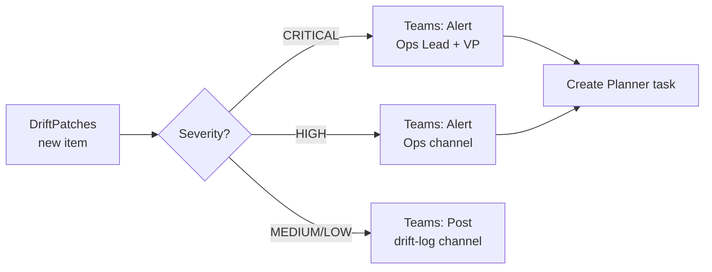
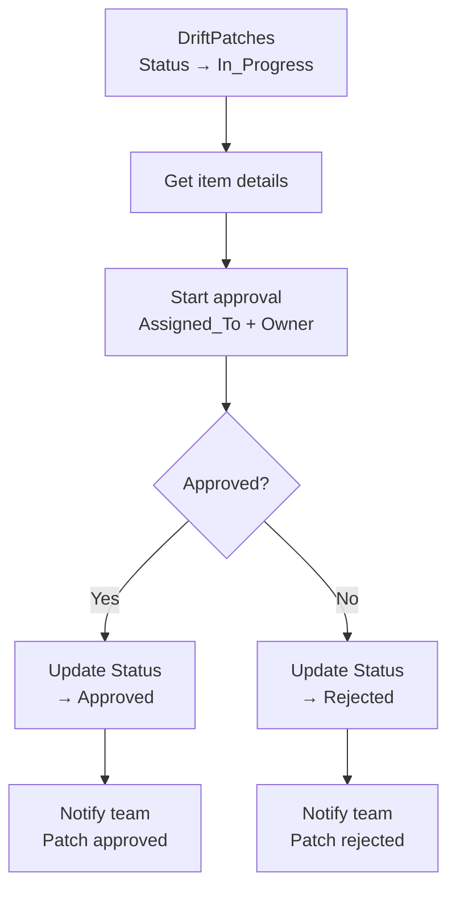
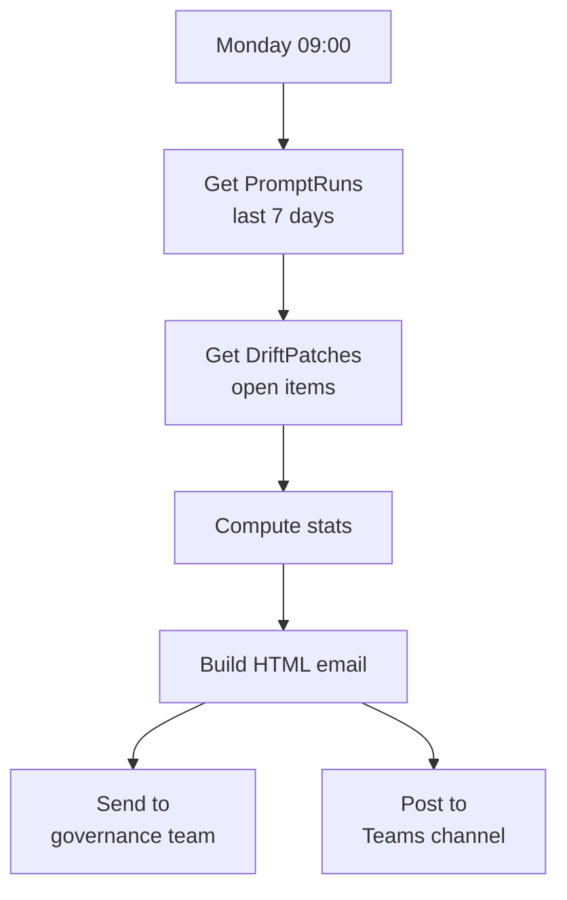
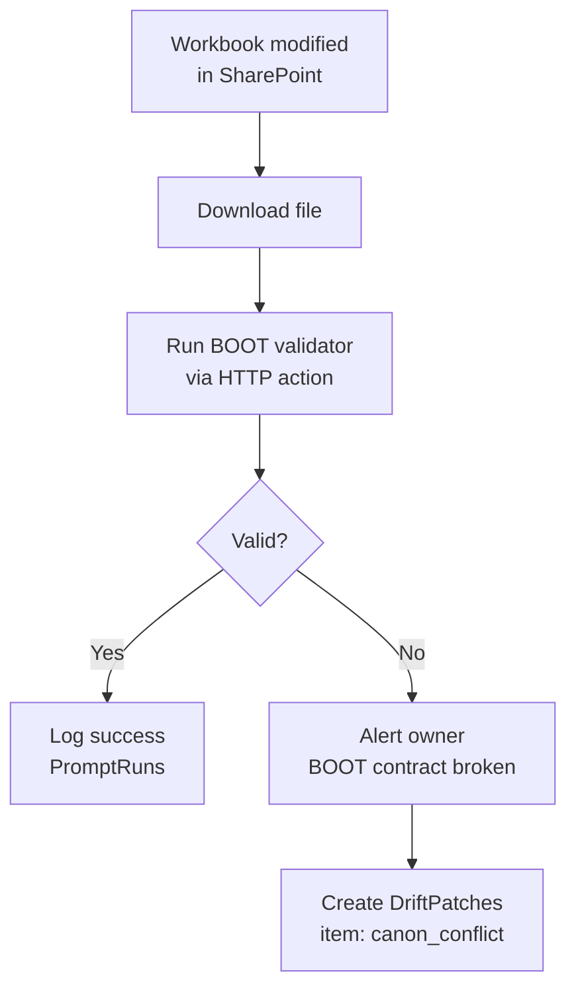

# Power Automate Flow Recipes

> Four ready-to-build flows that automate the MDPT governance lifecycle.

---

## Overview

These flows connect the SharePoint lists (PromptCapabilities, PromptRuns, DriftPatches) to Teams, email, and the governed workbook. All flows use standard Power Automate connectors — no premium licenses required for SharePoint + Teams + Outlook.

---

## Flow 1: Drift Alert

**Trigger:** When a new item is created in DriftPatches.

**Steps:**

1. Trigger: SharePoint → When an item is created (DriftPatches list)
2. Condition: Check Severity column
3. CRITICAL/HIGH: Post adaptive card to Ops Lead and/or VP via Teams
4. MEDIUM/LOW: Post summary to #drift-log Teams channel
5. CRITICAL/HIGH: Create Planner task with due date = SLA target

---

## Flow 2: Patch Approval

**Trigger:** When DriftPatches item Status changes to In_Progress.

**Steps:**

1. Trigger: SharePoint → When an existing item is modified (DriftPatches, Status = In_Progress)
2. Get item: Retrieve full details including Proposed_Action and Root_Cause
3. Start approval: Power Automate approval sent to Assigned_To
4. If approved: Update Status → Approved, notify #patches channel
5. If rejected: Update Status → Rejected, add Resolution_Notes

---

## Flow 3: Weekly Digest

**Trigger:** Recurrence — every Monday at 09:00.

**Steps:**

1. Trigger: Recurrence (weekly)
2. Get items: PromptRuns where Run_Timestamp >= 7 days ago
3. Get items: DriftPatches where Status != Closed AND Status != Rejected
4. Compose: Calculate totals (runs, drifts detected, patches open/closed, avg drift rate)
5. Send email: HTML summary to governance distribution list
6. Post to Teams: Summary card in #weekly-governance channel

**Digest fields:**

| Metric | Source |
|--------|--------|
| Total runs this week | PromptRuns count |
| Drifts detected | PromptRuns where Drift_Detected = Yes |
| Open patches | DriftPatches where Status = Open |
| Patches closed | DriftPatches closed this week |
| Avg drift rate | Sum(Drift_Count) / Sum(Rows_Analyzed) |
| Top drift type | Mode of DriftPatches.Drift_Type |

---

## Flow 4: Workbook Refresh Validator

**Trigger:** When the governed workbook file is modified in SharePoint.

**Steps:**

1. Trigger: SharePoint → When a file is modified (document library, specific workbook)
2. Get file content: Download the .xlsx
3. HTTP action: Call a validation endpoint (Azure Function or Power Automate HTTP) that runs the BOOT validator logic
4. If valid: Log a "refresh validated" entry in PromptRuns
5. If invalid: Post Teams alert to workbook owner, create DriftPatches item with Drift_Type = canon_conflict

**Note:** The validation logic mirrors `tools/validate_workbook_boot.py`. For teams without Azure Functions, implement as a Power Automate Desktop flow that runs the Python script locally.

---

## Connector Requirements

| Connector | License | Used In |
|-----------|---------|---------|
| SharePoint | Standard | All flows |
| Microsoft Teams | Standard | Flows 1, 2, 3 |
| Outlook | Standard | Flow 3 |
| Approvals | Standard | Flow 2 |
| Planner | Standard | Flow 1 |
| HTTP | Premium (optional) | Flow 4 |

---

## See Also

- [PromptCapabilities Build Sheet](SHAREPOINT_LIST_BUILD_SHEET_PromptCapabilities.md)
- [PromptRuns Build Sheet](SHAREPOINT_LIST_BUILD_SHEET_PromptRuns.md)
- [DriftPatches Build Sheet](SHAREPOINT_LIST_BUILD_SHEET_DriftPatches.md)
- [Power Apps Screen Map](POWER_APPS_SCREEN_MAP.md)
- [MDPT Governance](GOVERNANCE.md)
