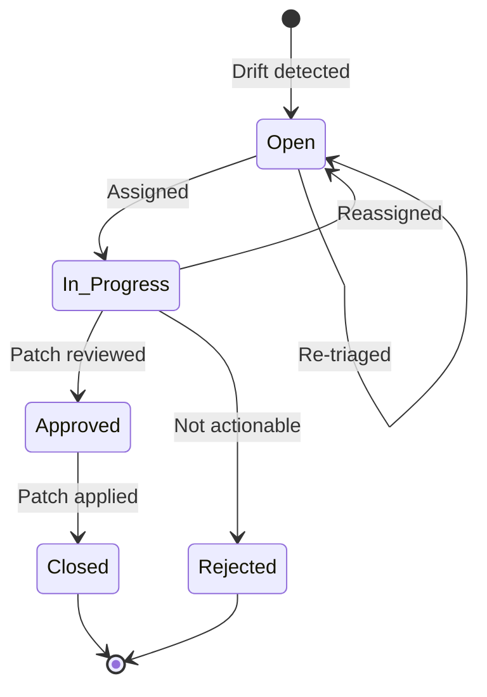

# SharePoint List Build Sheet — DriftPatches

> Tracks every drift signal and its resolution through the patch lifecycle.

---

## Purpose

The **DriftPatches** list is the Power Platform equivalent of `tblPatchLog` in the Excel workbook. Every drift signal detected by a prompt run creates a row here. The row tracks the drift through triage, patch proposal, approval, and resolution.

---

## List Settings

| Setting | Value |
|---------|-------|
| List name | DriftPatches |
| Content type | Custom: DriftPatch |
| Versioning | Major versions enabled |
| Require approval | Yes (for status changes to Closed) |
| Item-level permissions | Read all, Edit: owner + members |

---

## Column Schema

| Column | Type | Required | Description |
|--------|------|----------|-------------|
| Title | Single line of text | Yes | Brief drift description |
| Patch_ID | Single line of text | Yes | Unique ID (e.g., "PAT-20260219-001") |
| Run_Ref | Lookup | Yes | FK → PromptRuns.Run_ID |
| Drift_Type | Choice | Yes | freshness, bypass, verify, outcome, canon_conflict |
| Severity | Choice | Yes | LOW, MEDIUM, HIGH, CRITICAL |
| Source_Table | Choice | Yes | tblTimeline, tblDeliverables, tblDLR, tblClaims, tblAssumptions, tblPatchLog, tblCanonGuardrails |
| Source_Row_ID | Single line of text | Yes | Row ID in source table (e.g., "ASM-005") |
| Decision_Ref | Single line of text | No | Related Decision ID (e.g., "DEC-005") |
| Root_Cause | Multiple lines of text | Yes | What caused the drift |
| Proposed_Action | Multiple lines of text | Yes | Recommended fix |
| Canon_Check | Single line of text | No | Guardrail ID + PASS/FAIL |
| Expected_CI_Impact | Single line of text | No | Expected coherence score change |
| Assigned_To | Person or Group | No | Who will resolve this |
| Status | Choice | Yes | Open, In_Progress, Approved, Closed, Rejected |
| Date_Opened | Date and Time | Yes | When drift was detected |
| Date_Closed | Date and Time | No | When patch was resolved |
| Resolution_Notes | Multiple lines of text | No | How it was actually resolved |

---

## Status Flow

---

## Default Views

### Open Patches (default)

Filter: `Status ne 'Closed' AND Status ne 'Rejected'`. Sorted by Severity (CRITICAL first), then Date_Opened.

### By Severity

Grouped by Severity column. Color-coded: CRITICAL=red, HIGH=orange, MEDIUM=yellow, LOW=green.

### My Patches

Filter: `Assigned_To eq [Me]`. Personal queue.

### Closed (Archive)

Filter: `Status eq 'Closed' OR Status eq 'Rejected'`. Sorted by Date_Closed descending.

---

## SLA Targets

| Severity | Triage SLA | Resolution SLA |
|----------|-----------|----------------|
| CRITICAL | 4 hours | 24 hours |
| HIGH | 24 hours | 3 days |
| MEDIUM | 3 days | 7 days |
| LOW | 7 days | 14 days |

---

## Automation Hooks

| Trigger | Action |
|---------|--------|
| New item created | Power Automate → Teams notification to drift channel |
| Severity = CRITICAL | Power Automate → immediate alert to Ops Lead + VP |
| SLA breach (triage) | Power Automate → escalation email |
| Status → Closed | Power Automate → update PromptRuns.Drift_Count |

---

## See Also

- [PromptCapabilities Build Sheet](SHAREPOINT_LIST_BUILD_SHEET_PromptCapabilities.md)
- [PromptRuns Build Sheet](SHAREPOINT_LIST_BUILD_SHEET_PromptRuns.md)
- [Power Automate Flows](POWER_AUTOMATE_FLOWS.md)
