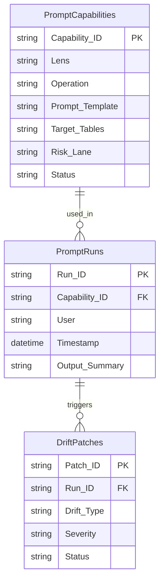

# SharePoint List Build Sheet — PromptCapabilities

> Master registry of all prompt capabilities available to the MDPT workbook.

---

## Purpose

The **PromptCapabilities** list stores the 18 prompt patterns (6 lenses x 3 operations) plus any custom prompts added by the team. Each row defines what the prompt does, which lens and operation it belongs to, and its governance constraints.

---

## List Settings

| Setting | Value |
|---------|-------|
| List name | PromptCapabilities |
| Content type | Custom: PromptCapability |
| Versioning | Major versions enabled |
| Require approval | No |
| Item-level permissions | Read all, Create all |

---

## Column Schema

| Column | Type | Required | Description |
|--------|------|----------|-------------|
| Title | Single line of text | Yes | Short prompt name (e.g., "PRIME-IntelOps") |
| Capability_ID | Single line of text | Yes | Unique ID (e.g., "CAP-PRIME-INTEL-001") |
| Lens | Choice | Yes | PRIME, EXEC, OPS, AI-TECH, HUMAN, ICON |
| Operation | Choice | Yes | IntelOps, ReOps, FranOps |
| Prompt_Template | Multiple lines of text | Yes | The prompt text template |
| Description | Multiple lines of text | No | What this prompt does |
| Target_Tables | Multiple lines of text | Yes | Comma-separated table names to scan (e.g., "tblClaims, tblAssumptions") |
| Output_Format | Choice | Yes | Table, Narrative, Checklist, Write-back Rows |
| Canon_Guardrail_Refs | Single line of text | No | Guardrail IDs that constrain this prompt |
| Risk_Lane | Choice | Yes | ADVISORY, REVIEW, GATE |
| Status | Choice | Yes | Active, Draft, Deprecated |
| Owner | Person or Group | No | Who maintains this capability |
| Last_Updated | Date and Time | No | Last modification date |
| Version | Number | Yes | Capability version (e.g., 1.0) |

---

## Default Views

### All Capabilities (default)

All items grouped by Lens, sorted by Operation.

### By Operation

Filtered by Operation column. Three saved views: IntelOps, ReOps, FranOps.

### Active Only

Filter: `Status eq 'Active'`. Sorted by Lens then Operation.

---

## Relationships

---

## Seed Data

Pre-populate with the 18 standard MDPT capabilities:

| Capability_ID | Lens | Operation | Title |
|---------------|------|-----------|-------|
| CAP-PRIME-INTEL | PRIME | IntelOps | Truth Standards Scan |
| CAP-PRIME-RE | PRIME | ReOps | Governance Invariant Check |
| CAP-PRIME-FRAN | PRIME | FranOps | Canon Precedence Lookup |
| CAP-EXEC-INTEL | EXEC | IntelOps | Top Claims + Blast Radius |
| CAP-EXEC-RE | EXEC | ReOps | Decision Gate Review |
| CAP-EXEC-FRAN | EXEC | FranOps | Narrative Risk Assessment |
| CAP-OPS-INTEL | OPS | IntelOps | Collection Gap Analysis |
| CAP-OPS-RE | OPS | ReOps | Daily Loop Plan |
| CAP-OPS-FRAN | OPS | FranOps | Continuity Check |
| CAP-AITECH-INTEL | AI-TECH | IntelOps | Drift Automation Scan |
| CAP-AITECH-RE | AI-TECH | ReOps | Drift Trigger Review |
| CAP-AITECH-FRAN | AI-TECH | FranOps | Safe Summary Rules |
| CAP-HUMAN-INTEL | HUMAN | IntelOps | Bias Risk Scan |
| CAP-HUMAN-RE | HUMAN | ReOps | Adoption Friction Review |
| CAP-HUMAN-FRAN | HUMAN | FranOps | Tone Guardrail Check |
| CAP-ICON-INTEL | ICON | IntelOps | Truth Status Lights |
| CAP-ICON-RE | ICON | ReOps | Seal/Patch Marker Review |
| CAP-ICON-FRAN | ICON | FranOps | SEV Banner Audit |

---

## See Also

- [PromptRuns Build Sheet](SHAREPOINT_LIST_BUILD_SHEET_PromptRuns.md)
- [DriftPatches Build Sheet](SHAREPOINT_LIST_BUILD_SHEET_DriftPatches.md)
- [Power Automate Flows](POWER_AUTOMATE_FLOWS.md)
