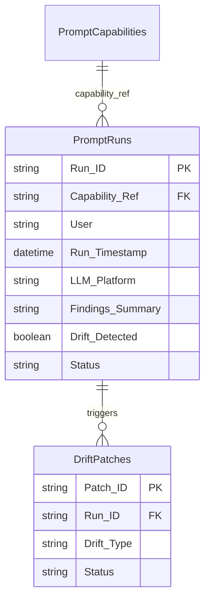

# SharePoint List Build Sheet — PromptRuns

> Execution log for every prompt run against the MDPT workbook.

---

## Purpose

The **PromptRuns** list records every time a user runs an MDPT prompt capability against the governed workbook. Each row captures what was asked, what was found, and what write-back actions were proposed. This creates an audit trail of all LLM interactions with governance data.

---

## List Settings

| Setting | Value |
|---------|-------|
| List name | PromptRuns |
| Content type | Custom: PromptRun |
| Versioning | Major versions enabled |
| Require approval | No |
| Item-level permissions | Read all, Create: owner + members |

---

## Column Schema

| Column | Type | Required | Description |
|--------|------|----------|-------------|
| Title | Single line of text | Yes | Auto-generated: "{Lens}-{Operation} — {date}" |
| Run_ID | Single line of text | Yes | Unique ID (e.g., "RUN-20260219-001") |
| Capability_Ref | Lookup | Yes | FK → PromptCapabilities.Capability_ID |
| User | Person or Group | Yes | Who initiated the run |
| Run_Timestamp | Date and Time | Yes | When the run started |
| LLM_Platform | Choice | Yes | ChatGPT, Claude, Copilot, Other |
| Tables_Scanned | Multiple lines of text | Yes | Which tables the LLM read |
| Rows_Analyzed | Number | No | Count of rows processed |
| Findings_Summary | Multiple lines of text | Yes | Key findings from the run |
| Actions_Proposed | Number | No | Count of recommended actions |
| Writeback_Rows | Number | No | Count of write-back rows generated |
| Drift_Detected | Yes/No | Yes | Was drift detected during this run? |
| Drift_Count | Number | No | Number of drift signals found |
| Canon_Violations | Number | No | Count of canon guardrail violations |
| Duration_Seconds | Number | No | How long the LLM interaction took |
| Status | Choice | Yes | Complete, Partial, Failed |
| Notes | Multiple lines of text | No | Free-form observations |

---

## Calculated Columns

| Column | Formula | Description |
|--------|---------|-------------|
| Governance_Coverage | `=Rows_Analyzed / (Total rows across scanned tables)` | % of governance data examined |
| Drift_Rate | `=Drift_Count / Rows_Analyzed * 100` | Drift signals per 100 rows |

---

## Default Views

### Recent Runs (default)

Sorted by Run_Timestamp descending. Shows last 50 runs.

### By Capability

Grouped by Capability_Ref. Useful for seeing which prompts are used most.

### Drift Runs Only

Filter: `Drift_Detected eq 'Yes'`. Highlights runs that found problems.

### My Runs

Filter: `User eq [Me]`. Personal audit trail.

---

## Relationships

---

## Automation Hooks

| Trigger | Action |
|---------|--------|
| New item created with `Drift_Detected = Yes` | Power Automate → create DriftPatches item |
| `Canon_Violations > 0` | Power Automate → notify Brand Manager |
| `Status = Failed` | Power Automate → alert Ops channel |

---

## See Also

- [PromptCapabilities Build Sheet](SHAREPOINT_LIST_BUILD_SHEET_PromptCapabilities.md)
- [DriftPatches Build Sheet](SHAREPOINT_LIST_BUILD_SHEET_DriftPatches.md)
- [Power Automate Flows](POWER_AUTOMATE_FLOWS.md)
