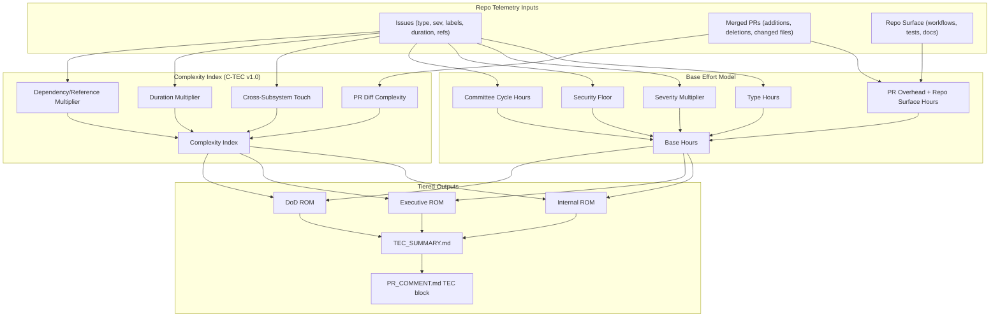

# C-TEC Pipeline (v1.0)

Complexity-Weighted TEC (C-TEC) derives Time/Effort/Cost from deterministic repo telemetry and publishes three lenses: Internal, Executive, and DoD.



## Formula

```text
Effective_Hours = Base_Hours + (Issue_Base_Hours * Complexity_Index_Adjustment)
```

Where complexity adjustment is derived from PR churn, subsystem spread, issue duration, and coordination references.
