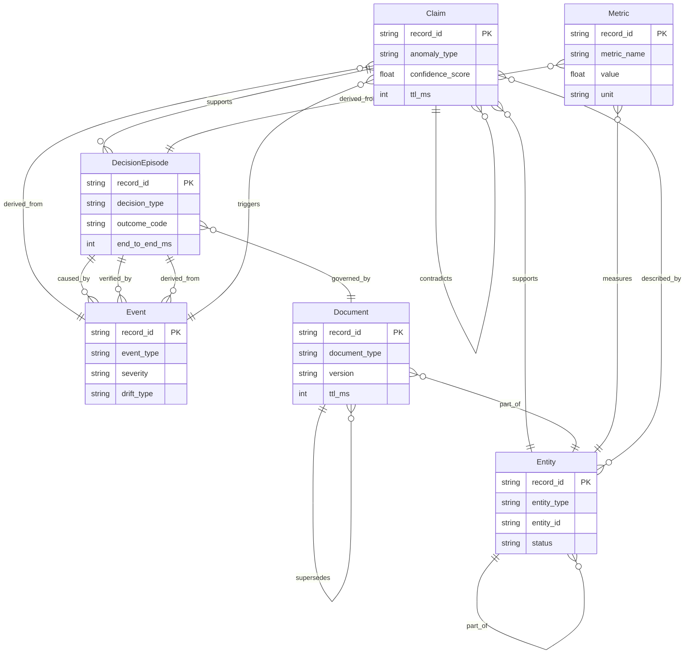

# 12 — Record Type Relationships

How the six canonical record types relate to each other via graph edges.

```mermaid
erDiagram
    Claim ||--o{ DecisionEpisode : "supports"
    Claim ||--o{ Claim : "contradicts"
    Claim }o--|| Event : "derived_from"
    Claim }o--|| Entity : "supports"

    DecisionEpisode ||--o{ Event : "caused_by"
    DecisionEpisode }o--|| Document : "governed_by"
    DecisionEpisode ||--o{ Event : "verified_by"

    Event }o--|| DecisionEpisode : "derived_from"
    Event ||--o{ Claim : "triggers"

    Document ||--o{ Document : "supersedes"
    Document }o--|| Entity : "part_of"

    Entity ||--o{ Entity : "part_of"
    Entity }o--o{ Claim : "described_by"

    Metric }o--|| DecisionEpisode : "derived_from"
    Metric }o--|| Entity : "measures"

    Claim {
        string record_id PK
        string anomaly_type
        float confidence_score
        int ttl_ms
    }
    DecisionEpisode {
        string record_id PK
        string decision_type
        string outcome_code
        int end_to_end_ms
    }
    Event {
        string record_id PK
        string event_type
        string severity
        string drift_type
    }
    Document {
        string record_id PK
        string document_type
        string version
        int ttl_ms
    }
    Entity {
        string record_id PK
        string entity_type
        string entity_id
        string status
    }
    Metric {
        string record_id PK
        string metric_name
        float value
        string unit
    }
```
