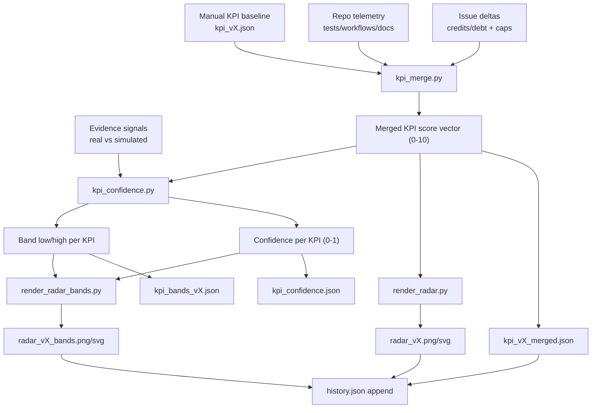

# KPI Confidence Bands Flow

How Repo Radar converts evidence into KPI scores with explicit uncertainty bands.

```mermaid
flowchart TD
    I1["Manual KPI baseline<br/>kpi_vX.json"]
    I2["Repo telemetry<br/>tests/workflows/docs"]
    I3["Issue deltas<br/>credits/debt + caps"]
    I4["Evidence signals<br/>real vs simulated"]

    I1 --> M["kpi_merge.py"]
    I2 --> M
    I3 --> M
    M --> S["Merged KPI score vector (0-10)"]

    I4 --> C["kpi_confidence.py"]
    S --> C
    C --> B["Band low/high per KPI"]
    C --> CF["Confidence per KPI (0-1)"]

    S --> R1["render_radar.py"]
    B --> R2["render_radar_bands.py"]
    CF --> R2

    R1 --> O1["radar_vX.png/svg"]
    R2 --> O2["radar_vX_bands.png/svg"]
    S --> O3["kpi_vX_merged.json"]
    CF --> O4["kpi_confidence.json"]
    B --> O5["kpi_bands_vX.json"]
    O1 --> H["history.json append"]
    O2 --> H
    O3 --> H
```
