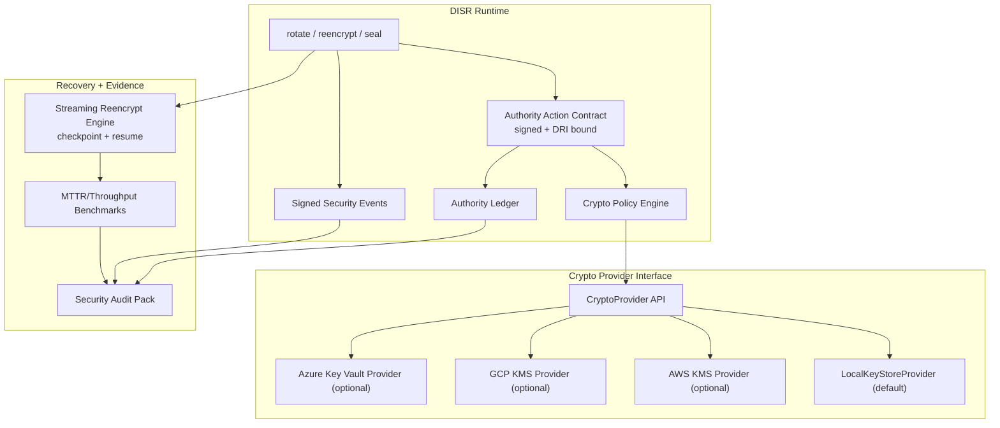

# DISR Dual-Mode Architecture

Local provider by default, optional KMS providers through a stable abstraction layer.

```mermaid
graph TB
    subgraph Runtime["DISR Runtime"]
        API["rotate / reencrypt / seal"]
        CONTRACT["Authority Action Contract<br/>signed + DRI bound"]
        POLICY["Crypto Policy Engine"]
        LEDGER["Authority Ledger"]
        EVENTS["Signed Security Events"]
    end

    subgraph Providers["Crypto Provider Interface"]
        IFACE["CryptoProvider API"]
        LOCAL["LocalKeyStoreProvider (default)"]
        AWS["AWS KMS Provider (optional)"]
        GCP["GCP KMS Provider (optional)"]
        AZ["Azure Key Vault Provider (optional)"]
    end

    subgraph Recovery["Recovery + Evidence"]
        STREAM["Streaming Reencrypt Engine<br/>checkpoint + resume"]
        BENCH["MTTR/Throughput Benchmarks"]
        AUDIT["Security Audit Pack"]
    end

    API --> CONTRACT
    CONTRACT --> POLICY
    POLICY --> IFACE
    IFACE --> LOCAL
    IFACE --> AWS
    IFACE --> GCP
    IFACE --> AZ

    CONTRACT --> LEDGER
    API --> EVENTS
    API --> STREAM
    STREAM --> BENCH
    EVENTS --> AUDIT
    LEDGER --> AUDIT
    BENCH --> AUDIT
```
