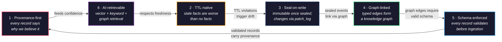

# 19 — Design Principles Cycle

The six design principles of the LLM Data Model and how they reinforce each other.

```mermaid
graph LR
    P1["1 · Provenance-first<br/><i>every record says<br/>why we believe it</i>"]
    P2["2 · TTL-native<br/><i>stale facts are worse<br/>than no facts</i>"]
    P3["3 · Seal-on-write<br/><i>immutable once sealed;<br/>changes via patch_log</i>"]
    P4["4 · Graph-linked<br/><i>typed edges form<br/>a knowledge graph</i>"]
    P5["5 · Schema-enforced<br/><i>every record validates<br/>before ingestion</i>"]
    P6["6 · AI-retrievable<br/><i>vector + keyword +<br/>graph retrieval</i>"]

    P1 -->|"feeds confidence"| P6
    P6 -->|"respects freshness"| P2
    P2 -->|"TTL violations<br/>trigger drift"| P3
    P3 -->|"sealed events<br/>link via graph"| P4
    P4 -->|"graph edges require<br/>valid schema"| P5
    P5 -->|"validated records<br/>carry provenance"| P1

    style P1 fill:#1a1a2e,stroke:#e94560,stroke-width:2px,color:#fff
    style P2 fill:#1a1a2e,stroke:#f39c12,stroke-width:2px,color:#fff
    style P3 fill:#1a1a2e,stroke:#0f3460,stroke-width:2px,color:#fff
    style P4 fill:#1a1a2e,stroke:#2ecc71,stroke-width:2px,color:#fff
    style P5 fill:#1a1a2e,stroke:#3498db,stroke-width:2px,color:#fff
    style P6 fill:#1a1a2e,stroke:#9b59b6,stroke-width:2px,color:#fff
```
