# 27 — Claim Primitive Architecture

The Claim as the universal atomic substrate — structure, lifecycle, and graph.

## Claim Object Structure

```mermaid
graph TB
    subgraph Claim["CLAIM-2026-0001"]
        direction TB
        ST["statement<br/><i>One sentence, testable assertion</i>"]
        SC["scope<br/><i>where + when + context</i>"]
        TT["truthType<br/><i>observation · inference · assumption<br/>forecast · norm · constraint</i>"]

        subgraph Trust["Trust Assessment"]
            CO["confidence<br/><i>score: 0.94</i>"]
            SL["statusLight<br/><i>🟢 green</i>"]
        end

        subgraph Sources["Source Chain"]
            S1["source<br/><i>sensor · high reliability</i>"]
            S2["source<br/><i>human · medium reliability</i>"]
            E1["evidence<br/><i>trace · pattern_correlation</i>"]
            E2["evidence<br/><i>excerpt · structured_debrief</i>"]
        end

        subgraph Time["Temporal Integrity"]
            HL["halfLife<br/><i>24 hours</i>"]
            EX["expiresAt<br/><i>computed</i>"]
            RT["refreshTrigger<br/><i>expiry · contradiction · new_source</i>"]
        end

        subgraph Seal["Immutable Seal"]
            HA["hash<br/><i>sha256:...</i>"]
            VR["version<br/><i>1</i>"]
            PL["patchLog<br/><i>append-only</i>"]
        end
    end

    ST --> TT
    TT --> Trust
    Trust --> Sources
    Sources --> Time
    Time --> Seal

    style Claim fill:#1a1a2e,stroke:#e94560,stroke-width:2px
    style Trust fill:#533483,stroke:#e94560
    style Sources fill:#2b2d42,stroke:#0f3460
    style Time fill:#0f3460,stroke:#e94560
    style Seal fill:#16213e,stroke:#e94560
```

## Claim Graph Topology

## Truth Type Taxonomy

## Status Light Derivation

```mermaid
flowchart TD
    START["Evaluate Claim"] --> CONF{"confidence<br/>score?"}

    CONF -->|"≥ 0.80"| SRC{"≥ 1 source<br/>reliability: high?"}
    CONF -->|"0.50 – 0.79"| YELLOW["🟡 yellow"]
    CONF -->|"< 0.50"| RED["🔴 red"]

    SRC -->|"Yes"| CONTRA{"contradicts[]<br/>non-empty?"}
    SRC -->|"No"| YELLOW

    CONTRA -->|"No"| GREEN["🟢 green"]
    CONTRA -->|"Yes"| RED

    style GREEN fill:#27ae60,stroke:#2ecc71,stroke-width:2px,color:#fff
    style YELLOW fill:#f39c12,stroke:#e67e22,stroke-width:2px,color:#fff
    style RED fill:#e74c3c,stroke:#c0392b,stroke-width:2px,color:#fff
    style START fill:#1a1a2e,stroke:#e94560
    style CONF fill:#2b2d42,stroke:#e94560
    style SRC fill:#2b2d42,stroke:#e94560
    style CONTRA fill:#2b2d42,stroke:#e94560
```

## Half-Life Decay Lifecycle

```mermaid
stateDiagram-v2
    [*] --> Fresh: claim created
    Fresh --> Aging: time passes
    Aging --> HalfLife: halfLife reached
    HalfLife --> Expired: confidence halved
    Expired --> Refreshed: refreshTrigger fires
    Expired --> Superseded: new claim created
    Expired --> Red: no refresh + contradiction
    Refreshed --> Fresh: new version
    Superseded --> [*]: original preserved

    state Fresh {
        [*] --> Green
        Green: 🟢 confidence ≥ 0.80
    }

    state Aging {
        [*] --> StillGreen
        StillGreen: confidence stable
        StillGreen --> Yellowing: approaching halfLife
    }

    state Expired {
        [*] --> Stale
        Stale: confidence halved
        Stale --> DeeperDecay: another halfLife
    }
```

