# 28 — DLR Claim-Native Architecture

The Decision Log Record refactored as a claim graph — five decision stages, rationale edges, and freshness snapshots.

## DLR Decision Flow (Claim Stages)

## Rationale Graph (Weighted Edges)

## DLR vs Episode: Before and After

```mermaid
graph LR
    subgraph Before["Episode-Centric DLR (old)"]
        direction TB
        EP1["episodeId"]
        DTE1["dteRef"]
        AC1["action_contract<br/><i>flat fields</i>"]
        VER1["verification<br/><i>result only</i>"]
        POL1["policy_stamp<br/><i>present/absent</i>"]
        OUT1["outcome_code<br/><i>string</i>"]
    end

    subgraph After["Claim-Native DLR (new)"]
        direction TB
        EP2["episodeId"]
        CL["claims<br/><i>context · rationale · action<br/>verification · outcome</i>"]
        RG["rationaleGraph<br/><i>typed + weighted edges</i>"]
        FS["freshnessSnapshot<br/><i>allFresh? · expired[] · stalest</i>"]
        PS["policyStamp<br/><i>+ result enum</i>"]
        CS["coherenceScore<br/><i>0–100</i>"]
        SEAL["seal<br/><i>hash + version + patchLog</i>"]
    end

    Before -.->|"refactored to"| After

    style Before fill:#2b2d42,stroke:#e74c3c,stroke-dasharray: 5 5
    style After fill:#1a1a2e,stroke:#2ecc71,stroke-width:2px
    style CL fill:#533483,stroke:#e94560
    style RG fill:#533483,stroke:#e94560
    style FS fill:#0f3460,stroke:#e94560
```

## claimRef Snapshot Model

## Composability: Everything is Claims

