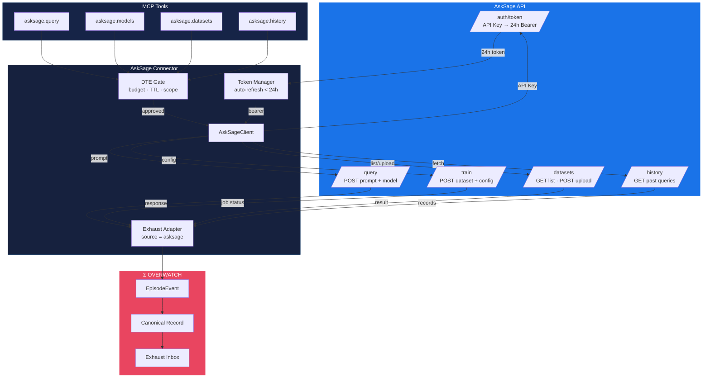

# AskSage Connector Flow

Data flow from AskSage API through the exhaust adapter into canonical records, including the two-phase auth token lifecycle.

## Key Details

- **Two-phase auth**: Long-lived API key exchanges for a 24-hour bearer token. Token Manager auto-refreshes before expiry.
- **DTE Gate**: Every MCP tool call passes through DTE constraint checking before the API request is issued.
- **Exhaust Adapter**: Captures `model`, `prompt_hash`, `token_count`, `latency_ms`, `cost_usd` per operation.
- **Canonical Records**: All exhaust events are wrapped in the standard canonical envelope with provenance metadata.
