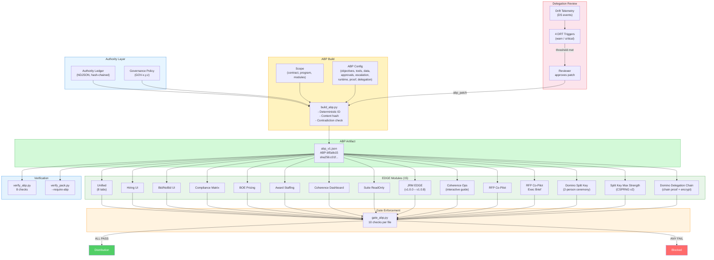

# EDGE + ABP

> **Exportable Decision Governance Engine** — self-contained HTML modules with embedded Authority Boundary Primitives for offline-capable, verifiable decision surfaces.

## Table of Contents

- [Overview](#overview)
- [Architecture](#architecture)
- [Module Inventory](#module-inventory)
- [Quick Reference](#quick-reference)
- [Wiki](#wiki)

---

## Overview

**EDGE** modules are standalone HTML files that bundle an entire decision surface — UI, logic, data, and governance — into a single distributable artifact. Each EDGE export embeds a signed **ABP** (Authority Boundary Primitive) that declares what the module is allowed to do, what data it can access, and what proof it must produce.

The system enforces a closed loop:

1. **Build ABP** — declare authority boundaries (scope, objectives, tools, data, approvals, escalation, runtime validators, proof requirements)
2. **Embed in EDGE** — stamp each HTML export with the ABP in a `<script type="application/json" id="ds-abp-v1">` block
3. **Gate before distribution** — `gate_abp.py` runs 10 checks per file (hash, ID, scope, contradictions, status bar, verification JS, delegation review)
4. **Verify independently** — `verify_abp.py` runs 8 structural checks; `verify_pack.py` validates the full admissibility pack
5. **Reassess via delegation review** — sustained drift triggers formal ABP reassessment (DRT-001 through DRT-004)

## Architecture



## Module Inventory

| File | Version | Module Key | Purpose |
|------|---------|------------|---------|
| `EDGE_Unified_v1.0.0.html` | 1.0.0 | `unified` | Unified control surface — 8 tabs: Suite, Hiring, Bid, Compliance, BOE, IRIS, Delegation, Utility |
| `EDGE_Coherence_Dashboard_v2.0.0.html` | 2.0.0 | `coherence` | Coherence monitoring — CI gauge, claims, drift signals, analysis visualizations |
| `EDGE_Hiring_UI_v1.0.0.html` | 1.0.0 | `hiring` | Hiring console — form-driven staffing intake and candidate tracking |
| `EDGE_BidNoBid_UI_v1.0.0.html` | 1.0.0 | `bid` | Bid/no-bid decision matrix — opportunity evaluation and scoring |
| `EDGE_BOE_Pricing_UI_v1.0.0.html` | 1.0.0 | `boe` | Basis-of-estimate pricing models and rate calculations |
| `EDGE_ComplianceMatrix_UI_v1.0.0.html` | 1.0.0 | `compliance` | Compliance requirements mapped to deliverables |
| `EDGE_AwardStaffing_Estimator_v1.2.0.html` | 1.2.0 | `award_staffing` | Award staffing allocation and cost estimation |
| `EDGE_Suite_ReadOnly_v1.0.0.html` | 1.0.0 | `suite_readonly` | Read-only wrapper with telemetry and rollup export |
| `EDGE_JRM_EDGE_v1.0.0.html` | 1.0.0 | `jrm` | JRM pipeline visualizer — 9-stage ribbon, coherence meter, trace drawer, packet viewer |
| `EDGE_JRM_EDGE_v1.0.1.html` | 1.0.1 | `jrm` | JRM EDGE enhanced — error guard, stage timestamps, refined drift heat, agentic demo, packet validation, cross-packet diff, table pagination |
| `EDGE_JRM_EDGE_v1.0.4.html` | 1.0.4 | `jrm` | Process proof — 250-event generator, scenario mixer, Health tab with pipeline transparency and drift drill-down |
| `EDGE_JRM_EDGE_v1.0.5.html` | 1.0.5 | `jrm` | Replay proof — deterministic replay, Health tab refinements |
| `EDGE_JRM_EDGE_v1.0.6.html` | 1.0.6 | `jrm` | Test Lab tab — drift 0-100 scale, baseline capture, patch simulator |
| `EDGE_JRM_EDGE_v1.0.7.html` | 1.0.7 | `jrm` | So What panel, Analyzer toggle, timeline visualization, stream mode, policy drawer |
| `EDGE_JRM_EDGE_v1.0.8.html` | 1.0.8 | `jrm` | Consistency Gate — Sheaf-Residue Engine, claim graph, CRS scoring, force-directed visualization, claim drawer with "How to Fix", fixable claims panel |
| `EDGE_Coherence_Ops_v1.0.0.html` | 1.0.0 | `coherence_ops` | Interactive Coherence Ops guide — 7 tabs (Overview, How It Works, 3 Domains, 4 Artifacts, Drift→Patch, Quick Start, FAQ), 80s synthwave styling, copy-ready templates |
| `edge_rfp_copilot_excel_json.html` | — | `rfp_copilot` | RFP Co-Pilot — AI-assisted extraction to Excel/JSON workflow |
| `edge_rfp_copilot_exec_brief.html` | — | `rfp_copilot` | RFP Co-Pilot Exec Brief — executive summary generator for RFP responses |
| `EDGE_Domino_SplitKey_v1.html` | 1.0 | `domino_splitkey` | Domino Split Key ceremony — 2-person offline key derivation using domino tiles, SHA-256, optional HKDF |
| `EDGE_SplitKey_MaxStrength_v2.html` | 2.0 | `splitkey_v2` | Max Strength Split Key — CSPRNG 32-byte shares, SHA-256 master, HKDF derivation, optional domino witness anchor, hide/show toggles |
| `EDGE_Domino_DelegationChain_v1.html` | 1.0 | `domino_chain` | Domino Delegation Chain — physical co-presence proof via domino chaining, chain-bound AES-256-GCM encrypt/decrypt, ceremony record with domino fingerprint verbalization |

### Supporting Files

| File | Purpose |
|------|---------|
| `abp_v1.json` | Reference ABP artifact (ABP-bf0afe15) |
| `gate_abp.py` | Gate enforcement CLI — verifies all EDGE exports carry valid ABP |

## Quick Reference

```bash
# Build ABP from config
python enterprise/src/tools/reconstruct/build_abp.py \
    --scope '{"contract_id":"CTR-DEMO-001","program":"SEQUOIA","modules":["hiring","bid","compliance","boe","award_staffing","coherence","suite_readonly","unified"]}' \
    --authority-entry-id AUTH-033059a5 \
    --authority-ledger enterprise/artifacts/public_demo_pack/authority_ledger.ndjson \
    --config abp_config.json \
    --clock 2026-02-25T00:00:00Z \
    --out-dir edge/

# Gate-check all EDGE exports
python edge/gate_abp.py --dir edge/ --abp-ref edge/abp_v1.json

# Gate-check single file
python edge/gate_abp.py --file edge/EDGE_Hiring_UI_v1.0.0.html

# Gate-check with JSON output
python edge/gate_abp.py --dir edge/ --json

# Verify ABP standalone
python enterprise/src/tools/reconstruct/verify_abp.py \
    --abp edge/abp_v1.json \
    --ledger enterprise/artifacts/public_demo_pack/authority_ledger.ndjson

# Verify full evidence pack (with ABP requirement)
python enterprise/src/tools/reconstruct/verify_pack.py \
    --pack /tmp/pack --require-abp

# Run ABP tests
python -m pytest enterprise/tests/test_build_abp.py -v
```

## Authoring Policy

All files in `edge/` are **hand-authored artifacts**. They are not generated by CI
or code-gen tooling. Changes to EDGE HTML modules or the ABP reference file must be:

1. **Reviewed** — every PR touching `edge/*.html` or `edge/*.json` requires human review
2. **Gate-checked** — `python edge/gate_abp.py --dir edge/` must pass before merge
3. **Version-bumped** — update the filename version suffix when modifying an EDGE module
4. **ABP-consistent** — if the ABP scope changes, re-stamp all EDGE modules

These files are marked `linguist-vendored` in `.gitattributes` so they do not
inflate language statistics on GitHub.

## Wiki

Deep-dive reference pages (synced to [GitHub Wiki](https://github.com/8ryanWh1t3/DeepSigma/wiki)):

| Page | Topic |
|------|-------|
| [EDGE Modules](https://github.com/8ryanWh1t3/DeepSigma/wiki/EDGE-Modules) | All 15 modules, Unified tabs, Coherence Dashboard, JRM EDGE versions, Coherence Ops, RFP Co-Pilot, Split Key (v1 + v2), Delegation Chain, localStorage keys |
| [ABP Specification](https://github.com/8ryanWh1t3/DeepSigma/wiki/ABP-Specification) | Full structure, deterministic ID/hash, canonical JSON, composition, sections reference |
| [Delegation Review](https://github.com/8ryanWh1t3/DeepSigma/wiki/Delegation-Review) | Governance loop, 4 DRT triggers, review policy, client-side evaluation |
| [Gate Enforcement](https://github.com/8ryanWh1t3/DeepSigma/wiki/Gate-Enforcement) | gate_abp.py, 10 checks, file-to-module map, CLI, JSON output |
| [ABP Verification](https://github.com/8ryanWh1t3/DeepSigma/wiki/ABP-Verification) | verify_abp.py 8 checks, verify_pack.py integration, evidence pack |
| [ABP Builder](https://github.com/8ryanWh1t3/DeepSigma/wiki/ABP-Builder) | build_abp(), compose_abps(), CLI, HTML embedding, re-stamping |
| [Authority Ledger Binding](https://github.com/8ryanWh1t3/DeepSigma/wiki/Authority-Ledger-Binding) | Ledger format, chaining, revocation, time-windowed authority |

### Related Canonical Mermaid Diagrams

| # | Diagram | Path |
|---|---------|------|
| 11 | [Seal-and-Prove Pipeline](../enterprise/docs/mermaid/11-seal-and-prove.md) | Admissibility chain |
| 16 | [Authority Boundary Primitive](../enterprise/docs/mermaid/16-authority-boundary-primitive.md) | ABP lifecycle + composition |
| 17 | [EDGE System](../enterprise/docs/mermaid/17-edge-system.md) | Module map, gate flow, delegation loop |
