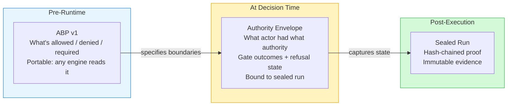
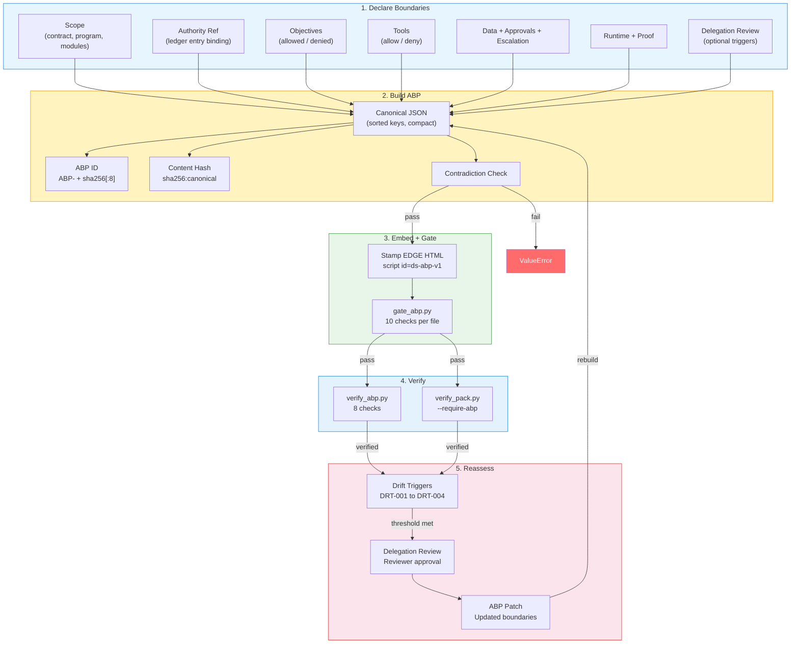
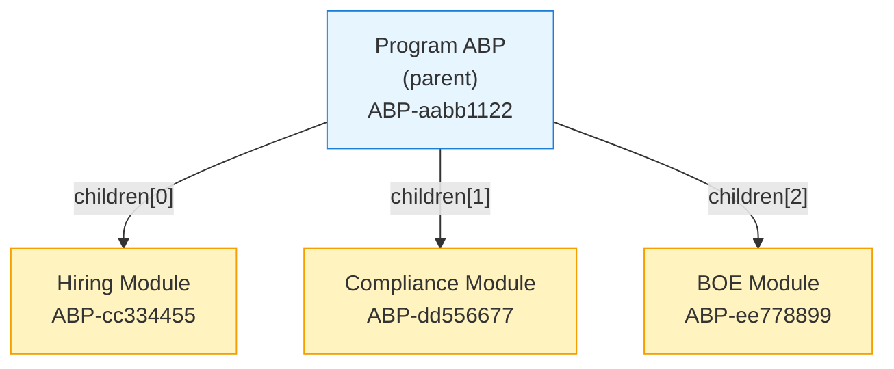

# ABP v1 Specification

> Authority Boundary Primitive — a stack-independent, pre-runtime governance declaration that any enforcement engine can read to know the boundaries without needing DeepSigma's runtime.

## Table of Contents

- [Overview](#overview)
- [ABP Lifecycle](#abp-lifecycle)
- [Deterministic ID](#deterministic-id)
- [Content Hash](#content-hash)
- [Canonical JSON](#canonical-json)
- [Sections Reference](#sections-reference)
- [Objectives](#objectives)
- [Tools](#tools)
- [Composition](#composition)
- [Current ABP](#current-abp)

---

## Overview

The ABP is a JSON document that declares:

- **What** an AI system is allowed to do (objectives, tools)
- **Where** it operates (scope — contract, program, modules)
- **With what authority** (binding to authority ledger entry)
- **Under what constraints** (data permissions, approvals, escalation paths)
- **Producing what proof** (runtime validators, proof requirements)
- **With what reassessment** (delegation review triggers)

The ABP is **pre-runtime** — it exists before any agent executes. At decision time, the agent's Authority Envelope references the ABP. After execution, the Sealed Run contains both.



## ABP Lifecycle



## Deterministic ID

The ABP ID is deterministic — same inputs always produce the same ID:

```
abp_id = "ABP-" + sha256(canonical_json({
    "scope": scope,
    "authority_ref": authority_ref,
    "created_at": created_at
}))[:8]
```

- Only scope, authority_ref, and created_at determine the ID
- Adding/changing objectives, tools, delegation_review, etc. does **not** change the ID
- Adding delegation_review **does** change the hash (different canonical JSON)

**Current:** `ABP-bf0afe15`

## Content Hash

The content hash covers the entire ABP:

```
hash = sha256(canonical_json(abp_with_hash_set_to_empty_string))
```

1. Copy the ABP object
2. Set `copy["hash"] = ""`
3. Serialize to canonical JSON
4. Compute SHA-256
5. Prefix with `"sha256:"`

Any change to any field (except `hash` itself) changes the content hash. This is how tamper detection works.

**Current:** `sha256:c01f3565f11678598e098083ab01d7fc429d985525756300f932f44eea722789`

## Canonical JSON

All hashes in the system are computed over canonical JSON serialization only:

| Rule | Example |
|------|---------|
| Dict keys sorted alphabetically | `{"a":1,"b":2}` not `{"b":2,"a":1}` |
| Compact separators (no spaces) | `{"a":1}` not `{ "a": 1 }` |
| Floats normalized to 15-digit precision | `1.000000000000000` |
| Datetime strings normalized to UTC Z | `2026-02-25T00:00:00Z` |
| Newlines normalized to `\n` | No `\r\n` |

**Implementation:** `enterprise/src/tools/reconstruct/canonical_json.py`

Key functions:

- `canonical_dumps(obj)` — canonical JSON string
- `sha256_text(s)` — SHA-256 of UTF-8 string, prefixed with `"sha256:"`
- `sha256_canonical(obj)` — hash of canonical JSON

## Sections Reference

| Section | Type | Required | Description |
|---------|------|----------|-------------|
| `abp_version` | string | Yes | Schema version: `"1.0"` |
| `abp_id` | string | Yes | Deterministic ID: `"ABP-xxxxxxxx"` |
| `scope` | object | Yes | `contract_id`, `program`, `modules[]` |
| `authority_ref` | object | Yes | `authority_entry_id`, `authority_entry_hash`, `authority_ledger_path` |
| `objectives` | object | Yes | `allowed[]` (id + description), `denied[]` (id + description + reason) |
| `tools` | object | Yes | `allow[]` (name + scope), `deny[]` (name + reason) |
| `data` | object | Yes | `permissions[]` (resource, operations, roles, sensitivity) |
| `approvals` | object | Yes | `required[]` (action, approver_role, threshold, timeout_ms) |
| `escalation` | object | Yes | `paths[]` (trigger, destination, severity, auto) |
| `runtime` | object | Yes | `validators[]` (name, when, fail_action, config) |
| `proof` | object | Yes | `required[]` array of proof types |
| `composition` | object | Yes | `parent_abp_id`, `parent_abp_hash`, `children[]` |
| `effective_at` | string | Yes | ISO 8601 effective date |
| `expires_at` | string/null | Yes | ISO 8601 expiry (null = no expiry) |
| `created_at` | string | Yes | ISO 8601 creation timestamp |
| `hash` | string | Yes | Self-authenticating content hash |
| `delegation_review` | object | No | Optional: `triggers[]`, `review_policy{}` |

## Objectives

### Allowed Objectives

| ID | Description |
|----|-------------|
| OBJ-001 | Evaluate bid/no-bid for opportunity DEC-001 |
| OBJ-002 | Assess staffing readiness for contract execution |
| OBJ-003 | Map compliance requirements to deliverables |
| OBJ-004 | Generate basis-of-estimate pricing models |
| OBJ-005 | Estimate award staffing allocation and costs |
| OBJ-006 | Monitor claim coherence and drift signals |
| OBJ-007 | Present read-only unified decision surface |
| OBJ-008 | Export verifiable evidence packs from any module |

### Denied Objectives

| ID | Description | Reason |
|----|-------------|--------|
| OBJ-D01 | Modify sealed decisions | Sealed artifacts are immutable per governance policy |
| OBJ-D02 | Bypass ABP verification on export | All EDGE exports must carry verified ABP |
| OBJ-D03 | Alter coherence scores without re-evaluation | Coherence values are derived from evidence chains |

## Tools

### Allowed Tools

| Name | Scope |
|------|-------|
| `seal_bundle` | DEC-001 |
| `sign_artifact` | DEC-001 |
| `replay_sealed_run` | (any) |
| `verify_pack` | (any) |
| `verify_abp` | (any) |
| `gate_abp` | (any) |
| `export_evidence_pack` | SEQUOIA |

### Denied Tools

| Name | Reason |
|------|--------|
| `authority_ledger_revoke` | Only reviewers may revoke authority grants |
| `transparency_log_delete` | Append-only log cannot be truncated |

## Composition

ABPs can form hierarchies via the `composition` section:



`compose_abps()` merges child ABPs into a parent:

- Concatenates `objectives.allowed` + `objectives.denied`
- Concatenates `tools.allow` + `tools.deny`
- Concatenates `data.permissions`, `approvals.required`, `escalation.paths`, `runtime.validators`
- Unions `proof.required`
- Deduplicates `delegation_review.triggers` by ID
- Takes tightest `review_policy.timeout_ms` from children
- Records each child's `abp_id` + `hash` in `composition.children`

## Current ABP

| Field | Value |
|-------|-------|
| `abp_id` | `ABP-bf0afe15` |
| `hash` | `sha256:c01f3565f11678598e098083ab01d7fc429d985525756300f932f44eea722789` |
| `scope.contract_id` | `CTR-DEMO-001` |
| `scope.program` | `SEQUOIA` |
| `scope.modules` | hiring, bid, compliance, boe, award_staffing, coherence, suite_readonly, unified |
| `authority_ref.entry_id` | `AUTH-033059a5` |
| `created_at` | `2026-02-25T00:00:00Z` |
| `effective_at` | `2026-02-25T00:00:00Z` |
| `expires_at` | null (no expiry) |

**File:** `edge/abp_v1.json`
**Schema:** `enterprise/schemas/reconstruct/abp_v1.json`
