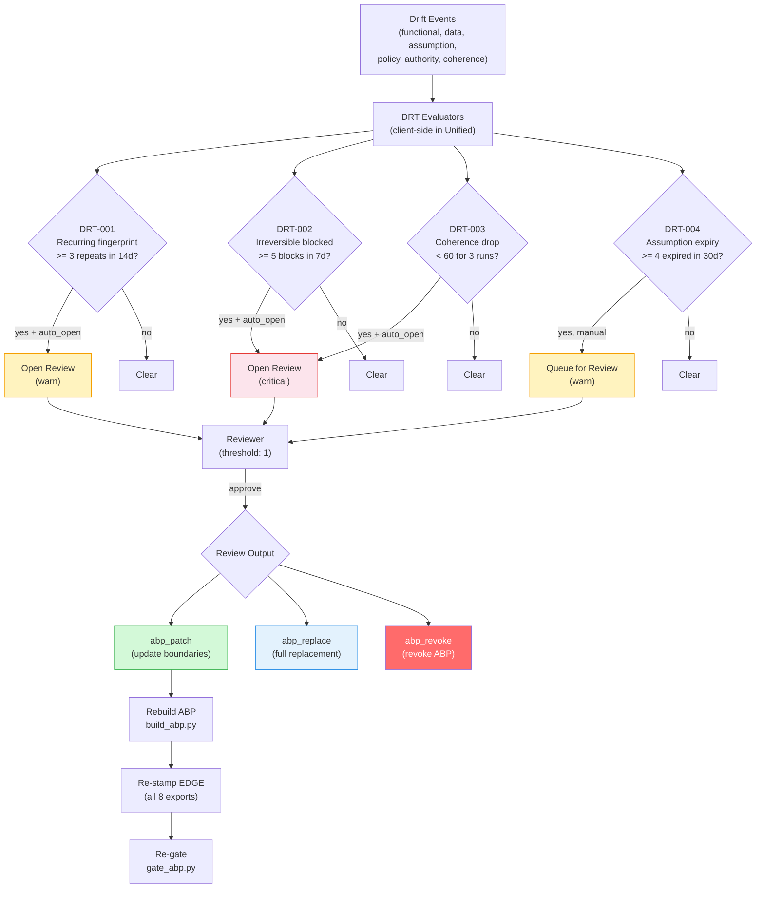

# Delegation Review Triggers

> Closed-loop ABP reassessment — sustained drift signals trigger formal review and authority boundary patching.

## Table of Contents

- [The Governance Loop](#the-governance-loop)
- [Delegation Review Flow](#delegation-review-flow)
- [Triggers](#triggers)
- [Review Policy](#review-policy)
- [Client-Side Evaluation](#client-side-evaluation)
- [Trigger States](#trigger-states)

---

## The Governance Loop

The complete at-scale governance loop has three phases:

| Phase | What | Status |
|-------|------|--------|
| **1. Delegation Artifact** | Board/leadership defines what AI can do via ABP v1 — scope, objectives, tools, data permissions, proof requirements | Complete |
| **2. Execution Umbrella** | Agents reference ABP v1; every action passes runtime validators (authority_envelope_complete, policy_hash_matches, abp_present_on_export, abp_hash_valid, drift_threshold) | Complete |
| **3. Drift → Filter → Reassessment** | Sustained drift opens Delegation Review episode — structured re-evaluation produces ABP patch | Complete |

```mermaid
flowchart LR
    subgraph Phase1["1. Delegate"]
        BOARD["Board / Leadership"]
        ABP["ABP v1\n(authority boundaries)"]
        BOARD -->|"defines"| ABP
    end

    subgraph Phase2["2. Execute"]
        AGENT["AI Agents"]
        VALID["Runtime Validators\n(5 checks)"]
        SEAL["Sealed Runs\n(evidence)"]
        ABP -->|"governs"| AGENT
        AGENT -->|"pass validators"| VALID
        VALID -->|"produce"| SEAL
    end

    subgraph Phase3["3. Reassess"]
        DS["Drift Signals\n(8 types)"]
        DRT["DRT Triggers\n(4 conditions)"]
        REVIEW["Delegation Review\n(Reviewer)"]
        PATCH["ABP Patch\n(updated boundaries)"]
        SEAL -->|"generate"| DS
        DS -->|"filter"| DRT
        DRT -->|"threshold met"| REVIEW
        REVIEW -->|"approve"| PATCH
        PATCH -->|"rebuild"| ABP
    end

    style Phase1 fill:#e7f5ff,stroke:#1c7ed6
    style Phase2 fill:#fff3bf,stroke:#f59f00
    style Phase3 fill:#fce4ec,stroke:#e53935
```



## Delegation Review Flow



## Triggers

Four concrete triggers are defined in the ABP's `delegation_review.triggers` array:

| ID | Name | Condition | Severity | Auto-Open |
|----|------|-----------|----------|-----------|
| **DRT-001** | `recurring_drift_fingerprint` | Same drift fingerprint appears >= 3 times within 14 days | `warn` | `true` |
| **DRT-002** | `irreversible_action_blocked` | Gate blocks >= 5 irreversible actions within 7 days | `critical` | `true` |
| **DRT-003** | `linkage_score_sustained_drop` | Overall coherence index < 60 for >= 3 consecutive runs | `critical` | `true` |
| **DRT-004** | `assumption_expiry_breach` | >= 4 expired claims/assumptions within 30 days | `warn` | `false` |

### DRT-001: Recurring Drift Fingerprint

**What it detects:** The same root cause keeps triggering drift signals — a structural issue, not a transient one.

**Condition:**
```json
{
    "fingerprint_repeats": 3,
    "window_days": 14
}
```

**Data sources:** Drift signals from hiring/bid localStorage data, fingerprint deduplication.

### DRT-002: Irreversible Action Blocked

**What it detects:** The ABP is blocking too many actions — the boundary may be too restrictive for current operations.

**Condition:**
```json
{
    "blocked_count_gt": 5,
    "window_days": 7
}
```

**Data sources:** Gate failure counts from `buildHostRollup()`.

### DRT-003: Linkage Score Sustained Drop

**What it detects:** Organizational coherence is degrading consistently — not a blip, but a trend.

**Condition:**
```json
{
    "overall_coherence_lt": 60,
    "consecutive_runs": 3
}
```

**Data sources:** Composite score history tracked in `ds_delegation_review_state_v1` localStorage key.

### DRT-004: Assumption Expiry Breach

**What it detects:** Too many assumptions have expired without being reviewed — stale logic is accumulating.

**Condition:**
```json
{
    "expired_claims_gt": 4,
    "window_days": 30
}
```

**Data sources:** Expired assumptions from bid/boe localStorage data.

## Review Policy

When a trigger fires, the review policy governs what happens next:

| Field | Value | Description |
|-------|-------|-------------|
| `approver_role` | `"Reviewer"` | Who must approve the review |
| `threshold` | `1` | Number of approvals needed |
| `timeout_ms` | `604800000` | 7-day timeout window |
| `output` | `"abp_patch"` | Default output type |

### Output Types

| Output | Description |
|--------|-------------|
| `abp_patch` | Update specific ABP sections (objectives, tools, permissions, etc.) — preserves continuity |
| `abp_replace` | Full ABP replacement — new ABP ID, new hash, fresh start |
| `abp_revoke` | Revoke current ABP — requires new ABP before operations resume |

## Client-Side Evaluation

In EDGE Unified's Delegation tab, triggers are evaluated client-side using four evaluator functions:

| Function | Trigger | Data Source |
|----------|---------|-------------|
| `evaluateDRT001(trigger)` | DRT-001 | Drift fingerprint repeats across hiring/bid localStorage |
| `evaluateDRT002(trigger)` | DRT-002 | Gate failure count from `buildHostRollup()` |
| `evaluateDRT003(trigger)` | DRT-003 | Composite score history in `ds_delegation_review_state_v1` |
| `evaluateDRT004(trigger)` | DRT-004 | Expired assumptions from bid/boe localStorage |

The evaluators are registered in the `DRT_EVALUATORS` map:

```javascript
const DRT_EVALUATORS = {
    'DRT-001': evaluateDRT001,
    'DRT-002': evaluateDRT002,
    'DRT-003': evaluateDRT003,
    'DRT-004': evaluateDRT004,
};
```

`renderDelegationPanel()` iterates over all triggers from the ABP, runs the corresponding evaluator, and renders cards with progress bars showing threshold proximity.

## Trigger States

Each trigger card in the Delegation tab displays one of three states:

| State | Visual | Meaning |
|-------|--------|---------|
| **clear** | Green pill | Well below threshold — no action needed |
| **armed** | Yellow pill | Approaching threshold — warning level |
| **tripped** | Red pill | Threshold met/exceeded — review needed |

The state is determined by comparing the evaluator's current count against the trigger's condition threshold.

### Schema Validation

The ABP JSON schema (`enterprise/schemas/reconstruct/abp_v1.json`) enforces:

- Trigger IDs match pattern `^DRT-[0-9]{3}$`
- Severity must be `"warn"` or `"critical"`
- `auto_open` is boolean
- Review policy requires `approver_role`, `threshold` (>= 1), `timeout_ms` (integer or null), `output` (one of `abp_patch`, `abp_replace`, `abp_revoke`)
- The entire `delegation_review` section is **optional** — ABPs without it still validate
