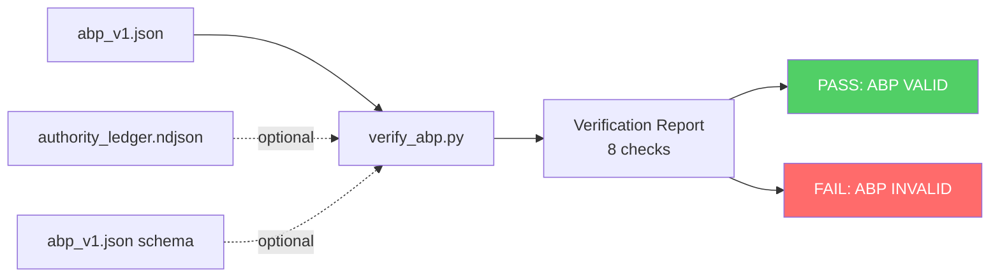
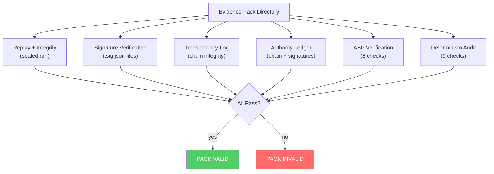

# ABP Verification

> `verify_abp.py` — standalone ABP verifier with 8 structural checks. Also callable from `verify_pack.py`.

## Table of Contents

- [Overview](#overview)
- [Verification Checks](#verification-checks)
- [CLI Usage](#cli-usage)
- [Evidence Pack Integration](#evidence-pack-integration)
- [Pack Structure](#pack-structure)
- [Programmatic Usage](#programmatic-usage)

---

## Overview

`verify_abp.py` validates an ABP artifact against 8 checks that cover structural validity, cryptographic integrity, authority binding, and logical consistency. It operates independently of the EDGE gate — the gate validates ABP-in-HTML, while the verifier validates the ABP artifact itself.



## Verification Checks

| # | Check Name | What It Verifies | Requires |
|---|-----------|-----------------|----------|
| 1 | `abp.schema_valid` | ABP validates against `enterprise/schemas/reconstruct/abp_v1.json` | `jsonschema` library (optional) |
| 2 | `abp.hash_integrity` | Recomputed content hash matches recorded `hash` field | — |
| 3 | `abp.id_deterministic` | Recomputed ABP ID from scope + authority_ref + created_at matches `abp_id` | — |
| 4 | `abp.authority_ref_valid` | `authority_entry_id` exists in ledger, hash matches, not revoked | `--ledger` |
| 5 | `abp.authority_not_expired` | ABP `created_at` falls within authority entry's effective/expires window | `--ledger` |
| 6 | `abp.composition_valid` | Parent/child references consistent; no duplicate child ABP IDs; parent_id/parent_hash paired | — |
| 7 | `abp.no_contradictions` | No objective ID in both allowed and denied; no tool name in both allow and deny | — |
| 8 | `abp.delegation_review_valid` | When present: no duplicate trigger IDs, valid severities (warn/critical), review_policy has approver_role and output. When absent: passes (optional section) | — |

### Check Details

#### 1. Schema Validation

Uses `jsonschema` library if installed. Validates against `enterprise/schemas/reconstruct/abp_v1.json`. If `jsonschema` is not installed, the check passes with a note. The schema path is auto-detected relative to the verifier's location.

#### 2. Hash Integrity

Recomputes the content hash:

1. Copy ABP object
2. Set `copy["hash"] = ""`
3. Compute `sha256(canonical_dumps(copy))`
4. Compare against `abp["hash"]`

Any tampering with any field (except `hash`) will cause this check to fail.

#### 3. ID Deterministic

Recomputes the ABP ID:

```python
seed = canonical_dumps({
    "scope": abp["scope"],
    "authority_ref": abp["authority_ref"],
    "created_at": abp["created_at"],
})
expected = "ABP-" + sha256(seed)[:8]
```

#### 4. Authority Ref Valid

Requires `--ledger` flag. Reads the NDJSON authority ledger and:

1. Finds entry matching `authority_entry_id`
2. Verifies `entry_hash` matches `authority_entry_hash`
3. Confirms `revoked_at` is null (not revoked)

Without `--ledger`, this check is skipped with a note.

#### 5. Authority Not Expired

Requires `--ledger` flag and check #4 to have found the entry. Verifies:

```
authority.effective_at <= abp.created_at <= authority.expires_at
```

If `expires_at` is null, only the lower bound is checked.

#### 6. Composition Valid

Validates the `composition` section:

- If `parent_abp_id` is set, `parent_abp_hash` must also be set (and vice versa)
- No duplicate `abp_id` values in `children[]`

#### 7. No Contradictions

Checks for overlap between allow and deny lists:

- No objective ID in both `objectives.allowed` and `objectives.denied`
- No tool name in both `tools.allow` and `tools.deny`

#### 8. Delegation Review Valid

When `delegation_review` is present:

- All trigger IDs must be unique
- All severities must be `"warn"` or `"critical"`
- `review_policy` must have `approver_role` and `output`

When absent, the check passes (it's an optional section).

## CLI Usage

### Basic verification

```bash
python enterprise/src/tools/reconstruct/verify_abp.py \
    --abp edge/abp_v1.json
```

### With authority ledger

```bash
python enterprise/src/tools/reconstruct/verify_abp.py \
    --abp edge/abp_v1.json \
    --ledger enterprise/artifacts/public_demo_pack/authority_ledger.ndjson
```

### With explicit schema path

```bash
python enterprise/src/tools/reconstruct/verify_abp.py \
    --abp edge/abp_v1.json \
    --schema enterprise/schemas/reconstruct/abp_v1.json
```

### All flags

| Flag | Description |
|------|-------------|
| `--abp PATH` | Path to ABP JSON file (required) |
| `--ledger PATH` | Path to authority ledger NDJSON (enables checks #4 and #5) |
| `--schema PATH` | Path to ABP JSON schema (auto-detected if omitted) |

### Sample Output

```
============================================================
  ABP Verification Report
============================================================
  [PASS] abp.json_valid: Valid JSON
  [PASS] abp.schema_valid: Validates against abp_v1.json
  [PASS] abp.hash_integrity: Content hash verified
  [PASS] abp.id_deterministic: ABP ID verified (ABP-bf0afe15)
  [PASS] abp.authority_ref_valid: Authority AUTH-033059a5 valid and active
  [PASS] abp.authority_not_expired: ABP created_at within authority window
  [PASS] abp.composition_valid: 0 children
  [PASS] abp.no_contradictions: No contradictions
  [PASS] abp.delegation_review_valid: 4 triggers, policy output=abp_patch
------------------------------------------------------------
  RESULT: ABP VALID  (9/9 checks passed)
============================================================
```

Exit codes: `0` = valid, `1` = invalid.

## Evidence Pack Integration

`verify_pack.py` integrates ABP verification as part of full evidence pack validation:

```bash
python enterprise/src/tools/reconstruct/verify_pack.py \
    --pack /tmp/pack \
    --require-abp
```

When `--require-abp` is set:

1. Pack discovery looks for `abp_v1.json` in the pack directory
2. If found, runs all 8 ABP verification checks
3. If not found and `--require-abp` is set, the pack verification fails
4. ABP checks are reported alongside replay, signature, log, and ledger checks

## Pack Structure

An admissibility pack with ABP:

```
pack_dir/
├── RUN-abc12345_20260221T000000Z.json          # sealed run
├── RUN-abc12345_20260221T000000Z.json.sig.json # signature
├── RUN-abc12345_20260221T000000Z.manifest.json # manifest
├── transparency_log.ndjson                     # tamper-evident log
├── authority_ledger.ndjson                     # authority chain
├── abp_v1.json                                 # ABP artifact
└── VERIFY_INSTRUCTIONS.md                      # human-readable guide
```



## Programmatic Usage

```python
from pathlib import Path
from verify_abp import verify_abp

result = verify_abp(
    abp_path=Path("edge/abp_v1.json"),
    ledger_path=Path("enterprise/artifacts/public_demo_pack/authority_ledger.ndjson"),
)

# Check overall result
assert result.passed  # True if all checks pass

# Iterate checks
for name, passed, detail in result.checks:
    print(f"{'PASS' if passed else 'FAIL'} {name}: {detail}")

# Count failures
print(f"Failures: {result.failed_count}")
```

The `VerifyAbpResult` class accumulates checks and provides:

- `checks` — list of `(name: str, passed: bool, detail: str)` tuples
- `passed` — property: `True` if all checks pass
- `failed_count` — property: count of failed checks
