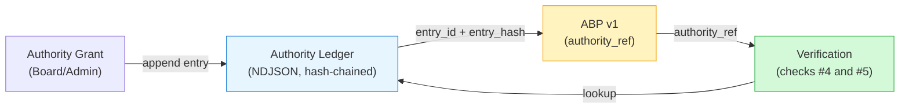
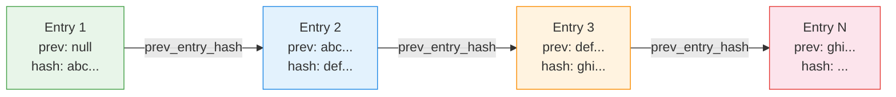

# Authority Ledger Binding

> The authority ledger is a tamper-evident, append-only chain of authority grants and revocations. The ABP binds to a specific ledger entry via `authority_ref`.

## Table of Contents

- [Overview](#overview)
- [ABP Authority Binding](#abp-authority-binding)
- [Ledger Format](#ledger-format)
- [Entry Fields](#entry-fields)
- [Grant Types](#grant-types)
- [Chain Integrity](#chain-integrity)
- [Time-Windowed Authority](#time-windowed-authority)
- [Revocation](#revocation)
- [ABP Verification Checks](#abp-verification-checks)
- [Ledger Tools](#ledger-tools)

---

## Overview

The authority ledger answers: **who authorized what, when, and is that authorization still valid?**

Every ABP must reference an active, non-revoked authority ledger entry. This binding ensures that the ABP's governance declarations are traceable to a specific grant of authority.



## ABP Authority Binding

The ABP's `authority_ref` section binds to a specific ledger entry:

```json
{
    "authority_ref": {
        "authority_entry_id": "AUTH-033059a5",
        "authority_entry_hash": "sha256:521ae3f9e87b49dd954160ba859fe96205d15367c807bc96b8f6368e60d3d40c",
        "authority_ledger_path": "enterprise/artifacts/public_demo_pack/authority_ledger.ndjson"
    }
}
```

| Field | Purpose |
|-------|---------|
| `authority_entry_id` | Links to the specific ledger entry by ID |
| `authority_entry_hash` | Verifies the entry hasn't been modified since the ABP was created |
| `authority_ledger_path` | Relative path to the ledger file for discovery |

## Ledger Format

The authority ledger is stored as **NDJSON** (newline-delimited JSON) — one JSON object per line:

```
{"entry_version":"1.0","entry_id":"AUTH-033059a5","entry_hash":"sha256:521ae...","prev_entry_hash":null,...}
{"entry_version":"1.0","entry_id":"AUTH-7b2c4e91","entry_hash":"sha256:8f3a...","prev_entry_hash":"sha256:521ae...",...}
```

Each entry chains to the previous via `prev_entry_hash`, forming a tamper-evident sequence.

**Location:** `enterprise/artifacts/public_demo_pack/authority_ledger.ndjson`

## Entry Fields

| Field | Type | Required | Description |
|-------|------|----------|-------------|
| `entry_version` | string | Yes | `"1.0"` |
| `entry_id` | string | Yes | Deterministic ID: `AUTH-xxxxxxxx` |
| `entry_hash` | string | Yes | Self-authenticating content hash: `sha256:...` |
| `prev_entry_hash` | string/null | Yes | Hash of previous entry (null for first) |
| `authority_id` | string | Yes | Stable grant identifier (e.g., `AUTO-xxx`) |
| `actor_id` | string | Yes | Operator/actor identifier |
| `actor_role` | string | Yes | `Operator`, `Reviewer`, `Admin`, etc. |
| `grant_type` | string | Yes | Type of authority action |
| `scope_bound` | object | Yes | What the actor can access |
| `policy_version` | string | Yes | Governance policy version (e.g., `GOV-2.0.2`) |
| `policy_hash` | string | Yes | Policy snapshot hash at grant time |
| `effective_at` | string | Yes | ISO 8601 start timestamp |
| `expires_at` | string/null | No | ISO 8601 end timestamp (null = no expiry) |
| `revoked_at` | string/null | No | ISO 8601 revocation timestamp |
| `revocation_reason` | string/null | No | Reason for revocation |
| `witness_required` | boolean | No | Whether witness approval is needed |
| `witness_role` | string/null | No | Role of required witness |
| `signing_key_id` | string/null | No | Key used to sign entry |
| `signature_ref` | string/null | No | Signature reference |
| `commit_hash_refs` | array | No | References to sealed commits |
| `notes` | string | No | Additional notes |
| `observed_at` | string | Yes | ISO 8601 observation timestamp |

### Scope Bound

The `scope_bound` object defines what the actor can access:

```json
{
    "decisions": ["DEC-001"],
    "claims": ["*"],
    "patches": ["*"],
    "prompts": ["*"],
    "datasets": ["hiring_console/*", "bid_console/*"]
}
```

## Grant Types

| Type | Purpose |
|------|---------|
| `direct` | Direct authority grant from authorized role |
| `delegated` | Authority delegated from another grant |
| `emergency` | Emergency override (time-limited, requires justification) |
| `revocation` | Revokes a previous grant — makes it inactive |

## Chain Integrity



Any modification to Entry N:

1. Changes its `entry_hash`
2. Breaks `prev_entry_hash` link in Entry N+1
3. Corrupts all successor entries

This makes the ledger **tamper-evident** — any change is detectable by re-verifying the chain.

## Time-Windowed Authority

An authority entry is **active at time T** if all of the following hold:

1. `grant_type` is NOT `"revocation"`
2. `effective_at <= T`
3. `expires_at` is null OR `T <= expires_at`
4. No revocation entry exists with `revoked_at <= T`

```
  effective_at                    expires_at
       |<------- active window ------->|
       |           T (must be here)    |
```

## Revocation

Revocation is a **new ledger entry** with `grant_type: "revocation"`:

```json
{
    "entry_id": "AUTH-revoke-xxx",
    "grant_type": "revocation",
    "authority_id": "AUTH-033059a5",
    "revoked_at": "2026-03-01T00:00:00Z",
    "revocation_reason": "Authority scope reduced per quarterly review"
}
```

Revocations do not modify the original entry — they append a new entry that marks the old one as inactive. This preserves the chain and audit trail.

### Impact on ABP

If the authority entry referenced by an ABP is revoked:

- `verify_abp.py` check #4 (`abp.authority_ref_valid`) will **FAIL** with `"Authority {entry_id} has been revoked"`
- The ABP is no longer valid for enforcement
- A new ABP must be built referencing a new, active authority entry

## ABP Verification Checks

Two verification checks directly involve the authority ledger:

### Check #4: `abp.authority_ref_valid`

1. Read the ledger NDJSON
2. Find entry matching `authority_entry_id`
3. Verify `entry_hash` matches `authority_entry_hash`
4. Confirm `revoked_at` is null

### Check #5: `abp.authority_not_expired`

1. Parse `effective_at` and `expires_at` from the ledger entry
2. Parse `created_at` from the ABP
3. Verify: `effective_at <= created_at`
4. If `expires_at` is set, verify: `created_at <= expires_at`

Both checks are skipped if no `--ledger` flag is provided.

## Ledger Tools

### Append Entry

```bash
# In enterprise/src/tools/reconstruct/
python authority_ledger_append.py \
    --ledger enterprise/artifacts/authority_ledger/ledger.ndjson \
    --actor-id alice \
    --actor-role Operator \
    --grant-type direct \
    --scope '{"decisions":["DEC-001"]}' \
    --policy-version GOV-2.0.2
```

Key function: `append_entry()` — appends a new entry with deterministic ID, chained `prev_entry_hash`, and computed `entry_hash`.

### Verify Chain

```bash
python authority_ledger_verify.py \
    --ledger enterprise/artifacts/authority_ledger/ledger.ndjson
```

Verifies:

- Valid NDJSON (each line parses)
- Each `entry_hash` correctly computed
- `prev_entry_hash` chain is continuous (no breaks)
- Required fields present
- Signatures valid (if entries have `signature_ref`)

### Query Active Authority

```python
from authority_ledger_append import find_active_for_actor

# Find active authority for actor at a specific time
entry = find_active_for_actor(
    ledger_path=Path("ledger.ndjson"),
    actor_id="alice",
    at_time="2026-02-25T00:00:00Z",
)
```
