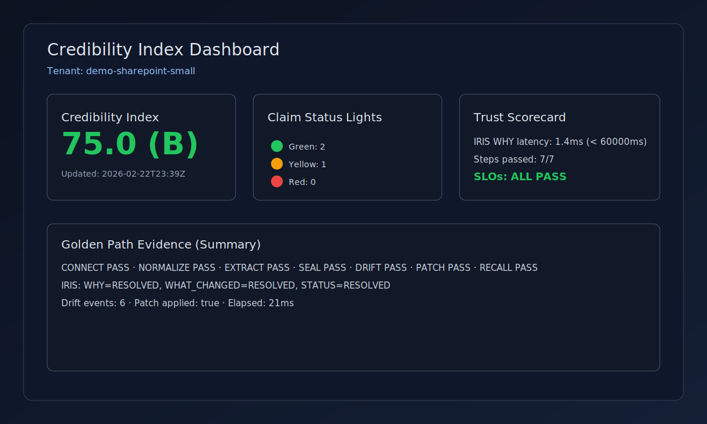
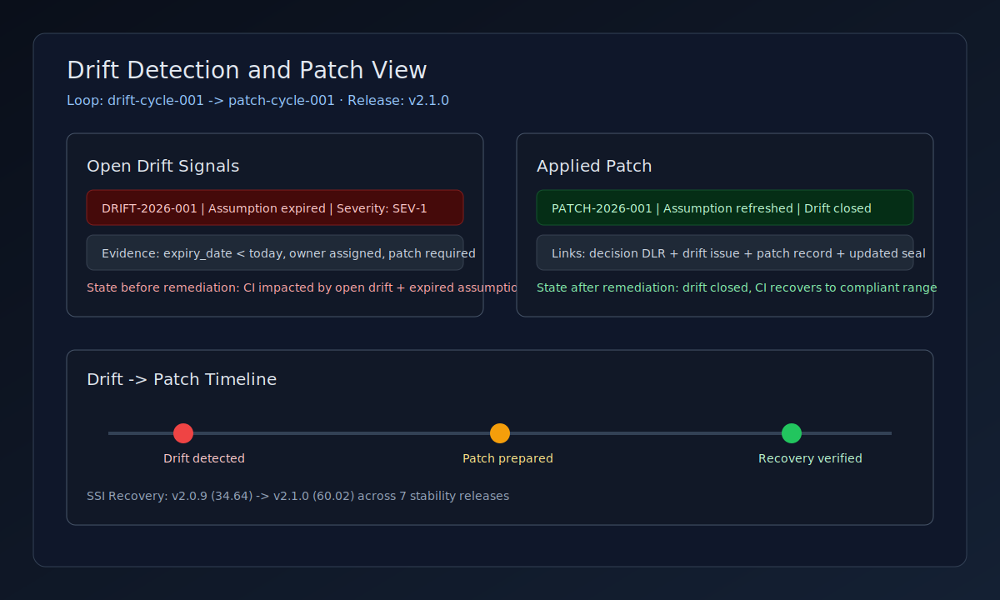

[](https://github.com/8ryanWh1t3/DeepSigma/actions/workflows/ci.yml)
[](https://pypi.org/project/deepsigma/)
[](./LICENSE)
[](https://www.python.org/downloads/)
[](https://github.com/8ryanWh1t3/DeepSigma/releases/latest)
[](https://github.com/codespaces/new/8ryanWh1t3/DeepSigma)

<div align="center">

# Σ OVERWATCH

**Current release:** v2.1.0
See: [docs/release/RELEASE_NOTES_v2.1.0.md](docs/release/RELEASE_NOTES_v2.1.0.md)

## Repo Radar KPI (latest)
[](release_kpis/radar_composite_latest.png)
[](release_kpis/roadmap_timeline.svg)

- Current release radar: [release_kpis/radar_v2.1.0.png](release_kpis/radar_v2.1.0.png)
- Composite release radar: [release_kpis/radar_composite_latest.png](release_kpis/radar_composite_latest.png)
- Composite release delta table: [release_kpis/radar_composite_latest.md](release_kpis/radar_composite_latest.md)
- Gate report: [release_kpis/KPI_GATE_REPORT.md](release_kpis/KPI_GATE_REPORT.md)
- Issue label gate: [release_kpis/ISSUE_LABEL_GATE_REPORT.md](release_kpis/ISSUE_LABEL_GATE_REPORT.md)
- Scalability gate: [release_kpis/SCALABILITY_GATE_REPORT.md](release_kpis/SCALABILITY_GATE_REPORT.md)
- KPI history: [release_kpis/history.json](release_kpis/history.json)
- KPI eligibility tiers: [governance/kpi_eligibility.json](governance/kpi_eligibility.json)
- KPI confidence: [release_kpis/kpi_confidence.json](release_kpis/kpi_confidence.json)
- KPI bands: [release_kpis/kpi_bands_v2.1.0.json](release_kpis/kpi_bands_v2.1.0.json)
- Benchmark trend: [release_kpis/benchmark_trend.png](release_kpis/benchmark_trend.png)
- Benchmark history: [release_kpis/benchmark_history.json](release_kpis/benchmark_history.json)
- TEC summary (C-TEC v2.0): [release_kpis/TEC_SUMMARY.md](release_kpis/TEC_SUMMARY.md)
- TEC internal tier: [release_kpis/tec_internal.json](release_kpis/tec_internal.json)
- TEC executive tier: [release_kpis/tec_executive.json](release_kpis/tec_executive.json)
- TEC Public Sector tier: [release_kpis/tec_public_sector.json](release_kpis/tec_public_sector.json)
- C-TEC mermaid flow: [docs/mermaid/12-c-tec-pipeline.md](docs/mermaid/12-c-tec-pipeline.md)
- Roadmap forecast: [release_kpis/roadmap_forecast.md](release_kpis/roadmap_forecast.md)
- Roadmap timeline: [release_kpis/roadmap_timeline.svg](release_kpis/roadmap_timeline.svg)
- Roadmap scope gate: [release_kpis/ROADMAP_SCOPE_GATE_REPORT.md](release_kpis/ROADMAP_SCOPE_GATE_REPORT.md)
- Nonlinear stability report: [release_kpis/nonlinear_stability_report.md](release_kpis/nonlinear_stability_report.md)
- SSI artifact (current release): [release_kpis/stability_v2.1.0.json](release_kpis/stability_v2.1.0.json)
- Authority evidence: [release_kpis/authority_evidence.json](release_kpis/authority_evidence.json)
- Economic metrics: [release_kpis/economic_metrics.json](release_kpis/economic_metrics.json)
- Stability-adjusted forecast: [release_kpis/stability_adjusted_forecast.json](release_kpis/stability_adjusted_forecast.json)
- Feature catalog (human): [docs/FEATURE_CATALOG.md](docs/FEATURE_CATALOG.md)
- Feature catalog (machine): [release_kpis/feature_catalog.json](release_kpis/feature_catalog.json)
- Feature catalog renderer: [scripts/render_feature_catalog.py](scripts/render_feature_catalog.py)

### Completed Track (v2.1.0 — Decision Infrastructure Hardening)

- All 8 KPIs >= 7.0 PASS
- SSI >= 55 PASS (60.02)
- 22 issues closed across 7 stability releases (v2.0.10–v2.0.16)
- Authority ledger chain verification + replay detection
- Evidence source binding + economic cost ledger
- Intent mutation detection + schema version enforcement
- Enterprise release checklist + operator runbook

### Next Track (v2.2.0 — Institutional Expansion)

- Enterprise Connectors
- Multi-provider DISR abstraction
- Authority-bound contract enforcement expansion
- Integration schema finalization

### Domain Modes (v2.1.0)

- IntelOps — 12 function handlers: claim ingest, validate, drift detect, patch, MG update, canon promote, authority/evidence check, triage, supersede, half-life, confidence recalc
- FranOps — 12 function handlers: canon propose/bless/enforce, retcon assess/execute/propagate, inflation monitor, expire, supersede, scope check, drift detect, rollback
- ReflectionOps — 12 function handlers: episode begin/seal/archive, gate evaluate/degrade/killswitch, audit non-coercion, severity score, coherence check, reflection ingest, IRIS resolve, replay
- Cascade Engine — 7 cross-domain rules with depth-limited propagation
- Event Contracts — routing table mapping 36 functions + 39 events
- Money Demo v2 — 10-step end-to-end pipeline (`make demo-money`)
- JRM — log-agnostic refinement engine: 3 adapters, 5-stage pipeline, JRM-X packet builder, enterprise federation
- 105 JRM tests, 207 domain mode tests, 686 total passing

### EDGE Modules

Exportable single-file HTML apps — zero dependencies, work offline, governance-ready.

| Module | Version | Description |
|--------|---------|-------------|
| EDGE Unified | v1.0.0 | 8-tab suite: Suite, Hiring, Bid, Compliance, BOE, IRIS, Delegation, Utility |
| Coherence Dashboard | v2.0.0 | 4-tab coherence overview with claims, drift, and analysis |
| JRM EDGE | v1.0.7 | 9-stage JRM pipeline explorer: events table, packets, health ring, test lab, stream mode, So What panel, policy drawer |
| RFP Co-Pilot | v1.0.0 | 8-tab RFP extraction workflow: Co-Pilot prompt, JSON spec, Power Query M scripts, role action packets |
| RFP Co-Pilot Exec Brief | v1.0.0 | 1-page executive summary with Print/PDF |
| Hiring UI | v1.0.0 | Staffing intake |
| BidNoBid UI | v1.0.0 | Opportunity evaluation |
| Compliance Matrix | v1.0.0 | Requirements mapping |
| BOE Pricing | v1.0.0 | Rate calculations |
| Award Staffing | v1.2.0 | Cost estimation |
| Suite ReadOnly | v1.0.0 | Telemetry + rollup |
| Domino Delegation Encryption | v1.0.0 | 4-of-7 Shamir threshold encryption ceremony with domino chain co-presence proof, TTL-gated keywords, AES-256-GCM |
| Domino Delegation Verifier | v1.0.0 | Read-only ceremony record verification (core edition) |

JRM EDGE v1.0.7 features: So What panel (per-stage what/why/next analysis), Analyzer vs Deep Sigma view toggle, packet chain timeline + diff, live stream mode + Freeze & Seal, policy drawer (guarded) + regression rerun.

RFP Co-Pilot: Parse Once. Execute Everywhere. — AI-assisted RFP extraction into structured JSON, loaded via Excel Power Query, with role-based action packets for 6 proposal team roles.

### Competitive Gap Closure (v2.1.0)

- Tool-call + LLM span tracing (OTel)
- Connector auto-instrumentation + W3C trace context
- RuntimeGate + SLO circuit breaker
- Compliance export encryption-at-rest + scheduled export
- Fairness drift types + external tool adapter (AIF360, Fairlearn)

## Positioning Shift
- Not AI governance tooling
- Not compliance software
- **Decision Infrastructure**
- **Institutional Accountability Engine**
- Positioning manifesto: [docs/positioning/positioning_manifesto.md](docs/positioning/positioning_manifesto.md)
- Executive briefing: [docs/positioning/executive_briefing_one_page.md](docs/positioning/executive_briefing_one_page.md)
- Architecture model: [specs/decision_infrastructure_model.md](specs/decision_infrastructure_model.md)
- Layer-to-KPI map: [release_kpis/layer_kpi_mapping.json](release_kpis/layer_kpi_mapping.json)

**Institutional Decision Infrastructure**

*Trust layer for agentic AI: verify before act, seal what happened, detect drift, ship patches.*

</div>

---

## What It Does

Organizations make thousands of decisions. Almost none are structurally recorded with their reasoning, evidence, or assumptions. When leaders leave, conditions change, or AI accelerates decisions 100x — governance fails silently.

**Σ OVERWATCH** fills this gap with three primitives:

- **Truth** — Decision Ledger Records (DLR) capture what was decided, by whom, with what evidence
- **Reasoning** — Reasoning Scaffolds (RS) capture why — claims, counter-claims, weights
- **Memory** — Decision Scaffolds + Memory Graphs (DS + MG) make institutional knowledge queryable

When assumptions decay, **Drift** fires. When drift exceeds tolerance, a **Patch** corrects it. This is the **Drift → Patch loop** — continuous self-correction.

---

## Quick Start

```bash
pip install deepsigma

# One-command Money Demo (recommended first run)
make demo

# Health check
deepsigma doctor

# Score coherence (0–100, A–F)
python -m core score ./core/examples/sample_episodes.json --json

# Drift → Patch canonical entrypoint
python -m core.examples.drift_patch_cycle

# Full 7-step Golden Path (no credentials needed)
deepsigma golden-path sharepoint \
  --fixture src/demos/golden_path/fixtures/sharepoint_small --clean

# Retention lifecycle sweep (cron-friendly)
deepsigma retention sweep --tenant tenant-alpha
```

## Golden-Path Proof Artifacts




```bash
# Golden Path run (ingest -> drift -> patch -> recall)
PYTHONPATH=src python -m tools.golden_path_cli golden-path sharepoint \
  --fixture src/demos/golden_path/fixtures/sharepoint_small \
  --output golden_path_output --clean

# Trust Scorecard (includes WHY retrieval SLO check)
PYTHONPATH=src python -m tools.trust_scorecard \
  --input golden_path_output \
  --output golden_path_output/trust_scorecard.json
```

```text
============================================================
  GOLDEN PATH
============================================================
  [1] CONNECT              PASS
  [2] NORMALIZE            PASS
  [3] EXTRACT              PASS
  [4] SEAL                 PASS
  [5] DRIFT                PASS
  [6] PATCH                PASS
  [7] RECALL               PASS
...
  IRIS:       WHY=RESOLVED, WHAT_CHANGED=RESOLVED, STATUS=RESOLVED
  Drift:      6 events
  Patch:      applied
============================================================
Trust Scorecard written to golden_path_output/trust_scorecard.json
  SLOs:    ALL PASS
```

Trust Scorecard highlights from the same run:
- `iris_why_latency_ms`: `1.4` (`<= 60000` target, retrieval <= 60s)
- `patch_applied`: `true`
- `drift_events_detected`: `6`
- `all_steps_passed`: `true`

---

## Court-Grade Proof (60 seconds)

```bash
# Seal + sign + authority bind + transparency log + pack
python src/tools/reconstruct/seal_and_prove.py \
    --decision-id DEC-001 --clock 2026-02-21T00:00:00Z \
    --sign-algo hmac --sign-key-id ds-dev --sign-key "$KEY" \
    --auto-authority --pack-dir /tmp/pack

# Verify everything in one command:
python src/tools/reconstruct/verify_pack.py --pack /tmp/pack --key "$KEY"
```

---

## Key Capabilities

| Capability | Description | Docs |
|---|---|---|
| **Coherence Ops CLI** | Score, audit, query, reconcile decision artifacts | [CLI Reference](docs/CLI.md) |
| **Golden Path** | 7-step end-to-end proof loop | [Golden Path](demos/golden_path/README.md) |
| **Credibility Engine** | Institutional-scale claim lattice with formal scoring | [Engine Docs](docs/credibility-engine/) |
| **Trust Scorecard** | Measurable SLOs from every Golden Path run | [Spec](schemas/core/trust_scorecard_v1.md) |
| **Excel-first BOOT** | Govern decisions in a shared workbook — no code required | [BOOT Protocol](docs/excel-first/WORKBOOK_BOOT_PROTOCOL.md) |
| **MDPT** | Multi-Dimensional Prompt Toolkit for governed prompt ops | [MDPT Docs](src/mdpt/README.md) |
| **Court-Grade Admissibility** | Seal-and-prove pipeline: Merkle commitments, transparency log, multi-sig witness, hardware key hooks | [Admissibility Levels](docs/reconstruct/ADMISSIBILITY_LEVELS.md) |
| **MCP Server** | Model Context Protocol server with auth + rate limiting | [MCP Adapter](adapters/mcp/) |
| **API Reference** | Auto-generated OpenAPI + static Redoc docs | [API Docs](docs/api/index.html) |
| **RDF/SPARQL** | Semantic lattice queries via in-process SPARQL 1.1 | [SPARQL Service](services/sparql_service.py) |
| **Dashboard** | React dashboard with Trust Scorecard + Zustand store | [Dashboard](dashboard/) |
| **Runtime Gate** | Composable pre-execution policy constraints with SLO circuit breaker | [src/engine/runtime_gate.py](src/engine/runtime_gate.py) |
| **OTel Span Tracing** | Tool-call + LLM completion spans, connector auto-instrumentation, W3C context propagation | [src/adapters/otel/](src/adapters/otel/) |
| **Compliance Export** | SOC 2 evidence packages with encryption-at-rest + scheduled auto-export | [CLI: compliance export](src/deepsigma/cli/compliance_export.py) |
| **Fairness Adapter** | Hybrid fairness monitoring — ingest AIF360/Fairlearn reports as drift signals | [src/adapters/fairness/](src/adapters/fairness/) |
| **Domain Modes** | IntelOps (12), FranOps (12), ReflectionOps (12) — 36 function handlers with deterministic replay | [src/core/modes/](src/core/modes/) |
| **Cascade Engine** | Cross-domain event propagation with 7 declarative rules and depth-limited cascading | [src/core/modes/cascade.py](src/core/modes/cascade.py) |
| **Event Contracts** | Routing table: 36 functions + 39 events mapped to FEEDS topics, subtypes, and handlers | [src/core/feeds/contracts/](src/core/feeds/contracts/) |
| **Money Demo v2** | 10-step pipeline exercising all 3 domain modes with drift, retcon, and cascade | [src/demos/money_demo/](src/demos/money_demo/) |
| **JRM Pipeline** | Log-agnostic Judgment Refinement Module — 3 adapters (Suricata, Snort, Copilot), 5-stage coherence pipeline, JRM-X packet zips | [src/core/jrm/](src/core/jrm/) |
| **JRM Federation** | Cross-environment gate, hub, advisory engine, HMAC-SHA256 packet signing | [enterprise/src/deepsigma/jrm_ext/](src/deepsigma/jrm_ext/) |

## Connectors

All connectors conform to the [Connector Contract v1.0](schemas/core/connector_contract_v1.md).

| Connector | Transport | Docs |
|---|---|---|
| SharePoint | Graph API | [docs](docs/26-sharepoint-connector.md) |
| Power Platform | Dataverse Web API | [docs](docs/27-power-platform-connector.md) |
| AskSage | REST API | [docs](docs/28-asksage-connector.md) |
| Snowflake | Cortex + SQL API | [docs](docs/29-snowflake-connector.md) |
| LangGraph | LangChain Callback | [docs](docs/23-langgraph-adapter.md) |
| OpenClaw | WASM Sandbox | [docs](adapters/openclaw/) |
| Local LLM | llama.cpp / OpenAI-compatible | [docs](docs/30-local-inference.md) |

## Security And Data Handling

- [Data Boundaries](docs/DATA_BOUNDARIES.md) — data at rest, storage locations, retention, redaction, tenancy isolation, connector flow, secrets policy, and network boundaries.
- [Connector SDK](docs/CONNECTOR_SDK.md) — ConnectorV1 contract and safety expectations for custom adapters.
- [DISR Security Model](docs/docs/security/DISR.md) — Breakable -> Detectable -> Rotatable -> Recoverable posture for pilot security credibility.
- [Key Lifecycle](docs/docs/security/KEY_LIFECYCLE.md) — key versioning, TTL, and rotation cadence.
- [Recovery Runbook](docs/docs/security/RECOVERY_RUNBOOK.md) — compromise response and re-encryption recovery sequence.
- [10-Minute Security Demo](docs/docs/security/DEMO_10_MIN.md) — reproducible DISR drill (`make security-gate` + `make security-demo`).
- [DISR Re-encrypt Benchmark](docs/docs/security/DEMO_10_MIN.md) — CI-eligible benchmark (`make benchmark`) with output in `release_kpis/scalability_metrics.json`.
- [Scalability Regression Gate](release_kpis/SCALABILITY_GATE_REPORT.md) — prevents throughput regressions (`make scalability-gate`).
- [Benchmark Trend](release_kpis/benchmark_trend.png) — historical throughput visualization (`make benchmark-trend`).

Note: `--ci-mode` runs produce deterministic, KPI-eligible benchmark evidence. Use `--real-workload` for full AES-256-GCM crypto operations with production keys.

## Monitoring

- Prometheus metrics endpoint: `GET /metrics`
- Grafana dashboard: `ops/grafana/deepsigma.json`
- Local monitoring stack: `docker-compose.monitoring.yml`

Start monitoring stack:

```bash
docker compose -f docker-compose.monitoring.yml up --build
```

Endpoints:
- DeepSigma API: `http://localhost:8000`
- Prometheus: `http://localhost:9090`
- Grafana: `http://localhost:3001` (`admin` / `admin`)

---

## Repo Structure

```
DeepSigma/
├── src/                 # 12 Python packages (all source code)
│   ├── core/   #   Core library + CLI
│   ├── engine/          #   Compression, degrade ladder, supervisor
│   ├── adapters/        #   MCP, SharePoint, Snowflake, LangGraph, OpenClaw, AskSage
│   ├── deepsigma/       #   Unified product CLI
│   ├── demos/           #   Golden Path, Excel-first Money Demo
│   ├── mdpt/            #   MDPT tools + Power App starter kit
│   └── ...              #   credibility_engine, services, mesh, governance, tenancy, verifiers, tools
├── tests/               # 1250+ tests, fixtures, datasets
├── docs/                # Documentation + examples (canonical, mermaid, lattices, etc.)
├── dashboard/           # React dashboard + API server
├── schemas/             # JSON schemas (core engine + Prompt OS)
├── artifacts/           # Workbooks, templates, sealed runs, sample data
├── prompts/             # Canonical prompts + Prompt OS control prompts
└── .github/             # CI/CD workflows
```

---

## Documentation

| | |
|---|---|
| [QUICKSTART.md](docs/QUICKSTART.md) | 5-minute starter path (`deepsigma init` + `make demo`) |
| [START_HERE.md](docs/START_HERE.md) | Front door |
| [HERO_DEMO.md](docs/HERO_DEMO.md) | 5-minute hands-on walkthrough |
| [NAV.md](docs/NAV.md) | Full navigation index |
| [ABOUT.md](docs/ABOUT.md) | Reality Await Layer (RAL) |
| [OPS_RUNBOOK.md](docs/OPS_RUNBOOK.md) | Operations + incident playbooks |
| [HELM.md](docs/deployment/HELM.md) | Helm install/test runbook (kind/minikube) |
| [STATELESS_API_SCALE_GUIDE.md](docs/scaling/STATELESS_API_SCALE_GUIDE.md) | 3-replica benchmark + sizing guidance |
| [STABILITY.md](docs/STABILITY.md) | Versioning policy + stability guarantees |
| [docs/99-docs-map.md](docs/99-docs-map.md) | Complete docs map |

---

## Excel Prompt OS v2

Structured cognition workbook for institutional decision-making — no code required.

- **Workbook:** [`artifacts/excel/Coherence_Prompt_OS_v2.xlsx`](artifacts/excel/Coherence_Prompt_OS_v2.xlsx)
- **Quickstart:** [`docs/prompt_os/README.md`](docs/prompt_os/README.md)
- **Prompts:** [`docs/prompt_os/PROMPTS.md`](docs/prompt_os/PROMPTS.md)
- **Diagram:** [`docs/prompt_os/diagrams/prompt_os_flow.mmd`](docs/prompt_os/diagrams/prompt_os_flow.mmd)

## Prompts

- **Canonical Prompts v1:** [`prompts/canonical/`](prompts/canonical/) — Executive Analysis, Reality Assessment
- **Prompt Index:** [`prompts/README.md`](prompts/README.md)

---

## Contributing

See [CONTRIBUTING.md](CONTRIBUTING.md).

## License

[MIT](LICENSE)

---

<div align="center">

**Σ OVERWATCH**
*We don't sell agents. We sell the ability to trust them.*

</div>
