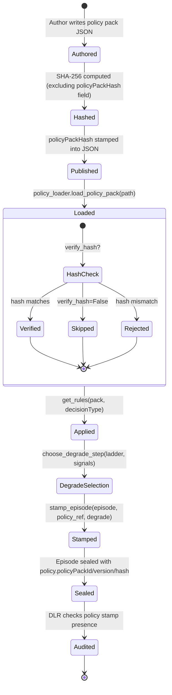
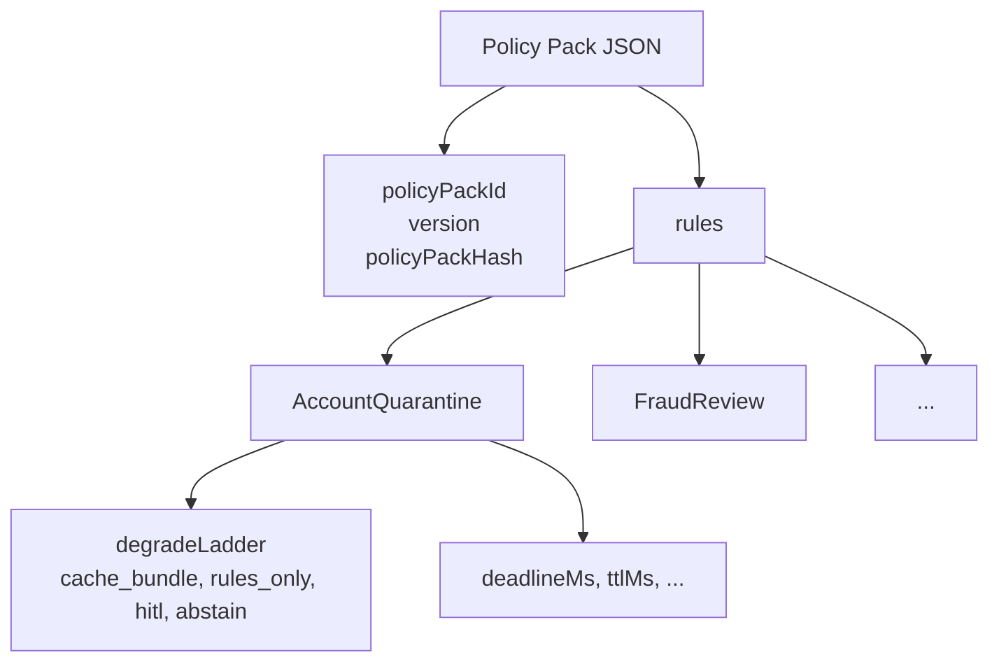

# Policy Pack Lifecycle

How policy packs are authored, loaded, verified, stamped onto episodes, and audited.

```mermaid
stateDiagram-v2
    [*] --> Authored: Author writes policy pack JSON
    Authored --> Hashed: SHA-256 computed (excluding policyPackHash field)
    Hashed --> Published: policyPackHash stamped into JSON
    Published --> Loaded: policy_loader.load_policy_pack(path)

    state Loaded {
        [*] --> HashCheck: verify_hash?
        HashCheck --> Verified: hash matches
        HashCheck --> Rejected: hash mismatch
        HashCheck --> Skipped: verify_hash=False
        Verified --> [*]
        Skipped --> [*]
        Rejected --> [*]
    }

    Loaded --> Applied: get_rules(pack, decisionType)
    Applied --> DegradeSelection: choose_degrade_step(ladder, signals)
    DegradeSelection --> Stamped: stamp_episode(episode, policy_ref, degrade)
    Stamped --> Sealed: Episode sealed with policy.policyPackId/version/hash
    Sealed --> Audited: DLR checks policy stamp presence
    Audited --> [*]
```

## Policy Pack Structure

```mermaid
graph TD
    PP[Policy Pack JSON] --> META[policyPackId<br/>version<br/>policyPackHash]
    PP --> RULES[rules]
    RULES --> DT1["AccountQuarantine"]
    RULES --> DT2["FraudReview"]
    RULES --> DTN["..."]
    DT1 --> LADDER1[degradeLadder<br/>cache_bundle, rules_only, hitl, abstain]
    DT1 --> THRESHOLDS1[deadlineMs, ttlMs, ...]
```
