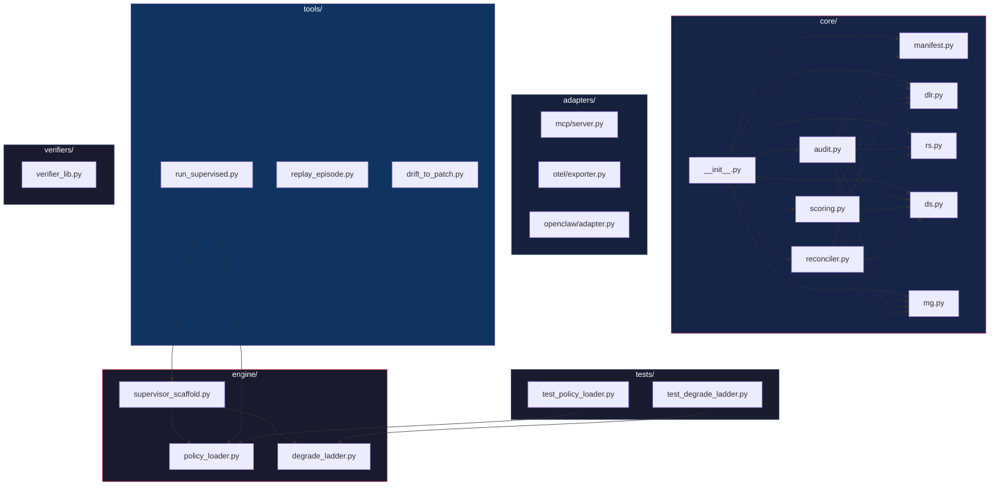

# Module Dependencies

Python import graph showing how the repo modules relate to each other.

```mermaid
graph TD
    subgraph engine["engine/"]
        PL[policy_loader.py]
        DL[degrade_ladder.py]
        SS[supervisor_scaffold.py]
    end

    subgraph coherence["core/"]
        INIT["__init__.py"]
        MAN[manifest.py]
        DLR[dlr.py]
        RSM[rs.py]
        DSM[ds.py]
        MGM[mg.py]
        AUD[audit.py]
        SCO[scoring.py]
        REC[reconciler.py]
    end

    subgraph adapters["adapters/"]
        MCP[mcp/server.py]
        OTEL[otel/exporter.py]
        OCLAW[openclaw/adapter.py]
    end

    subgraph tools["tools/"]
        RUN[run_supervised.py]
        REPLAY[replay_episode.py]
        DRIFT_TOOL[drift_to_patch.py]
    end

    subgraph verifiers["verifiers/"]
        VLIB[verifier_lib.py]
    end

    subgraph tests["tests/"]
        TDL[test_degrade_ladder.py]
        TPL[test_policy_loader.py]
    end

    SS --> PL
    SS --> DL
    RUN --> SS
    RUN --> PL

    INIT --> MAN
    INIT --> DLR
    INIT --> RSM
    INIT --> DSM
    INIT --> MGM
    INIT --> AUD
    INIT --> SCO
    INIT --> REC

    AUD --> DLR
    AUD --> DSM
    AUD --> MGM
    AUD --> RSM
    AUD --> MAN

    SCO --> DLR
    SCO --> RSM
    SCO --> DSM
    SCO --> MGM

    REC --> DLR
    REC --> DSM
    REC --> MGM

    TDL --> DL
    TPL --> PL

    style engine fill:#1a1a2e,stroke:#e94560,color:#fff
    style coherence fill:#162447,stroke:#e94560,color:#fff
    style adapters fill:#16213e,stroke:#0f3460,color:#fff
    style tools fill:#0f3460,stroke:#533483,color:#fff
    style verifiers fill:#1b1b2f,stroke:#1f4068,color:#fff
    style tests fill:#1b1b2f,stroke:#1f4068,color:#fff
```
