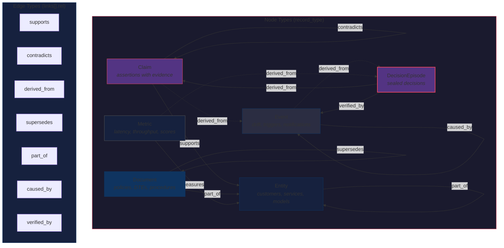
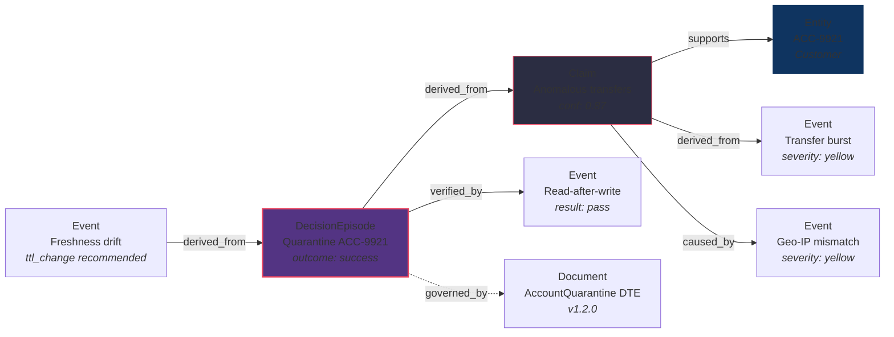

# 18 — Knowledge Graph Ontology

Visual map of node types, edge types, and how they form the canonical knowledge graph.

```mermaid
graph TB
    subgraph NodeTypes["Node Types (record_type)"]
        CL["Claim<br/><i>assertions with evidence</i>"]
        DE["DecisionEpisode<br/><i>sealed decisions</i>"]
        EV["Event<br/><i>drift, triggers, notifications</i>"]
        DOC["Document<br/><i>policies, DTEs, procedures</i>"]
        ENT["Entity<br/><i>customers, services, models</i>"]
        MET["Metric<br/><i>latency, throughput, scores</i>"]
    end

    CL -->|supports| ENT
    CL -->|contradicts| CL
    CL -.->|derived_from| EV
    DE -->|derived_from| CL
    DE -->|verified_by| EV
    EV -->|caused_by| EV
    EV -.->|derived_from| DE
    DOC -->|supersedes| DOC
    DOC -->|part_of| ENT
    ENT -->|part_of| ENT
    MET -.->|derived_from| DE
    MET -->|measures| ENT

    subgraph EdgeTypes["Edge Types (links[].rel)"]
        direction LR
        E1["supports"]
        E2["contradicts"]
        E3["derived_from"]
        E4["supersedes"]
        E5["part_of"]
        E6["caused_by"]
        E7["verified_by"]
    end

    style NodeTypes fill:#1a1a2e,stroke:#e94560
    style EdgeTypes fill:#16213e,stroke:#0f3460
    style CL fill:#533483,stroke:#e94560
    style DE fill:#533483,stroke:#e94560,stroke-width:2px
    style EV fill:#2b2d42,stroke:#0f3460
    style DOC fill:#0f3460,stroke:#0f3460
    style ENT fill:#16213e,stroke:#0f3460
    style MET fill:#16213e,stroke:#555
```

## Example: fraud investigation subgraph

```mermaid
graph LR
    E_ACC["Entity<br/>ACC-9921<br/><i>Customer</i>"]
    C_FRAUD["Claim<br/>Anomalous transfers<br/><i>conf: 0.87</i>"]
    E_BURST["Event<br/>Transfer burst<br/><i>severity: yellow</i>"]
    E_GEO["Event<br/>Geo-IP mismatch<br/><i>severity: yellow</i>"]
    D_QUAR["DecisionEpisode<br/>Quarantine ACC-9921<br/><i>outcome: success</i>"]
    E_VERIFY["Event<br/>Read-after-write<br/><i>result: pass</i>"]
    DOC_DTE["Document<br/>AccountQuarantine DTE<br/><i>v1.2.0</i>"]
    E_DRIFT["Event<br/>Freshness drift<br/><i>ttl_change recommended</i>"]

    C_FRAUD -->|supports| E_ACC
    C_FRAUD -->|derived_from| E_BURST
    C_FRAUD -->|caused_by| E_GEO
    D_QUAR -->|derived_from| C_FRAUD
    D_QUAR -->|verified_by| E_VERIFY
    D_QUAR -.->|governed_by| DOC_DTE
    E_DRIFT -->|derived_from| D_QUAR

    style D_QUAR fill:#533483,stroke:#e94560,stroke-width:2px
    style C_FRAUD fill:#2b2d42,stroke:#e94560
    style E_ACC fill:#0f3460,stroke:#0f3460
```
