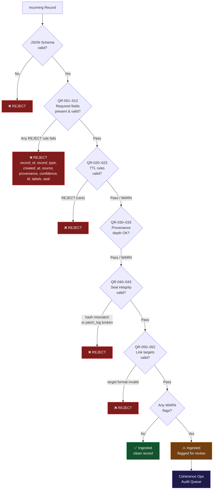

# 20 — Validation Gate

Quality rules that every canonical record must pass before ingestion. Based on `05_validation/quality_rules.md`.

```mermaid
flowchart TD
    IN["Incoming Record"] --> SCHEMA{"JSON Schema<br/>valid?"}
    SCHEMA -->|No| REJECT1["❌ REJECT"]
    SCHEMA -->|Yes| QR1{"QR-001–012<br/>Required fields<br/>present & valid?"}
    QR1 -->|"Any REJECT rule fails"| REJECT2["❌ REJECT<br/><i>record_id, record_type,<br/>created_at, source,<br/>provenance, confidence,<br/>ttl, labels, seal</i>"]
    QR1 -->|Pass| QR2{"QR-020–023<br/>TTL rules<br/>valid?"}
    QR2 -->|"REJECT (rare)"| REJECT3["❌ REJECT"]
    QR2 -->|"Pass / WARN"| QR3{"QR-030–033<br/>Provenance<br/>depth OK?"}
    QR3 -->|Pass / WARN| QR4{"QR-040–043<br/>Seal integrity<br/>valid?"}
    QR4 -->|"hash mismatch<br/>or patch_log broken"| REJECT4["❌ REJECT"]
    QR4 -->|Pass| QR5{"QR-050–052<br/>Link targets<br/>valid?"}
    QR5 -->|"target format invalid"| REJECT5["❌ REJECT"]
    QR5 -->|Pass| WARN{"Any WARN<br/>flags?"}
    WARN -->|No| CLEAN["✅ Ingested<br/><i>clean record</i>"]
    WARN -->|Yes| FLAGGED["⚠️ Ingested<br/><i>flagged for review</i>"]

    FLAGGED --> AUDIT["Coherence Ops<br/>Audit Queue"]

    style REJECT1 fill:#7f1d1d,stroke:#ef4444,color:#fff
    style REJECT2 fill:#7f1d1d,stroke:#ef4444,color:#fff
    style REJECT3 fill:#7f1d1d,stroke:#ef4444,color:#fff
    style REJECT4 fill:#7f1d1d,stroke:#ef4444,color:#fff
    style REJECT5 fill:#7f1d1d,stroke:#ef4444,color:#fff
    style CLEAN fill:#14532d,stroke:#22c55e,color:#fff
    style FLAGGED fill:#713f12,stroke:#f59e0b,color:#fff
    style AUDIT fill:#1e1b4b,stroke:#818cf8,color:#fff
```
