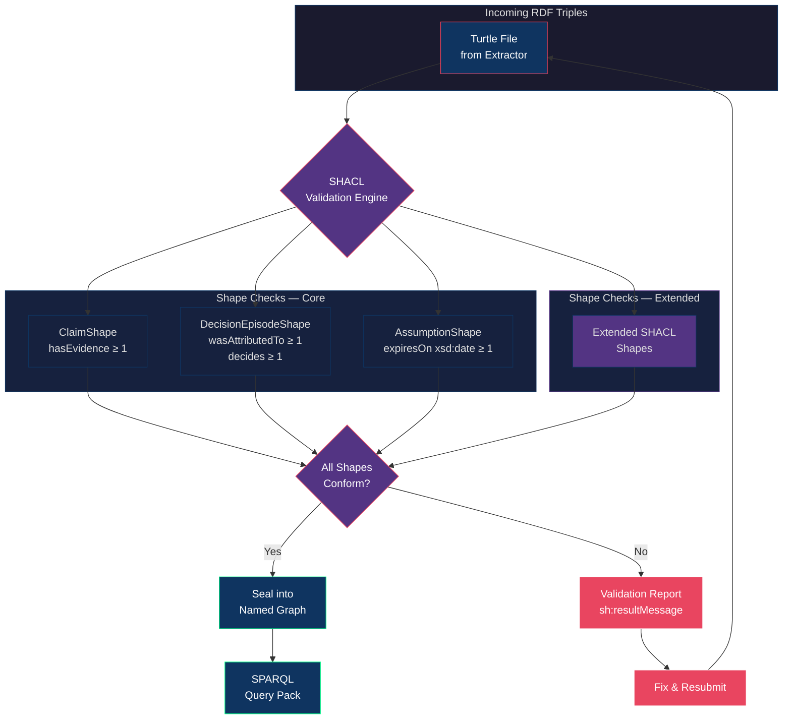

# 24 — SHACL Validation Gate

> Source: `rdf/shapes/coherence_ops_core.shacl.ttl`, `rdf/shapes/coherence_ops_extended.shacl.ttl`

## Reading the Diagram

| Element | Meaning |
|---------|---------|
| Turtle File | Output of the SharePoint → RDF extractor |
| ClaimShape | Every Claim needs ≥ 1 Evidence link |
| DecisionEpisodeShape | Every Decision needs attribution + ≥ 1 decided Claim |
| AssumptionShape | Every Assumption needs an expiration date |
| Green border | Successful path → sealed graph → SPARQL |
| Red nodes | Failure path → validation report → fix loop |

## See Also

- [rdf/shapes/coherence_ops_core.shacl.ttl](../rdf/shapes/coherence_ops_core.shacl.ttl)
- [rdf/shapes/coherence_ops_extended.shacl.ttl](../rdf/shapes/coherence_ops_extended.shacl.ttl)
- [23 — Core 8 Ontology Graph](23-core8-ontology-graph.md)
- [26 — Named Graph Sealing](26-named-graph-sealing.md)
