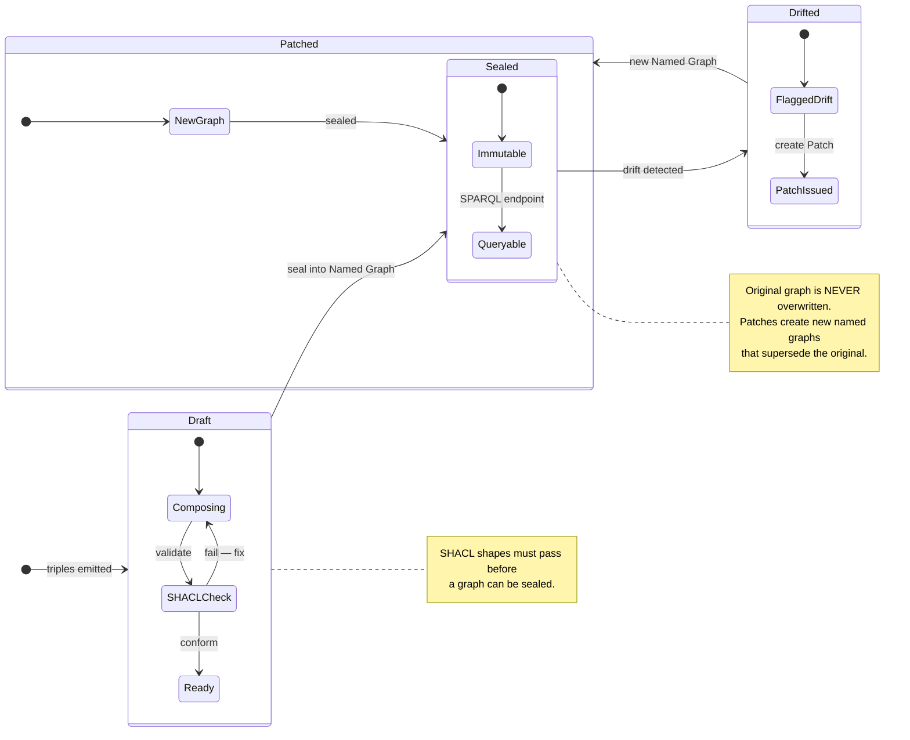

# 26 — Named Graph Sealing

> Design rule: "Use Named Graphs for sealing — immutable decision episodes; patch rather than overwrite."

## Reading the Diagram

| State | Meaning |
|-------|---------|
| Draft | Triples being composed; SHACL validation loop |
| Sealed | Immutable named graph; available for SPARQL queries |
| Drifted | Drift detected on a sealed episode |
| Patched | New named graph created; supersedes original; re-enters Sealed |

## Design Rules

The RDF layer enforces "patch rather than overwrite": a sealed named graph is never mutated. When drift is detected, a new graph is emitted containing the patch triples, and the original remains intact for audit.

## See Also

- [rdf/diagrams/rdf_escape_ramp.mmd](../rdf/diagrams/rdf_escape_ramp.mmd)
- [07 — Policy Pack Lifecycle](07-policy-pack-lifecycle.md)
- [14 — Seal and Patch Lifecycle](14-seal-patch-lifecycle.md)
- [24 — SHACL Validation Gate](24-shacl-validation-gate.md)
