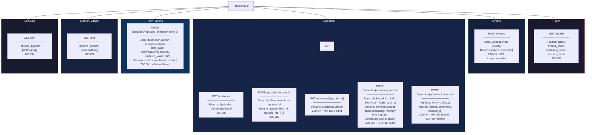
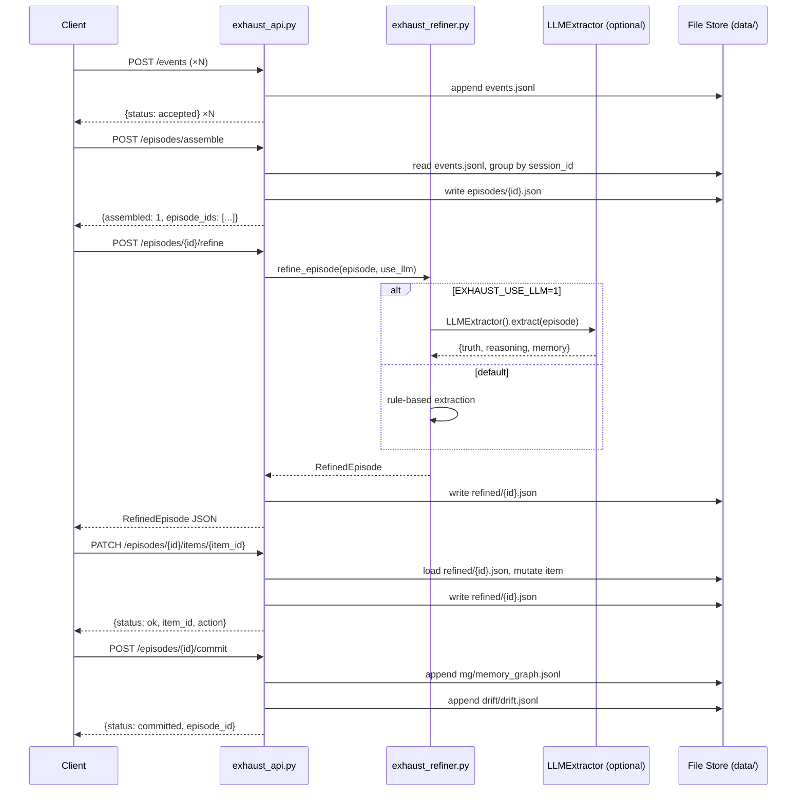
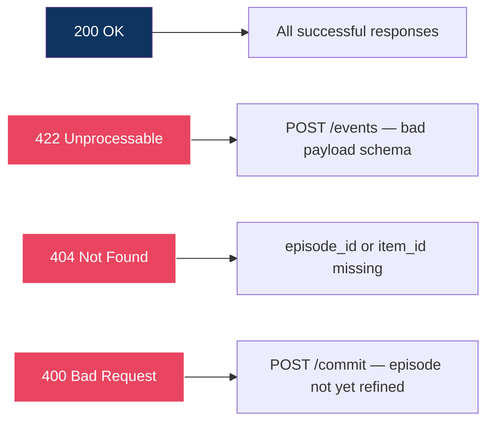

# Exhaust API Surface

All ten REST endpoints exposed by `dashboard/server/exhaust_api.py`, grouped by resource.

## Request / Response Flow

How a typical refine → item-action → commit sequence flows through the API.

## Status Code Summary

