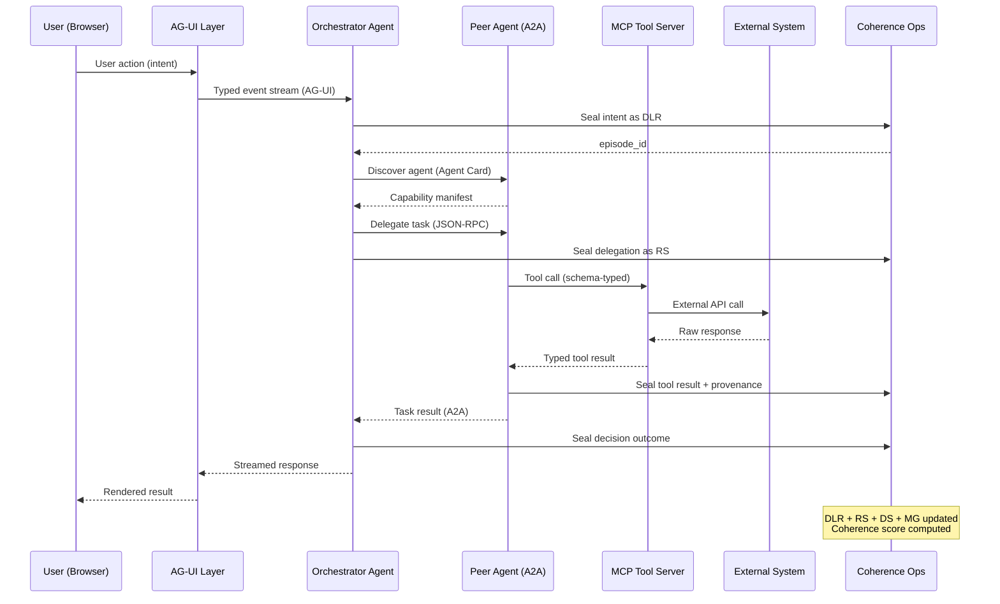

# Interop Request Flow — AG-UI → A2A → MCP → Response

A user action flowing through the full interoperability stack with Coherence Ops sealing at each transition.

```mermaid
sequenceDiagram
    participant U as User (Browser)
    participant AG as AG-UI Layer
    participant O as Orchestrator Agent
    participant A2A as Peer Agent (A2A)
    participant MCP as MCP Tool Server
    participant SYS as External System
    participant CO as Coherence Ops

    U->>AG: User action (intent)
    AG->>O: Typed event stream (AG-UI)
    O->>CO: Seal intent as DLR
    CO-->>O: episode_id

    O->>A2A: Discover agent (Agent Card)
    A2A-->>O: Capability manifest
    O->>A2A: Delegate task (JSON-RPC)
    O->>CO: Seal delegation as RS

    A2A->>MCP: Tool call (schema-typed)
    MCP->>SYS: External API call
    SYS-->>MCP: Raw response
    MCP-->>A2A: Typed tool result
    A2A->>CO: Seal tool result + provenance

    A2A-->>O: Task result (A2A)
    O->>CO: Seal decision outcome
    O-->>AG: Streamed response
    AG-->>U: Rendered result

    Note over CO: DLR + RS + DS + MG updated<br/>Coherence score computed
```
