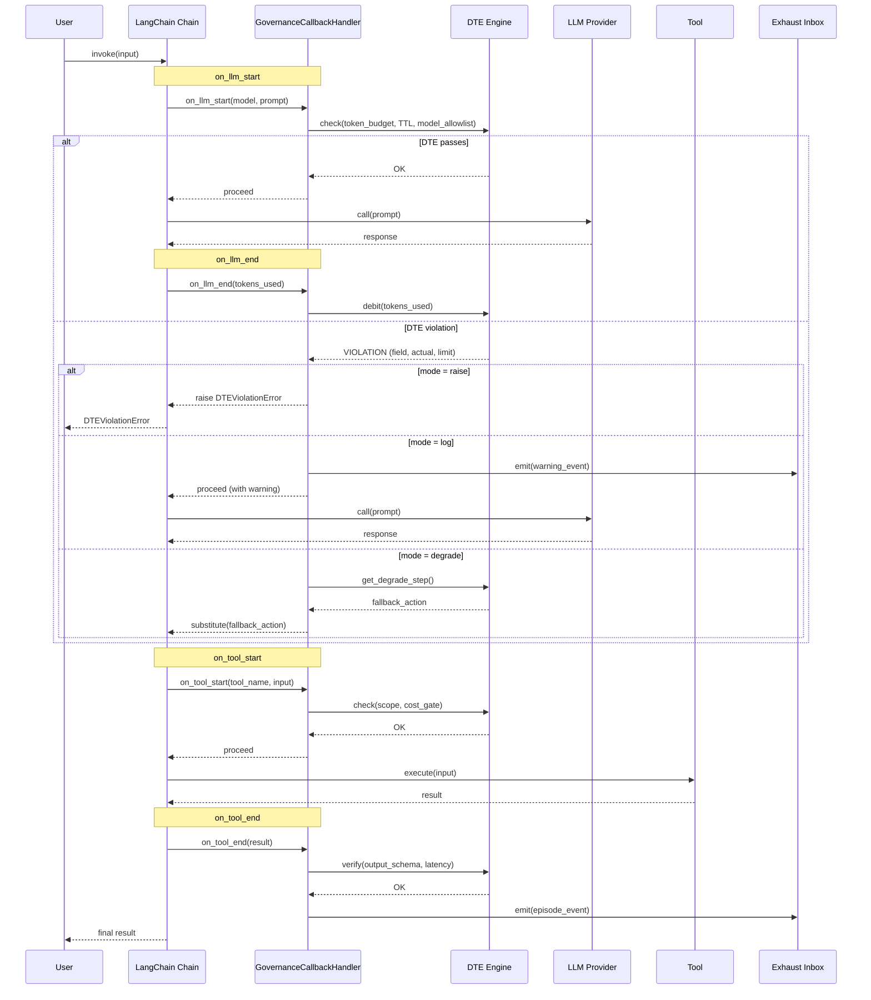

# LangChain Governance Flow

Sequence diagram showing DTE enforcement via `GovernanceCallbackHandler` during a LangChain chain execution.

## Key Details

- **Every LLM and tool call** passes through the governance callback before execution.
- **Violation decision tree**: The handler checks `violation_mode` to determine whether to raise, log, or degrade.
- **Degrade path**: Consults the Degrade Ladder for the next safe fallback action.
- **Exhaust events** are emitted on every tool completion and on every violation, regardless of mode.
