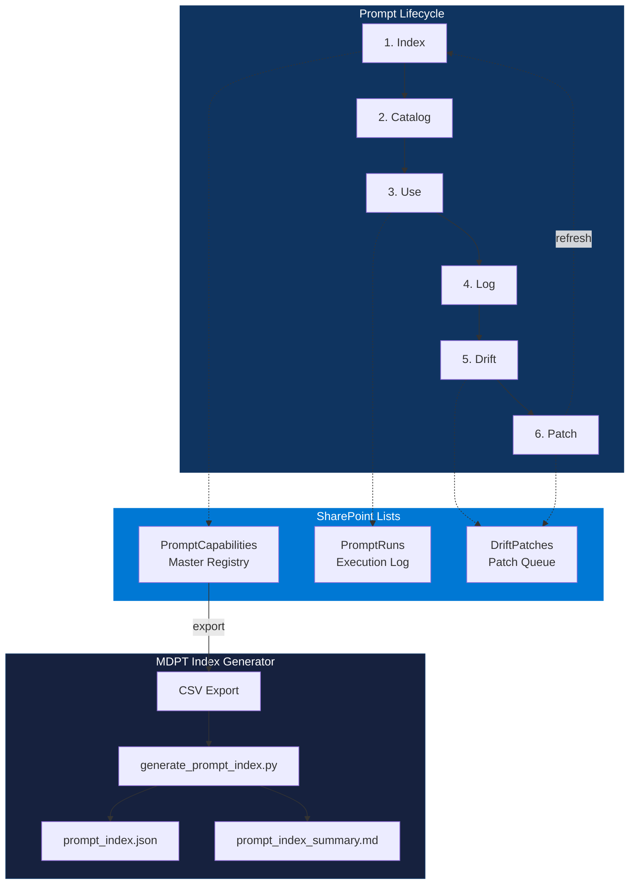

# 37 — MDPT Beta Kit Lifecycle

> Canonical lifecycle diagram for MDPT prompt operations: Index → Catalog → Use → Log → Drift → Patch.

This diagram is reused in `README.md` and `mdpt/README.md`.

```mermaid
flowchart TB
    subgraph SharePoint["SharePoint Lists"]
        PC[PromptCapabilities<br/>Master Registry]
        PR[PromptRuns<br/>Execution Log]
        DP[DriftPatches<br/>Patch Queue]
    end

    subgraph Generator["MDPT Index Generator"]
        CSV[CSV Export] --> GEN[generate_prompt_index.py]
        GEN --> IDX[prompt_index.json]
        GEN --> SUM[prompt_index_summary.md]
    end

    subgraph Lifecycle["Prompt Lifecycle"]
        direction LR
        INDEX[1. Index] --> CATALOG[2. Catalog]
        CATALOG --> USE[3. Use]
        USE --> LOG[4. Log]
        LOG --> DRIFT[5. Drift]
        DRIFT --> PATCH[6. Patch]
        PATCH -.->|refresh| INDEX
    end

    PC -->|export| CSV
    INDEX -.-> PC
    USE -.-> PR
    DRIFT -.-> DP
    PATCH -.-> DP

    style SharePoint fill:#0078d4,stroke:#0078d4,color:#fff
    style Generator fill:#16213e,stroke:#0f3460,color:#fff
    style Lifecycle fill:#0f3460,stroke:#0f3460,color:#fff
```
