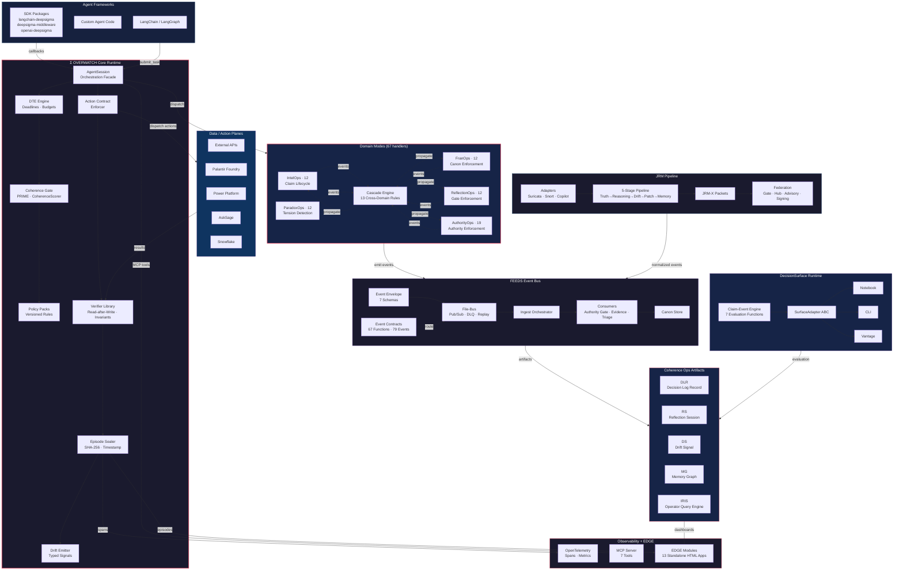

# System Architecture

Full system map of Sigma OVERWATCH — Coherence Ops platform for AI and human decision systems.

```mermaid
graph TB
    subgraph Agents["Agent Frameworks"]
        LC[LangChain / LangGraph]
        Custom[Custom Agent Code]
        SDK["SDK Packages<br/>langchain-deepsigma<br/>deepsigma-middleware<br/>openai-deepsigma"]
    end

    subgraph Core["Σ OVERWATCH Core Runtime"]
        direction TB
        SESSION[AgentSession<br/>Orchestration Facade]
        DTE[DTE Engine<br/>Deadlines · Budgets]
        GATE[Coherence Gate<br/>PRIME · CoherenceScorer]
        PP[Policy Packs<br/>Versioned Rules]
        AC[Action Contract<br/>Enforcer]
        VER[Verifier Library<br/>Read-after-Write · Invariants]
        SEAL[Episode Sealer<br/>SHA-256 · Timestamp]
        DRIFT[Drift Emitter<br/>Typed Signals]
    end

    subgraph Modes["Domain Modes (67 handlers)"]
        INTEL[IntelOps · 12<br/>Claim Lifecycle]
        FRAN[FranOps · 12<br/>Canon Enforcement]
        REOPS[ReflectionOps · 12<br/>Gate Enforcement]
        AUTH[AuthorityOps · 19<br/>Authority Enforcement]
        PDX[ParadoxOps · 12<br/>Tension Detection]
        CASCADE[Cascade Engine<br/>13 Cross-Domain Rules]
    end

    subgraph DSurface["DecisionSurface Runtime"]
        CEE[Claim-Event Engine<br/>7 Evaluation Functions]
        ADAPT[SurfaceAdapter ABC]
        NB[Notebook]
        CLI[CLI]
        VANT[Vantage]
    end

    subgraph FEEDS["FEEDS Event Bus"]
        ENV[Event Envelope<br/>7 Schemas]
        BUS[File-Bus<br/>Pub/Sub · DLQ · Replay]
        ING[Ingest Orchestrator]
        CON[Consumers<br/>Authority Gate · Evidence · Triage]
        CANON[Canon Store]
        CONTRACTS[Event Contracts<br/>67 Functions · 79 Events]
    end

    subgraph CohOps["Coherence Ops Artifacts"]
        DLR[DLR<br/>Decision Log Record]
        RS[RS<br/>Reflection Session]
        DS[DS<br/>Drift Signal]
        MG[MG<br/>Memory Graph]
        IRIS[IRIS<br/>Operator Query Engine]
    end

    subgraph JRM["JRM Pipeline"]
        JADAPT[Adapters<br/>Suricata · Snort · Copilot]
        JPIPE[5-Stage Pipeline<br/>Truth→Reasoning→Drift→Patch→Memory]
        JPACKET[JRM-X Packets]
        JFED[Federation<br/>Gate · Hub · Advisory · Signing]
    end

    subgraph Data["Data / Action Planes"]
        APIs[External APIs]
        Foundry[Palantir Foundry]
        Power[Power Platform]
        Sage[AskSage]
        Snow[Snowflake]
    end

    subgraph Observe["Observability + EDGE"]
        OTEL[OpenTelemetry<br/>Spans · Metrics]
        MCP[MCP Server<br/>7 Tools]
        EDGE[EDGE Modules<br/>13 Standalone HTML Apps]
    end

    %% Agent entry
    Agents -->|submit_task| SESSION
    SDK -->|callbacks| SESSION

    %% Core runtime flow
    SESSION --> DTE
    DTE --> GATE
    GATE --> PP
    SESSION --> AC
    AC --> VER
    VER --> SEAL
    SEAL --> DRIFT

    %% Core to Domain Modes
    SESSION -->|dispatch| Modes
    INTEL -.->|events| CASCADE
    FRAN -.->|events| CASCADE
    REOPS -.->|events| CASCADE
    AUTH -.->|events| CASCADE
    PDX -.->|events| CASCADE
    CASCADE -.->|propagate| INTEL
    CASCADE -.->|propagate| FRAN
    CASCADE -.->|propagate| REOPS
    CASCADE -.->|propagate| AUTH

    %% Domain Modes to FEEDS
    Modes -->|emit events| FEEDS
    ENV --> BUS
    BUS --> ING
    ING --> CON
    CON --> CANON
    CONTRACTS -.->|route| BUS

    %% FEEDS to Coherence Ops
    FEEDS -->|artifacts| CohOps

    %% DecisionSurface
    CEE --> ADAPT
    ADAPT --> NB
    ADAPT --> CLI
    ADAPT --> VANT
    DSurface -->|evaluation| CohOps

    %% Core to Data Planes
    AC -->|dispatch actions| Data
    Data -->|results| VER

    %% JRM Pipeline
    JADAPT --> JPIPE
    JPIPE --> JPACKET
    JPACKET --> JFED
    JRM -->|normalized events| FEEDS

    %% Observability
    SEAL -->|spans| OTEL
    SEAL -->|episodes| EDGE
    SESSION ---|MCP tools| MCP
    CohOps ---|dashboards| EDGE

    %% Styling
    style Core fill:#1a1a2e,stroke:#e94560,stroke-width:2px,color:#fff
    style Agents fill:#16213e,stroke:#0f3460,stroke-width:1px,color:#fff
    style Modes fill:#162447,stroke:#e94560,stroke-width:2px,color:#fff
    style DSurface fill:#162447,stroke:#533483,stroke-width:1px,color:#fff
    style FEEDS fill:#1a1a2e,stroke:#533483,stroke-width:1px,color:#fff
    style CohOps fill:#162447,stroke:#e94560,stroke-width:1px,color:#fff
    style JRM fill:#1a1a2e,stroke:#0f3460,stroke-width:1px,color:#fff
    style Data fill:#0f3460,stroke:#533483,stroke-width:1px,color:#fff
    style Observe fill:#1a1a2e,stroke:#e94560,stroke-width:1px,color:#fff
```
