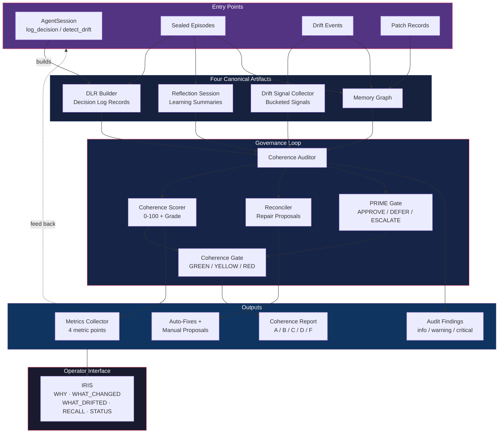
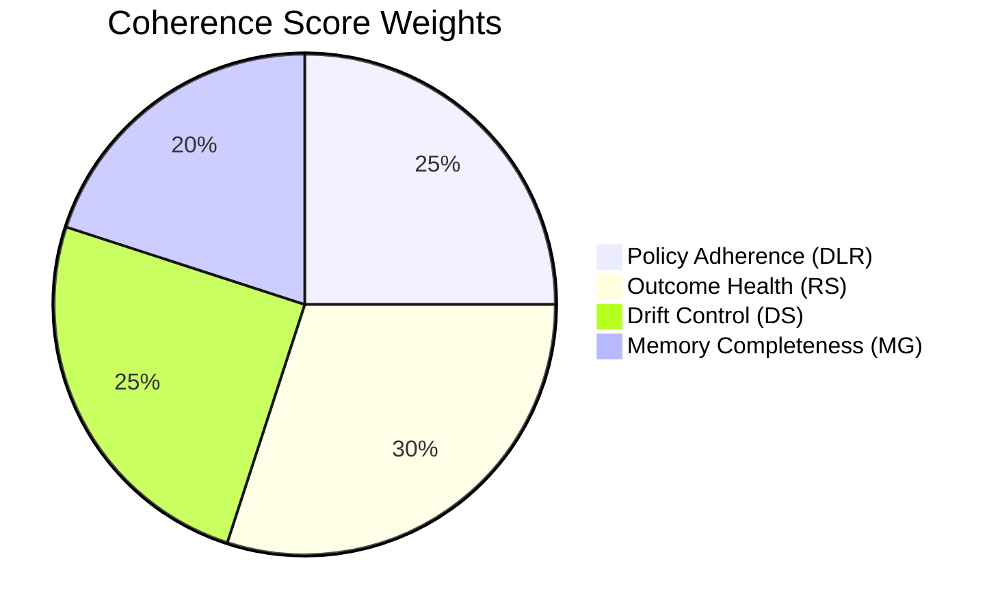

# Coherence Ops Pipeline

Data flow through the four canonical artifacts and the governance loop.

```mermaid
graph TD
    subgraph Entry["Entry Points"]
        AGENT[AgentSession<br/>log_decision / detect_drift]
        EP[Sealed Episodes]
        DR[Drift Events]
        PA[Patch Records]
    end

    subgraph Artifacts["Four Canonical Artifacts"]
        AGENT -->|builds| DLR
        EP --> DLR[DLR Builder<br/>Decision Log Records]
        EP --> RS[Reflection Session<br/>Learning Summaries]
        DR --> DS[Drift Signal Collector<br/>Bucketed Signals]
        EP --> MG[Memory Graph]
        DR --> MG
        PA --> MG
    end

    subgraph Governance["Governance Loop"]
        DLR --> AUD[Coherence Auditor]
        RS --> AUD
        DS --> AUD
        MG --> AUD
        AUD --> SCORE[Coherence Scorer<br/>0-100 + Grade]
        AUD --> RECON[Reconciler<br/>Repair Proposals]
        AUD --> PRIME[PRIME Gate<br/>APPROVE / DEFER / ESCALATE]
        SCORE --> GATE[Coherence Gate<br/>GREEN / YELLOW / RED]
        PRIME --> GATE
    end

    subgraph Output["Outputs"]
        GATE --> REPORT[Coherence Report<br/>A / B / C / D / F]
        RECON --> FIXES[Auto-Fixes +<br/>Manual Proposals]
        AUD --> FINDINGS[Audit Findings<br/>info / warning / critical]
        SCORE --> METRICS[Metrics Collector<br/>4 metric points]
    end

    subgraph Query["Operator Interface"]
        METRICS --> IRIS[IRIS<br/>WHY · WHAT_CHANGED<br/>WHAT_DRIFTED · RECALL · STATUS]
    end

    FIXES -.->|feed back| Entry

    style Entry fill:#533483,stroke:#e94560,color:#fff
    style Artifacts fill:#16213e,stroke:#0f3460,color:#fff
    style Governance fill:#162447,stroke:#e94560,color:#fff
    style Output fill:#0f3460,stroke:#533483,color:#fff
    style Query fill:#1a1a2e,stroke:#e94560,color:#fff
```

## Scoring Dimensions

```mermaid
pie title Coherence Score Weights
    "Policy Adherence (DLR)" : 25
    "Outcome Health (RS)" : 30
    "Drift Control (DS)" : 25
    "Memory Completeness (MG)" : 20
```
