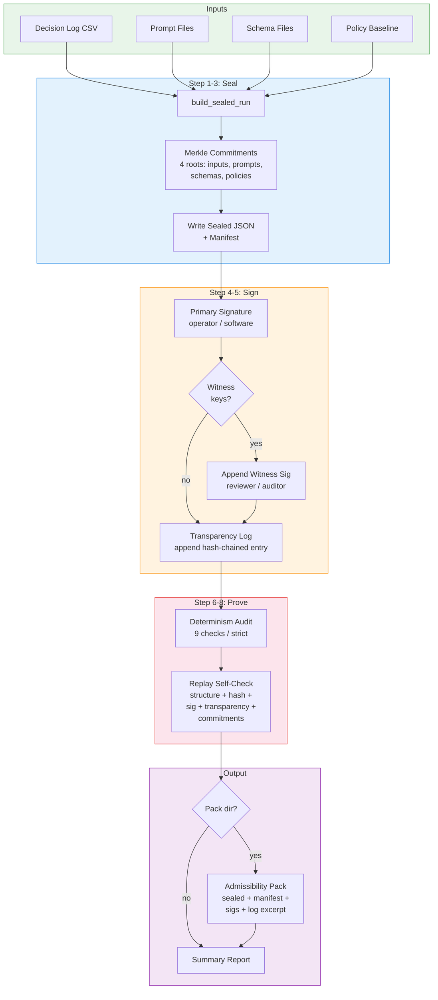
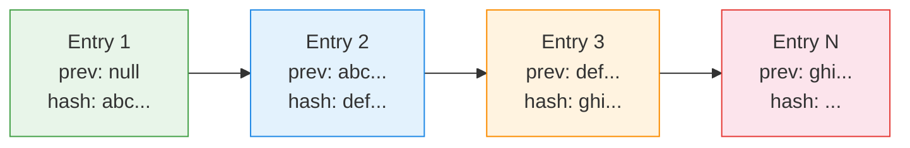
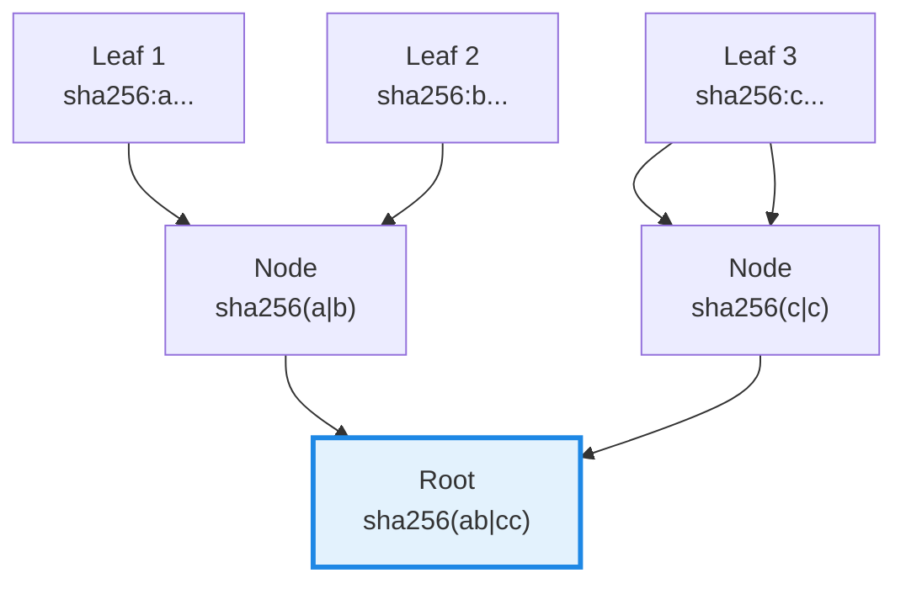
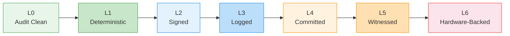
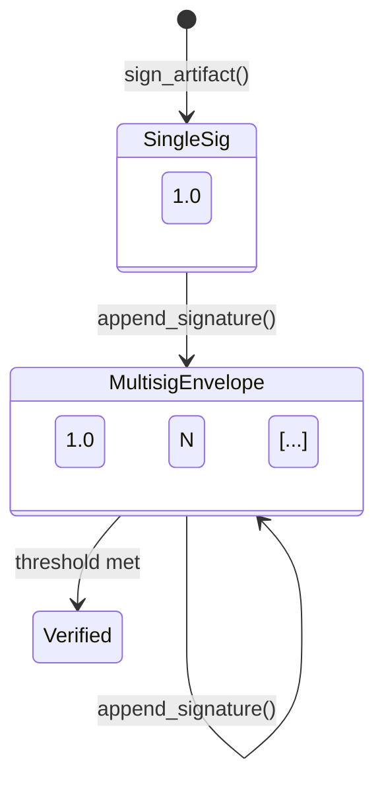

# Seal-and-Prove Pipeline

Court-grade admissibility pipeline: how a single `seal_and_prove` command
produces a verifiable, tamper-evident governance artifact bundle.

## Transparency Log Chain

Each log entry links to the previous via `prev_entry_hash`, forming a
tamper-evident chain.

## Merkle Commitment Tree

Binary Merkle tree with SHA-256. Odd leaf count pads by duplicating
the last leaf. Four independent trees: inputs, prompts, schemas, policies.

## Admissibility Levels

## Multi-Signature Evolution

