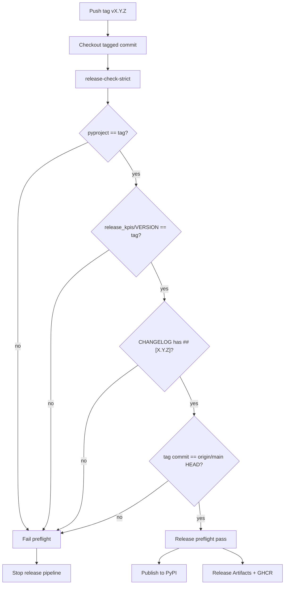

# Release Preflight Flow

Strict release flow for tag-based publishing. Prevents stale tags from reaching PyPI/GHCR.

```mermaid
flowchart TD
    T["Push tag vX.Y.Z"] --> C["Checkout tagged commit"]
    C --> R["release-check-strict"]
    R --> V1{"pyproject == tag?"}
    V1 -->|no| FAIL["Fail preflight"]
    V1 -->|yes| V2{"release_kpis/VERSION == tag?"}
    V2 -->|no| FAIL
    V2 -->|yes| V3{"CHANGELOG has ## [X.Y.Z]?"}
    V3 -->|no| FAIL
    V3 -->|yes| V4{"tag commit == origin/main HEAD?"}
    V4 -->|no| FAIL
    V4 -->|yes| PASS["Release preflight pass"]
    PASS --> P1["Publish to PyPI"]
    PASS --> P2["Release Artifacts + GHCR"]
    FAIL --> STOP["Stop release pipeline"]
```
