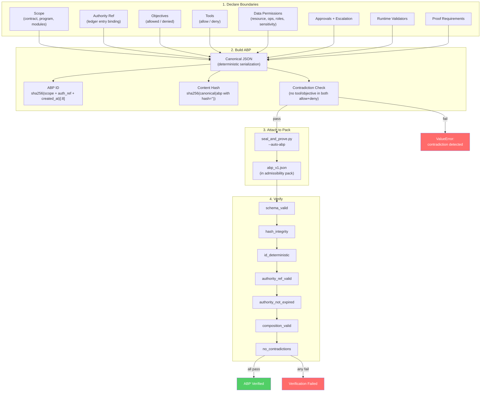
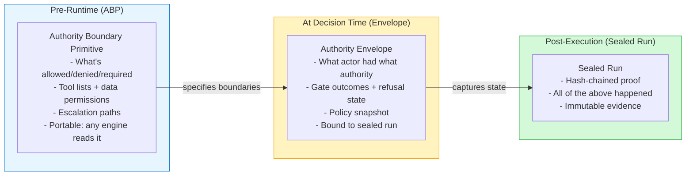
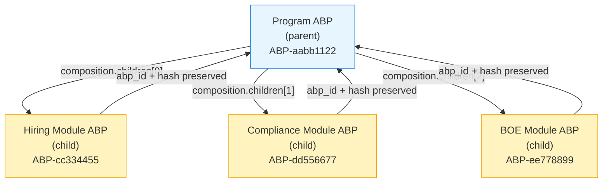

# Authority Boundary Primitive (ABP)

Pre-runtime governance declaration lifecycle: declare boundaries, build deterministic ABP, attach to admissibility pack, verify integrity.

## ABP Lifecycle

## ABP vs Authority Envelope

## ABP Composition

Boundaries from children are merged into the parent. `compose_abps()` concatenates allowed/denied objectives, tool allow/deny lists, data permissions, and records each child's `abp_id` and `hash` in `composition.children`.
