# EDGE System

Exportable Decision Governance Engine: 11 standalone HTML modules with embedded ABP enforcement, gate verification, and delegation review triggers.

## EDGE Module Map

## JRM EDGE Pipeline (v1.0.7)

```mermaid
graph LR
    subgraph Input["Log Sources"]
        EVE["Suricata EVE"]
        SNR["Snort fast.log"]
        CPL["Copilot JSONL"]
    end

    subgraph Pipeline["9-Stage Seeded Pipeline"]
        direction LR
        S1["RAW"] --> S2["PARSE"] --> S3["NORMALIZE"] --> S4["JOIN"]
        S4 --> S5["TRUTH"] --> S6["REASONING"] --> S7["DRIFT"]
        S7 --> S8["PATCH"] --> S9["MEMORY"]
    end

    subgraph Features["v1.0.7 Features"]
        SW["So What Panel\nper-stage what/why/next"]
        AZ["Analyzer ↔ Deep Sigma\nview toggle"]
        TL["Packet Timeline\nchain + diff"]
        ST["Stream Mode\nFreeze + Seal"]
        PD["Policy Drawer\nlocked thresholds\nregression rerun"]
    end

    EVE & SNR & CPL --> S1
    S9 --> SW
    S9 --> AZ
    S9 --> TL
    S9 --> ST
    S9 --> PD

    style Input fill:#e3f2fd,stroke:#1e88e5
    style Pipeline fill:#e8f5e9,stroke:#43a047
    style Features fill:#fff3e0,stroke:#fb8c00
```

## RFP Co-Pilot Workflow

## ABP Gate Enforcement Flow

## Delegation Review Closed Loop

## Delegation Review Triggers

## Unified Tab Architecture

## End-to-End EDGE Export Pipeline

