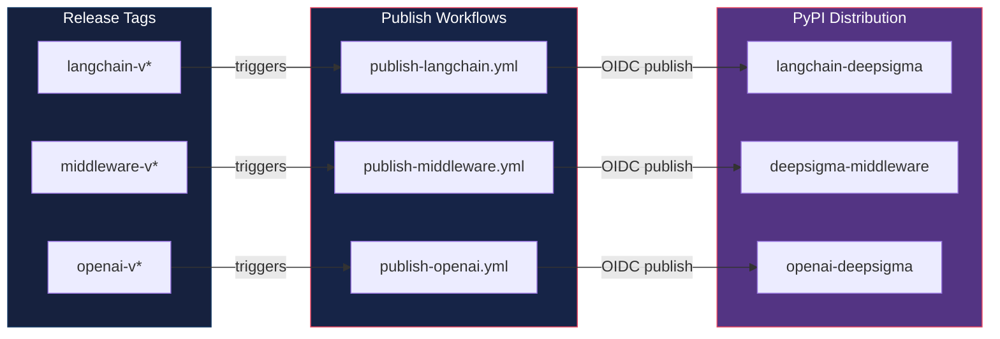

# SDK Package Architecture

How the three standalone pip packages wrap AgentSession to produce sealed decision episodes.

```mermaid
graph TB
    subgraph UserCode["User Application"]
        APP[Application Code]
    end

    subgraph LCPkg["langchain-deepsigma"]
        EXH[ExhaustCallbackHandler<br/>LLM + tool exhaust]
        GOV[GovernanceCallbackHandler<br/>DTE mid-chain enforcement]
        LGC[LangGraphConnector<br/>trace → canonical records]
        LGE[LangGraphExhaustTracker<br/>astream_events tracker]
    end

    subgraph MWPkg["deepsigma-middleware"]
        DEC[@log_decision<br/>sync + async decorator]
        ASGI[DeepSigmaMiddleware<br/>ASGI middleware]
        FLASK[FlaskDeepSigma<br/>Flask extension]
        CTXV[contextvars<br/>async-safe session]
    end

    subgraph OAIPkg["openai-deepsigma"]
        WRAP[DeepSigmaAgentWrapper<br/>intent → tools → seal]
        RES[AgentRunResult<br/>output + episodes + drift]
    end

    subgraph Core["AgentSession"]
        SESS[AgentSession<br/>log_decision · detect_drift<br/>score · prove · export]
        DLR[DLR Builder]
        DS[Drift Signal]
        MG[Memory Graph]
        SCORE[Coherence Scorer]
    end

    APP -->|callbacks| EXH
    APP -->|callbacks| GOV
    APP -->|middleware| ASGI
    APP -->|extension| FLASK
    APP -->|decorator| DEC
    APP -->|wrap agent| WRAP

    EXH -->|optional session| SESS
    GOV -->|optional session| SESS
    LGC -->|to_agent_session_decisions| SESS

    DEC -->|get_session via| CTXV
    ASGI -->|get_session via| CTXV
    FLASK -->|get_session via| CTXV
    CTXV -->|creates| SESS

    WRAP -->|log + seal| SESS
    WRAP -->|returns| RES

    SESS --> DLR
    SESS --> DS
    SESS --> MG
    SESS --> SCORE

    style UserCode fill:#1a1a2e,stroke:#e94560,color:#fff
    style LCPkg fill:#16213e,stroke:#0f3460,color:#fff
    style MWPkg fill:#162447,stroke:#1f4068,color:#fff
    style OAIPkg fill:#0f3460,stroke:#533483,color:#fff
    style Core fill:#e94560,stroke:#e94560,color:#fff
```

## Package Independence

Each package is independently installable and testable:


