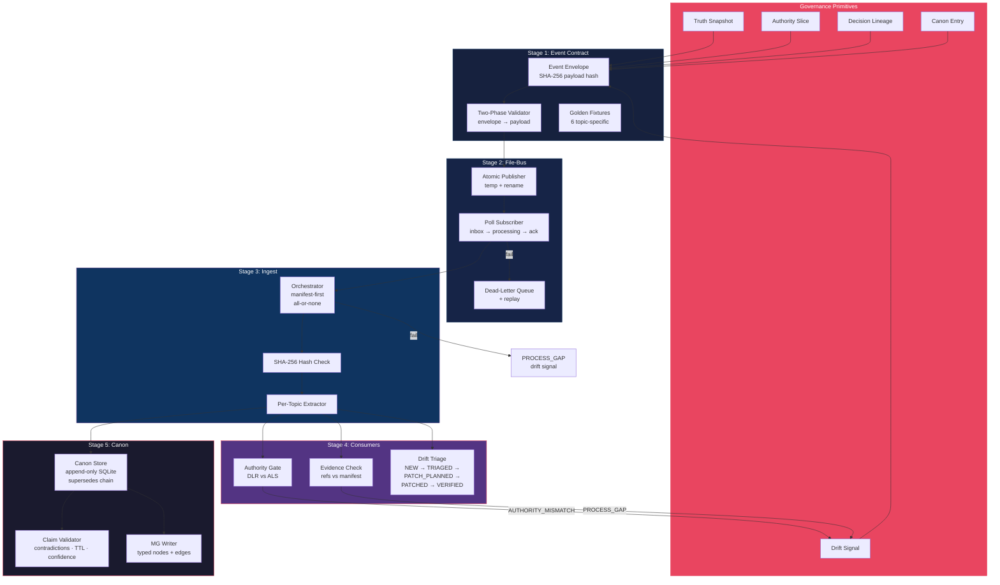
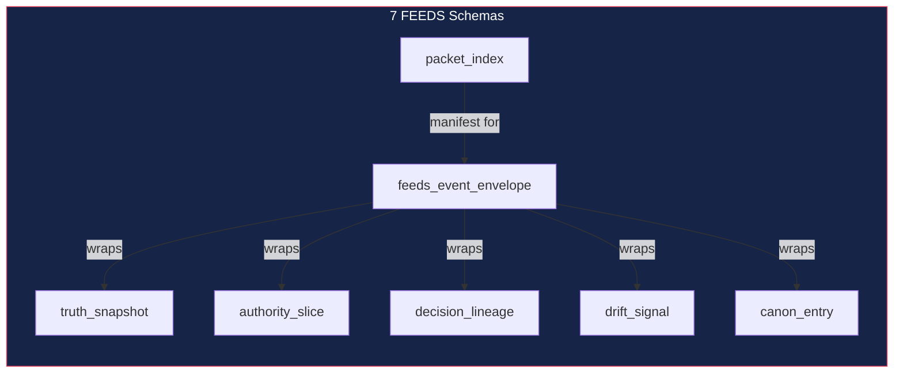

# FEEDS Pipeline

Five-stage event-driven pipeline connecting governance primitives via file-based pub/sub.

```mermaid
graph TD
    subgraph Sources["Governance Primitives"]
        TS[Truth Snapshot]
        ALS[Authority Slice]
        DLR[Decision Lineage]
        DS[Drift Signal]
        CE[Canon Entry]
    end

    subgraph Stage1["Stage 1: Event Contract"]
        ENV[Event Envelope<br/>SHA-256 payload hash]
        VAL[Two-Phase Validator<br/>envelope → payload]
        FIX[Golden Fixtures<br/>6 topic-specific]
    end

    subgraph Stage2["Stage 2: File-Bus"]
        PUB[Atomic Publisher<br/>temp + rename]
        SUB[Poll Subscriber<br/>inbox → processing → ack]
        DLQ[Dead-Letter Queue<br/>+ replay]
    end

    subgraph Stage3["Stage 3: Ingest"]
        ORCH[Orchestrator<br/>manifest-first<br/>all-or-none]
        HASH[SHA-256 Hash Check]
        EXTRACT[Per-Topic Extractor]
    end

    subgraph Stage4["Stage 4: Consumers"]
        AUTH[Authority Gate<br/>DLR vs ALS]
        EVID[Evidence Check<br/>refs vs manifest]
        TRIAGE[Drift Triage<br/>NEW → TRIAGED →<br/>PATCH_PLANNED →<br/>PATCHED → VERIFIED]
    end

    subgraph Stage5["Stage 5: Canon"]
        STORE[Canon Store<br/>append-only SQLite<br/>supersedes chain]
        CLVAL[Claim Validator<br/>contradictions · TTL · confidence]
        MGW[MG Writer<br/>typed nodes + edges]
    end

    TS --> ENV
    ALS --> ENV
    DLR --> ENV
    DS --> ENV
    CE --> ENV

    ENV --> VAL
    VAL --> PUB
    PUB --> SUB
    SUB -->|fail| DLQ

    SUB --> ORCH
    ORCH --> HASH
    HASH --> EXTRACT
    ORCH -->|fail| DRIFTGAP[PROCESS_GAP<br/>drift signal]

    EXTRACT --> AUTH
    EXTRACT --> EVID
    EXTRACT --> TRIAGE

    AUTH -->|AUTHORITY_MISMATCH| DS
    EVID -->|PROCESS_GAP| DS

    EXTRACT --> STORE
    STORE --> CLVAL
    STORE --> MGW

    style Sources fill:#e94560,stroke:#e94560,color:#fff
    style Stage1 fill:#16213e,stroke:#0f3460,color:#fff
    style Stage2 fill:#162447,stroke:#1f4068,color:#fff
    style Stage3 fill:#0f3460,stroke:#533483,color:#fff
    style Stage4 fill:#533483,stroke:#e94560,color:#fff
    style Stage5 fill:#1a1a2e,stroke:#e94560,color:#fff
```

## Schema Coverage

```mermaid
graph LR
    subgraph Schemas["7 FEEDS Schemas"]
        S1[feeds_event_envelope]
        S2[truth_snapshot]
        S3[authority_slice]
        S4[decision_lineage]
        S5[drift_signal]
        S6[canon_entry]
        S7[packet_index]
    end

    S1 -->|wraps| S2
    S1 -->|wraps| S3
    S1 -->|wraps| S4
    S1 -->|wraps| S5
    S1 -->|wraps| S6
    S7 -->|manifest for| S1

    style Schemas fill:#162447,stroke:#e94560,color:#fff
```
